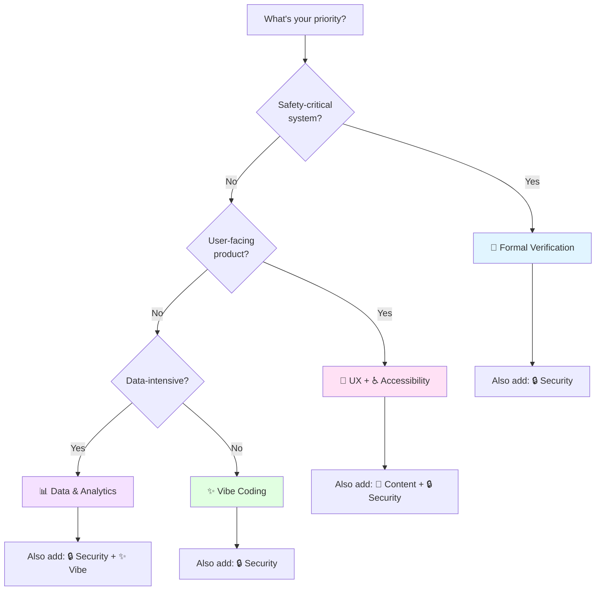
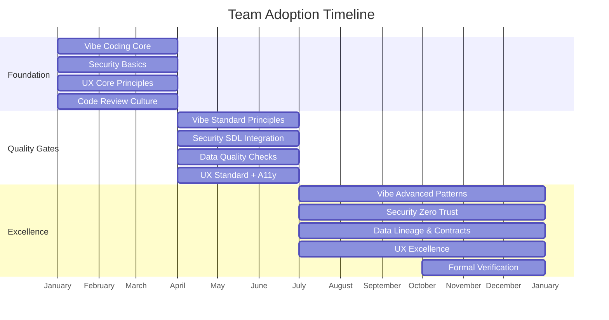

(it's mostly for agents - don't judge me)

# Code Review Manifestos

**Software engineering manifestos for code review and system quality**

---

## About This Project

This repository aggregates software engineering manifestos—each representing coherent philosophies backed by industry best practices—to help teams standardize code review and engineering culture.

### What is a Manifesto?

Included manifestos define coherent philosophies with actionable guidance for specific software quality dimensions (correctness, maintainability, security, UX, data quality, content). Each is production-ready with implementation guides, examples, and measurement frameworks.

### Project Scope

**Quality Dimensions Covered**: Correctness & Safety • Maintainability • Data Quality • Security • User Experience • Accessibility • Content & Communication

### Manifesto Structure

All manifestos follow a consistent structure (Title & Version • Core Principles • Implementation Guide • Examples • Tools & Ecosystem • Metrics • Changelog) enabling easy comparison, adoption, and integration across teams.

---

## Table of Contents

- [About This Project](#about-this-project)
  - [What is a Manifesto?](#what-is-a-manifesto)
  - [Project Scope](#project-scope)
  - [Manifesto Structure](#manifesto-structure)
- [Quick Selection Guide](#quick-selection-guide)
- [Manifesto Index](#manifesto-index)
  - [⚖️ Ethics Framework](#️-ethics-framework)
  - [🔬 Formal Verification](#-formal-verification)
  - [✨ Vibe Coding](#-vibe-coding)
  - [📊 Data & Analytics](#-data--analytics)
  - [🔒 Security Hardening](#-security-hardening)
  - [🎨 User Experience](#-user-experience)
  - [♿ Accessibility](#-accessibility)
  - [📝 Content & Communication](#-content--communication)
  - [⚖️ Ethical Engineering](#️-ethical-engineering)
- [Comparison Matrix](#comparison-matrix)
- [Selection by Role](#selection-by-role)
- [Selection by Context](#selection-by-context)
- [Implementation Quick Reference](#implementation-quick-reference)
- [Common Themes](#common-themes)
- [Adoption Timeline](#adoption-timeline)
- [Version Information](#version-information)
- [Contributing](#contributing)
- [License](#license)

---

## Quick Selection Guide

**Choose manifestos based on your primary concern:**

| If your priority is... | Start with | Also consider |
|------------------------|-----------|---------------|
| **Making ethical trade-off decisions** | ⚖️ Ethics Framework | All other manifestos (Ethics resolves conflicts) |
| **Code correctness & safety** | 🔬 Formal Verification + ⚖️ Ethics | ✨ Vibe Coding + 🔒 Security |
| **Code readability & maintainability** | ✨ Vibe Coding + ⚖️ Ethics | 🎨 UX (if frontend) |
| **Data reliability & quality** | 📊 Data & Analytics + ⚖️ Ethics | 🔒 Security Hardening |
| **System security & resilience** | 🔒 Security Hardening + ⚖️ Ethics | 🔬 Formal (critical systems) |
| **User satisfaction & usability** | 🎨 User Experience + ⚖️ Ethics | ✨ Vibe Coding + ♿ Accessibility |
| **Universal access & legal compliance** | ♿ Accessibility + ⚖️ Ethics | 🎨 UX (broader context) |
| **Content clarity & documentation** | 📝 Content & Communication + ⚖️ Ethics | ✨ Vibe Coding + 🎨 UX |
| **General software quality** | ⚖️ Ethics + ✨ Vibe Coding | Context-dependent |

**Note**: The ⚖️ Ethics Framework is recommended for **all** contexts as it provides the decision-making structure for prioritizing and resolving conflicts between other manifestos.

### Decision Tree

---

## Manifesto Index

### ⚖️ Ethics Framework

**[Ethics Manifesto: A Computable Framework for Software Engineering](./ethics/ETHICS_MANIFESTO.md)** • v1.0 • [Changelog](./ethics/CHANGELOG.md) • 5 foundational objectives

**At a Glance**: Mathematical decision framework • All roles • Low learning curve • Immediate ROI • Universal (foundational)

**Key Objectives (weighted hierarchy)**: System Integrity (5x) • Human Sustainability (4x) • Knowledge Capital (3x) • System Longevity (2x) • Resource Efficiency (1x)

**Best For**: Resolving conflicts between competing priorities • Autonomous agent decision-making • Code review decisions • Architecture trade-offs • CI/CD ethical guardrails • Preventing burnout, security lapses, and technical debt

**Framework**: Maqasid al-Shariah translated to software engineering • Weighted score algorithm (Σ Impact × Weight) • Three recommendation levels (proceed, conditional, reject) • Domain mappings across Security, DevOps, UX, Architecture, and AI/ML

**Implementation**: Decision engine with mathematical guarantees • CI/CD integration patterns • ADR templates • Incident post-mortem categorization • Agent human-in-the-loop protocols • 4-phase adoption roadmap

**Guarantees**: Lower-priority gains cannot justify higher-priority harms • Security cannot be sacrificed for speed • Team wellbeing cannot be compromised for velocity

---

### 🔬 Formal Verification

**[Formal Verification Manifesto](./formal_verification/FORMAL_VERIFICATION_MANIFESTO.md)** • v1.1 • 16 principles

**At a Glance**: Mathematical correctness proofs • Safety/security engineers • Very high learning curve • Long-term ROI • Specialized adoption

**Key Principles**: Specification as Foundation • Types as Propositions (Curry-Howard) • Totality & Termination • Refinement Types • Separation Logic • Proof Automation • Verified Compilation • Incremental Formalization

**Best For**: Safety-critical systems (avionics, medical, automotive) • Security-critical components (cryptography, authentication) • High-assurance software

**Tools**: Coq • Isabelle • Lean • Agda • F* • Dafny • TLA+ • SPARK Ada

**Implementation**: 30-day quickstart • 3-month deep dive • Tool selection decision tree • Cost-benefit analysis

---

### ✨ Vibe Coding

**[Vibe Coding Manifesto](./vibe_coding/VIBE_CODING_MANIFESTO.md)** • v2.0 • [Changelog](./vibe_coding/CHANGELOG.md) • 15 principles

**At a Glance**: Human readability & maintainability • All developers • Medium learning curve • Immediate ROI • Universal adoption

**Key Principles (tiered)**: **Core** (Aesthetic Legibility • Intentional Naming • Literate Programming • Obviousness • Locality & Cohesion) • **Standard** (Semantic Density • Immutability Default • Contextual Verbosity • Joyful Craft) • **Excellence** (Type as Documentation • Composition • Error as Value • Constraint Propagation)

**Best For**: Long-lived production systems (10+ years) • Teams valuing correctness & maintainability • Complex business logic • Libraries and frameworks

**Languages**: Python • TypeScript • Rust • Go • Haskell • Java

**Implementation**: 3-phase incremental adoption (weeks 1-2, months 1-2, months 3-6) • Language-specific guidance • Metrics & measurement • Code review checklists

---

### 📊 Data & Analytics

**[Data & Analytics Manifesto](./data_analytics/DATA_ANALYTICS_MANIFESTO.md)** • v2.0 • [Changelog](./data_analytics/CHANGELOG.md) • 18 principles

**At a Glance**: Data reliability & scalability • Data engineers & analysts • Medium-high learning curve • Medium-term ROI • Data-intensive organizations

**Key Principles**: Data as Product • Single Source of Truth • Immutability & Temporal Integrity • Schema as Contract • Data Quality by Design • Lineage & Provenance • Idempotency & Determinism • Metrics as Code • Data Observability • Privacy & Compliance • Data Contracts • Testing • Cost-Aware Engineering

**Best For**: Data warehouses & analytics platforms • Data pipelines (batch/streaming) • BI systems • ML platforms • Data mesh architectures

**Tools**: dbt • Airflow • Snowflake • BigQuery • Spark • Kafka • Great Expectations • Amundsen

**Implementation**: Per-principle checklists • 6-level maturity model • Tool ecosystem map • Cost optimization framework

---

### 🔒 Security Hardening

**[Security Hardening Manifesto](./security_hardening/SECURITY_HARDENING_MANIFESTO.md)** • v2.0 • [Changelog](./security_hardening/CHANGELOG.md) • 18 principles

**At a Glance**: System security & resilience • Security engineers, DevSecOps teams, all developers • Medium learning curve • Immediate ROI (avoid breach) • Universal (required)

**Key Principles**: Defense in Depth • Least Privilege • Fail Secure • Complete Mediation • Zero Trust • Cryptographic Agility • Secure Development Lifecycle • Audit Everything • Separation of Duties • Input Validation & Output Encoding • Secure Secrets Management • Vulnerability Management • Immutable Infrastructure • Threat Modeling • Supply Chain Security • Security Monitoring & Incident Response

**Best For**: Security-critical applications (fintech, healthcare, government) • Cloud-native & microservices • Organizations building security programs • Compliance-driven environments (PCI-DSS, HIPAA, GDPR) • DevSecOps transformation

**Standards**: OWASP Top 10 • NIST CSF • CIS Controls • ISO 27001 • PCI-DSS • GDPR

**Implementation**: Per-principle checklists (18) • 6-level security maturity model • Tool ecosystem map (100+ tools) • Compliance mapping • Learning paths (30-day/3-month/1-day) • Modern architecture guidance • Trade-offs & anti-patterns

---

### 🎨 User Experience

**[UX Manifesto](./user_experience/UX_MANIFESTO.md)** • v2.0 • [Changelog](./user_experience/CHANGELOG.md) • 17 principles

**At a Glance**: User success & satisfaction • Designers, PMs, frontend developers • Medium learning curve • Immediate-Medium ROI • Universal (product-focused)

**Key Principles (tiered)**: **Core** (User Primacy • Clarity • Progressive Disclosure • Consistency & Coherence • Accessibility as Foundation) • **Standard** (Immediate Feedback • Forgiveness & Reversibility • Recognition Over Recall • Efficiency & Flow • Appropriate Defaults • Contextual Relevance • Error Prevention • Privacy & Ethical Design • Navigation & Findability) • **Excellence** (Aesthetic Integrity • Performance as Feature • Continuous Validation)

**Best For**: Web & mobile applications • Voice interfaces & conversational UI • AR/VR & spatial computing • IoT devices & embedded systems • Design systems & component libraries • Multimodal interfaces

**Standards**: Nielsen Heuristics • WCAG 2.1 AA • Core Web Vitals • Privacy-by-Design

**Implementation**: Core/Standard/Excellence hierarchy • Role-based ownership matrix • Measurement framework with KPIs • Conflict resolution framework

---

### ♿ Accessibility

**[Accessibility Manifesto](./accessibility/ACCESSIBILITY_MANIFESTO.md)** • v1.1 • [Changelog](./accessibility/CHANGELOG.md) • 15 principles

**At a Glance**: Universal access & WCAG compliance • Frontend developers, designers, accessibility specialists, all developers • Medium learning curve • Immediate ROI (avoid lawsuits) + Long-term (broader audience) • Universal (legally required)

**Key Principles (tiered)**: **Core/WCAG A** (Universal Design • Perceivability • Operability • Keyboard Accessibility) • **Standard/WCAG AA** (Understandability • Robustness • Semantic Structure • Screen Reader Compatibility • Sufficient Time • Seizure Prevention • Navigational Clarity • Input Assistance) • **Excellence/WCAG AAA** (Adaptive Technology Support • Multimodal Interaction • Testing & Validation)

**Best For**: All web & mobile applications (legal requirement) • Government & education platforms (Section 508) • E-commerce (settlement risk mitigation) • Design systems & component libraries • Public-facing applications • Healthcare & financial services

**Standards**: WCAG 2.1 AA/AAA • Section 508 • ADA • EAA (EU) • AODA (Ontario) • EN 301 549

**Tools**: axe DevTools • WAVE • Lighthouse • Pa11y • NVDA • JAWS • VoiceOver • TalkBack • Colour Contrast Analyser • Accessibility Insights

**Implementation**: 3-tier (Core/Standard/Excellence) • Comprehensive measurement framework (automated + manual + user testing) • 40+ tool ecosystem map • Legal compliance mapping • Actionable checklists per tier • Cost-benefit analysis (10% → 10× → 100× multiplier)

**Related**: Expands UX Manifesto Principle VIII with WCAG implementation details

---

### 📝 Content & Communication

**[Content & Communication Manifesto](./content_communication/CONTENT_COMMUNICATION_MANIFESTO.md)** • v2.0 • [Changelog](./content_communication/CHANGELOG.md) • 18 principles

**At a Glance**: Clear, maintainable, accessible content across all touchpoints • Technical writers, developers, designers, DevRel, content strategists, product managers • Low-Medium learning curve • Immediate ROI (reduced support, higher conversion, better UX) • Universal (all projects with user-facing content)

**Key Principles (tiered)**: **Core** (Clarity as Prime Directive • Semantic Hierarchy • Precision in Terminology • Accessibility as Requirement • Empathy & Respect) • **Standard** (Audience-First Architecture • Actionable Documentation • Progressive Disclosure • Scannability & Skimming • Code as Communication • Voice & Tone Consistency • Version Control & Change Management • Maintenance & Decay Prevention) • **Excellence** (Visual Communication • Searchability & Discoverability • Content Governance & Strategy • Internationalization & Localization • Continuous Measurement)

**Best For**: Technical documentation (API docs, tutorials, guides, reference) • UI/UX content (microcopy, error messages, tooltips, labels) • Marketing content (landing pages, emails, product descriptions) • Support content (help centers, FAQs, chatbots) • Internal content (runbooks, incident reports, specifications)

**Content Types**: Documentation • UI Microcopy • Error Messages • Marketing • Support • Onboarding

**Tools**: Vale • alex • write-good • Grammarly • Docusaurus • MkDocs • OpenAPI • Mermaid • PlantUML • axe DevTools • Lighthouse • i18next • Crowdin • Plausible Analytics

**Implementation**: 4-phase adoption (Week 1-2, Month 1-2, Month 3-6, Ongoing) • Content maturity model (5 levels) • Diátaxis framework integration • Measurement framework with content quality scorecard • Role-specific guidance (8 roles) • Tool ecosystem map (50+ tools)

**Related**: Complements Accessibility, UX, and Vibe Coding manifestos

---

### ⚖️ Ethical Engineering

**[Ethical Engineering Manifesto](./ethical_engineering/ETHICAL_ENGINEERING_MANIFESTO.md)** • v1.0 • [Changelog](./ethical_engineering/CHANGELOG.md) • 20 principles

**At a Glance**: Ethical framework for software development • All developers, security engineers, product managers, data scientists • Medium learning curve • Immediate ROI (avoid harm, build trust) + Long-term (sustainability) • Universal (moral imperative)

**Key Principles (tiered by ethical categorization)**: **Fard/Critical Required** (Encryption • Access Control • Input Validation • Vulnerability Remediation • Accessibility • Privacy Compliance • Ethical Design • Developer Sustainability • Bias Audits • Explainability • Human Oversight for AI) • **Mandub/Recommended** (Immutable Infrastructure • CI/CD • Disaster Recovery • Domain-Driven Design • Documentation • Testing • Monitoring • Code Readability) • **Mubah/Discretionary** (Technology choices, feature flags, A/B testing) • **Makruh/Anti-Pattern** (Manual deployments, god objects, premature optimization) • **Haram/Prohibited** (Hardcoded secrets, dark patterns, ignoring CVEs, selling user data, burnout culture, black-box AI for high-stakes decisions)

**Best For**: All software development contexts • User-facing applications with personal data • Safety-critical systems • AI/ML systems • Compliance-driven environments • Organizations building ethical culture • Long-lived systems requiring sustainability

**Framework**: Five Objectives (Maqasid): System Integrity (Hifz al-Din) • Resource Efficiency (Hifz al-Mal) • System Longevity (Hifz al-Nasl) • Human Sustainability (Hifz al-Nafs) • Knowledge Capital (Hifz al-Aql)

**Domains Covered**: Security & Reliability • DevOps & Infrastructure • Product & UX • Software Architecture • Data Science & AI • Testing & QA • Code Quality

**Implementation**: Per-principle checklists (7 domains) • 5-level ethical maturity model • 30-day and 3-month learning paths • Domain-specific application guides (web, mobile, API, data pipeline) • Trade-offs framework • Tool ecosystem map (50+ tools)

**Related**: Provides moral framework integrating 🔒 Security + ♿ Accessibility + 🎨 UX + 📊 Data + ✨ Vibe Coding + 🔬 Formal Verification + 📝 Content

---

## Comparison Matrix

| Aspect | ⚖️ Ethics Framework | ⚖️ Ethical Engineering | 🔬 Formal Verification | ✨ Vibe Coding | 📊 Data & Analytics | 🔒 Security Hardening | 🎨 User Experience | ♿ Accessibility | 📝 Content & Communication |
|--------|-------------------|----------------------|----------------------|---------------|--------------------|--------------------|-------------------|----------------|---------------------------|
| **Focus** | Decision framework & trade-offs | Domain implementation & categorization | Mathematical correctness | Human readability | Data reliability | System security | User success | Universal access | Content clarity & effectiveness |
| **Verification Method** | Weighted score algorithm | Ethical audits, Fard/Haram classification | Formal proofs | Code review + tests | Data quality tests | Pen testing, audits, scanning | Usability testing + analytics | WCAG audits, screen reader testing | Content audits, user feedback |
| **Automation Tools** | CI/CD ethics bot, decision engine | Security + A11y + Privacy + Bias tools | Theorem provers, SMT solvers | Linters, formatters | Observability, monitoring | SAST, DAST, SCA, SIEM | A11y tools, analytics, A/B | axe, WAVE, Pa11y, Lighthouse | Vale, alex, link checkers |
| **Learning Curve** | ✓ Low | ✓ Medium | ⚠️ Very High | ✓ Medium | ⚠️ Medium-High | ✓ Medium | ✓ Medium | ✓ Medium | ✓ Low-Medium |
| **Adoption Scope** | ✓ Universal (meta-framework) | ✓ Universal (moral imperative) | Specialized | ✓ Universal | Data-intensive | ✓ Universal (required) | ✓ Universal | ✓ Universal (legally required) | ✓ Universal |
| **ROI Timeline** | ✓ Immediate (prevents bad decisions) | ✓ Immediate (trust) + Long-term | Long-term (years) | ✓ Immediate | Medium (months) | ✓ Immediate (avoid breach) | ✓ Immediate-Medium | ✓ Immediate (avoid lawsuits) | ✓ Immediate (reduced support) |
| **Team Size Impact** | Low (applies to all decisions) | Low (cultural shift) | High (specialist knowledge) | Low (general practice) | Medium (platform teams) | Low-Medium (all engineers) | Low-Medium (designers) | Low-Medium (all roles) | Low (all roles) |
| **Criticality** | All systems (decision meta-framework) | All systems (ethical obligation) | Safety-critical systems | All systems | Data-driven systems | All systems | All systems | All systems (legal requirement) | All systems with documentation/UI |

**Note**: The two ethics manifestos are **complementary**:
- **⚖️ Ethics Framework**: Provides mathematical decision engine for resolving trade-offs (use for: architecture decisions, PR reviews, conflict resolution)
- **⚖️ Ethical Engineering**: Provides domain-specific implementation guidance with ethical categorization (use for: daily practice, domain checklists, team culture)

---

## Selection by Role

**Note**: Both ethics manifestos are foundational for **all roles**:
- **⚖️ Ethics Framework**: Use for decision-making and resolving conflicts between manifestos
- **⚖️ Ethical Engineering**: Use for domain-specific implementation guidance and daily practice

### Developers (Backend/Fullstack)
1. **Start**: ⚖️ Ethics Framework (decision-making) + ⚖️ Ethical Engineering (Domains 1, 2, 4, 6, 7) + ✨ Vibe Coding (Core principles) + 🔒 Security Hardening (basics)
2. **Add**: 📊 Data & Analytics (if data-heavy) OR 🎨 UX (if user-facing)
3. **Consider**: 🔬 Formal Verification (for critical components)
4. **Ethics Focus**: Encryption, access control, input validation, sustainable pace, code readability

### Frontend Developers
1. **Start**: 🎨 User Experience + ♿ Accessibility + ✨ Vibe Coding + 🔒 Security (input validation, XSS prevention) + 📝 Content (UI microcopy, error messages) + ⚖️ Ethical Engineering (Domains 1, 3, 7)
2. **Priority**: Accessibility (WCAG AA compliance, screen reader testing), Performance (XIV), Consistency (IV), Security (CSP, CORS), Content (error messages, UI text)
3. **Focus**: UX Principle VIII + Accessibility Manifesto (full WCAG implementation details) + Content Manifesto (Principles I, III, V, XI)
4. **Ethics Focus**: Accessibility as requirement, privacy compliance, ethical design (reject dark patterns), input validation

### Data Engineers / Analysts
1. **Start**: 📊 Data & Analytics + 🔒 Security (data classification, PII protection) + ⚖️ Ethical Engineering (Domains 1, 5)
2. **Add**: ✨ Vibe Coding (pipeline code quality)
3. **Focus**: Data Quality, Lineage, Observability, Privacy & Compliance
4. **Ethics Focus**: Bias audits (if AI/ML), explainability, privacy compliance, encryption for PII

### Designers / Product Managers
1. **Start**: 🎨 User Experience + ♿ Accessibility + 📝 Content (UI copy, product messaging) + ⚖️ Ethical Engineering (Domain 3)
2. **Priority**: User Primacy (I), Accessibility (WCAG compliance, inclusive design), Privacy & Ethics (XIII), Continuous Validation (XV), Content (Clarity, Empathy)
3. **Consider**: ✨ Vibe Coding (understand engineering constraints) + 🔒 Security (privacy-by-design)
4. **Testing**: Include disabled users (≥20% of usability testing)
5. **Ethics Focus**: Accessibility as requirement, privacy compliance, ethical design (reject dark patterns, addictive mechanics), human sustainability

### Technical Writers / DevRel / Content Strategists
1. **Start**: 📝 Content & Communication (all tiers) + ♿ Accessibility
2. **Priority**: Core tier (Clarity, Semantic Hierarchy, Precision, Accessibility, Empathy), Diátaxis framework, Voice & Tone
3. **Add**: ✨ Vibe Coding (understand code examples) + 🎨 UX (understand user context)
4. **Tools**: Vale, MkDocs/Docusaurus, OpenAPI, Mermaid, link checkers, analytics
5. **Focus**: Technical documentation, API docs, tutorials, help centers, UI microcopy, error messages

### Platform / Infrastructure Engineers
1. **Start**: ✨ Vibe Coding + 🔒 Security Hardening
2. **Add**: 📊 Data & Analytics (observability) + 🔬 Formal Verification (critical paths)
3. **Priority**: All manifestos relevant due to infrastructure criticality

### Security Engineers
1. **Start**: 🔒 Security Hardening + 🔬 Formal Verification + ⚖️ Ethical Engineering (Domains 1, 3, 5)
2. **Add**: ✨ Vibe Coding + 🎨 UX (Privacy & Ethics principle) + 📊 Data (audit logging)
3. **Focus**: Threat modeling, supply chain security, incident response, cryptography verification
4. **Ethics Focus**: Encryption, access control, vulnerability remediation, privacy compliance, bias audits (if AI), human oversight for AI

---

## Selection by Context

### Project Type

| Project Type | Primary | Secondary | Notes |
|--------------|---------|-----------|-------|
| **Web Application** | 🎨 UX + ♿ Accessibility + 🔒 Security + ⚖️ Ethical | ✨ Vibe Coding + 📊 Data + 📝 Content | WCAG AA required; add 📊 if data-heavy, 📝 for UI copy/docs; Ethics: accessibility, privacy, no dark patterns |
| **Mobile App** | 🎨 UX + ♿ Accessibility + 🔒 Security + ⚖️ Ethical | ✨ Vibe Coding + 📝 Content | Performance, WCAG, privacy critical; Ethics: accessibility, privacy, ethical design |
| **API / Backend Service** | ✨ Vibe Coding + 🔒 Security + 📝 Content + ⚖️ Ethical | 📊 Data (if stateful) | Consider 🔬 for auth/payments; Ethics: encryption, access control, input validation |
| **Data Pipeline** | 📊 Data & Analytics + 🔒 Security + ⚖️ Ethical | ✨ Vibe Coding + 📝 Content | Quality, observability, PII protection; Ethics: privacy compliance, encryption for PII |
| **ML Platform** | 📊 Data & Analytics + 🔒 Security + ⚖️ Ethical | ✨ Vibe Coding + 📝 Content | Reproducibility, lineage; Ethics: bias audits, explainability, human oversight (CRITICAL) |
| **IoT / Embedded** | 🎨 UX + ♿ Accessibility + 🔒 Security | 🔬 Formal Verification + 📝 Content | Safety, usability, multimodal interaction, security constraints, clear error messages |
| **Financial System** | 🔬 Formal + 🔒 Security + ⚖️ Ethical | 📊 Data + ✨ Vibe + ♿ A11y + 📝 Content | Correctness, auditability, compliance; Ethics: accessibility, privacy, explainability for AI decisions, no discriminatory algorithms |
| **Medical Device** | 🔬 Formal + 🔒 Security + ♿ Accessibility + ⚖️ Ethical | 🎨 UX + 📝 Content | Safety, security, human factors; Ethics: accessibility, privacy (HIPAA), human oversight for AI, no harm to patients |
| **Design System** | 🎨 UX + ♿ Accessibility + 📝 Content | ✨ Vibe Coding + 🔒 Security | WCAG-compliant components, comprehensive documentation, secure patterns |
| **CLI Tool** | ✨ Vibe Coding + 📝 Content | 🎨 UX + 🔒 Security | Clarity, error messages, secure input handling, help documentation |
| **Developer Portal** | 📝 Content + ♿ Accessibility | 🎨 UX + ✨ Vibe Coding | API documentation, tutorials, searchability, code examples paramount |

### Organizational Maturity

| Stage | Focus | Manifestos | Rationale |
|-------|-------|-----------|-----------|
| **Startup (MVP)** | Speed + UX + Security basics | 🎨 UX + ✨ Vibe (Core) + 🔒 Security (OWASP Top 10) | User validation + avoid basic security flaws |
| **Growth (Scaling)** | Quality + Reliability + Security | ✨ Vibe + 🔒 Security + 📊 Data | Technical debt prevention, compliance prep |
| **Enterprise (Mature)** | All dimensions | All manifestos | Domain-specific application, regulatory compliance |
| **Legacy Modernization** | Code quality + Security first | ✨ Vibe Coding + 🔒 Security | Refactoring foundation, harden vulnerabilities |

### Risk Profile

| Risk Level | Manifestos | Priority Principles |
|------------|-----------|---------------------|
| **Critical** (life/finance) | 🔬 Formal + 🔒 Security + 📊 Data | Correctness proofs, zero trust, auditability |
| **High** (security/PII) | 🔒 Security + 🔬 Formal + 🎨 UX (Privacy) | Cryptography, threat modeling, privacy-by-design |
| **Medium** (business-critical) | 🔒 Security + 📊 Data + ✨ Vibe | SDL, vulnerability mgmt, observability, maintainability |
| **Standard** (typical SaaS) | 🔒 Security (basics) + 🎨 UX + ✨ Vibe | OWASP Top 10, user satisfaction, code quality |

---

## Implementation Quick Reference

### Timeline by Manifesto

| Manifesto | Phase 1 | Phase 2 | Phase 3 |
|-----------|---------|---------|---------|
| **⚖️ Ethics Framework** | Week 1 (learn 5 objectives, use in decisions) | Month 1 (integrate in code reviews, ADRs) | Month 2+ (CI/CD automation, agent integration) |
| **🔬 Formal Verification** | 30-day intro (1 component) | 3-month deep dive (module) | 6-12 month (subsystem) |
| **✨ Vibe Coding** | Weeks 1-2 (formatting, naming) | Months 1-2 (immutability, cohesion) | Months 3-6 (types, composition) |
| **📊 Data & Analytics** | Month 1 (observability, SLOs) | Months 2-4 (quality, contracts) | Months 5-12 (lineage, mesh) |
| **🔒 Security Hardening** | Week 1 (OWASP Top 10, MFA, secrets mgmt) | Months 1-3 (SDL, SIEM, threat modeling) | Months 4-12 (Zero Trust, supply chain, maturity level 3+) |
| **🎨 User Experience** | Week 1 (Core: accessibility, clarity) | Months 1-3 (Standard principles) | Ongoing (Excellence: performance, validation) |
| **♿ Accessibility** | Week 1 (Core: WCAG A, keyboard nav) | Months 1-3 (Standard: WCAG AA, screen readers) | Months 3-6+ (Excellence: WCAG AAA, user testing) |
| **📝 Content & Communication** | Weeks 1-2 (Core: clarity, style guide, accessibility) | Months 1-2 (Standard: docs-as-code, voice & tone, maintenance) | Months 3-6+ (Excellence: i18n, governance, measurement) |

### Resources Required

| Manifesto | Team Training | Tool Investment | External Expertise |
|-----------|---------------|-----------------|-------------------|
| ⚖️ Ethics | ✓ Very Low (1-hour workshop) | ✓ Very Low (decision templates) | Not needed |
| 🔬 Formal | ⚠️ High (specialist courses) | Medium (proof assistants) | Often required |
| ✨ Vibe | ✓ Low (internal workshops) | Low (linters, formatters) | Rarely needed |
| 📊 Data | Medium (platform training) | ⚠️ High (platform tools) | Sometimes needed |
| 🔒 Security | Medium (OWASP, SDL training) | Medium-High (SIEM, SAST, SOAR) | Recommended (pentest, audits) |
| 🎨 UX | Medium (UX research methods) | Medium (testing tools) | Recommended |
| ♿ Accessibility | ✓ Low-Medium (WCAG training, screen reader basics) | ✓ Low (axe, WAVE, Pa11y - mostly free) | Recommended (WCAG audits, disabled user testing) |
| 📝 Content | ✓ Low (writing workshops, style guides) | ✓ Low (Vale, link checkers - mostly free) | Optional (tech writers, editors) |

### Success Metrics

| Manifesto | Leading Indicators | Lagging Indicators |
|-----------|-------------------|-------------------|
| ⚖️ Ethics | % decisions scored, ADRs with ethics analysis | Bad trade-offs prevented, burnout incidents, ethical violations |
| 🔬 Formal | % code formally verified | Bug density in critical paths |
| ✨ Vibe | Code review approval time | Time to onboard new devs |
| 📊 Data | Data quality test coverage | Data incident frequency |
| 🔒 Security | Vuln SLA compliance, MTTD/MTTR | Security incidents, breach cost avoided |
| 🎨 UX | Usability test pass rate | User satisfaction (NPS/CSAT) |
| ♿ Accessibility | Automated test pass rate (100%), WCAG audit scores | ADA lawsuits avoided, screen reader user satisfaction, task completion parity |
| 📝 Content | Search success rate, link health, freshness | Support ticket deflection, "Was this helpful?" rating, user comprehension |

---

## Common Themes

Cross-cutting philosophy across all manifestos:

| Theme | Application | Ethics Framework Objective |
|-------|-------------|---------------------------|
| **Ethics as Decision Framework** | Use weighted objectives to resolve trade-offs | All 5 objectives (meta-framework) |
| **Quality by Design** | Build in correctness/quality from start, not retrofit | System Integrity (5x) |
| **Human Sustainability** | Prevent burnout, support wellbeing, manage cognitive load | Human Sustainability (4x) |
| **Incremental Adoption** | Progressive enhancement from basic → advanced | Resource Efficiency (1x) |
| **Explicit Over Implicit** | Make invariants, contracts, expectations explicit | Knowledge Capital (3x) |
| **Automation Matters** | Leverage tooling for enforcement & verification | System Longevity (2x) |
| **Cost-Benefit Awareness** | Apply techniques proportional to criticality | Ethics score calculation |
| **Documentation as Code** | Maintain docs alongside implementation | Knowledge Capital (3x) |
| **Security as Foundation** | Security integrated at every layer and phase | System Integrity (5x) |

**The Ethics Framework provides the mathematical foundation for prioritizing these themes when they conflict.**

---

## Adoption Timeline

### Individual Engineer (Self-Directed)

**Week 1**: Read ✨ Vibe Coding (Core) + 🔒 Security (OWASP Top 10) + apply to next PR
**Week 2-4**: Add domain manifesto (🔬/📊/🎨 based on context)
**Month 2-3**: Implement intermediate/standard principles
**Month 4-6**: Explore advanced principles, share with team

### Team (Coordinated)

**Month 1-3 (Foundations)**:
- ✨ Vibe Coding: Formatting, naming, documentation standards
- 🔒 Security: MFA, secrets management, input validation, SAST in CI/CD
- 🎨 UX: Core principles (if user-facing)
- Establish code review culture
- Set up linting, formatting, security scanning automation

**Month 4-6 (Quality Gates)**:
- ✨ Vibe Coding: Testing philosophy, immutability
- 🔒 Security: SDL integration, threat modeling, vulnerability management
- 📊 Data: Quality checks, observability (if applicable)
- 🎨 UX: Standard principles, A11y testing
- Establish SLAs and monitoring

**Month 7-12 (Advanced Techniques)**:
- ✨ Vibe Coding: Type-driven design, advanced patterns
- 🔒 Security: Zero Trust implementation, supply chain security, security maturity level 3+
- 📊 Data: Contracts, lineage, cost optimization
- 🎨 UX: Excellence principles, continuous validation
- 🔬 Formal: Consider for critical components

### Organization (Federated)

**Quarter 1**: Pilot team adoption + tooling setup
**Quarter 2**: Expand to similar teams + refine playbooks
**Quarter 3-4**: Org-wide rollout with domain customization
**Ongoing**: Maturity assessment, continuous improvement, security audits

---

## Contributing

These are living documents maintained by the community. We welcome all contributions that help improve the quality, clarity, and usefulness of these manifestos.

### How to Contribute

- **Feedback & Questions**: [Open an issue](../../issues) with suggestions or questions
- **Bug Reports**: Found a broken link, typo, or error? [Report it](../../issues)
- **Improvements**: Submit pull requests for clarifications, examples, or corrections
- **New Manifestos**: Propose new manifestos that meet our [inclusion criteria](#what-is-a-manifesto)
- **Case Studies**: Share adoption stories and lessons learned
- **Translations**: Help make these manifestos accessible to the global community

### Contribution Process

1. **Read [CONTRIBUTING.md](./CONTRIBUTING.md)** for detailed guidelines on:
   - Content standards and quality requirements
   - Style guide and formatting conventions
   - Quality checks and review process
   - Versioning and changelog updates

2. **Fork and create a feature branch**: `git checkout -b feature/your-improvement`

3. **Make your changes** following the [Style Guide](./STYLE_GUIDE.md)

4. **Run quality checks**: Link checking, markdown linting, spell checking

5. **Submit a pull request** with a clear description of your changes

### Recognition

All contributors are recognized through:
- GitHub contributor graph
- PR descriptions and commit history
- CHANGELOG.md entries (for significant contributions)

**By contributing, you agree that your contributions will be licensed under the same [CC0 1.0 Universal](./LICENSE) license.**

---

## License

**[CC0 1.0 Universal (Public Domain)](./LICENSE)**

To maximize reuse and accessibility, all manifestos in this repository are dedicated to the public domain under the CC0 1.0 Universal license.

This means you can:
- ✅ Use these manifestos in commercial and non-commercial projects
- ✅ Modify, adapt, and build upon them without attribution
- ✅ Include them in your company's engineering guidelines
- ✅ Translate and distribute them freely
- ✅ Use them for education, research, and training

**No permission required. No attribution required. Maximum freedom to use and adapt.**

For full legal text, see [LICENSE](./LICENSE).

---

## Source & Maintenance

**Origin**: Manifestos gathered from larsbx/tui-story repository
**Maintained**: As part of code review best practices initiative
**Questions**: [Open an issue](../../issues) for discussion

---

**Navigation**: [Top ↑](#code-review-manifestos) | [Quick Selection ↑](#quick-selection-guide) | [Comparison ↑](#comparison-matrix)
