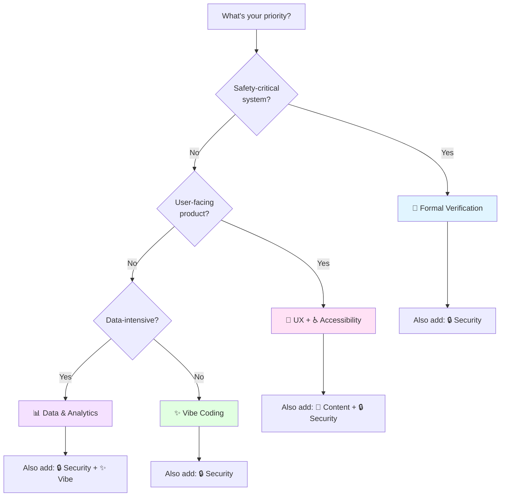
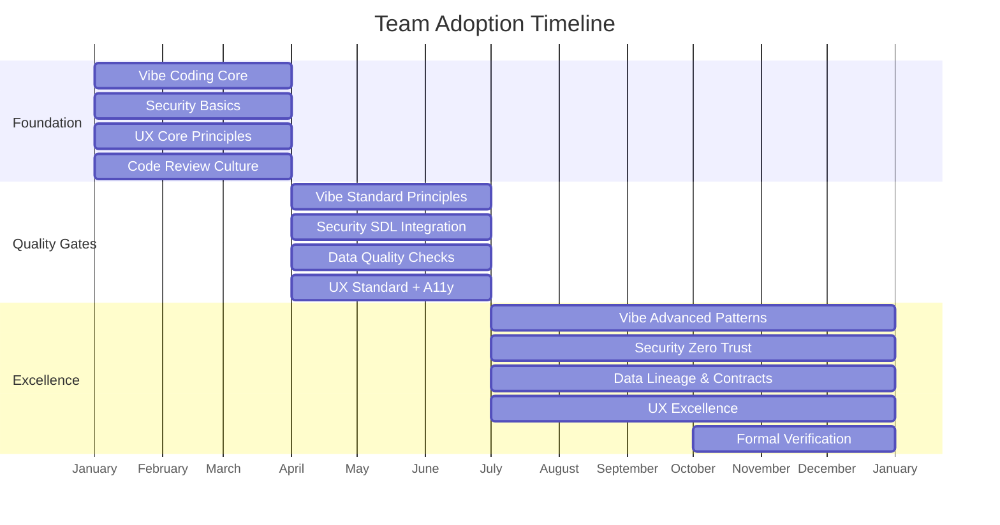

these are for coding agents mostly.

# Code Review Manifestos

**A reference index of software engineering manifestos for reliable, maintainable, secure, and high-quality systems**

---

## About This Project

This repository aggregates and structures high-quality software engineering manifestos that teams can use to standardize their code review practices and engineering culture. Each manifesto represents a coherent philosophy backed by industry best practices, research, and real-world experience.

### What is a Manifesto?

For inclusion in this repository, a manifesto must:

1. **Define a coherent philosophy**: Express a unified set of principles addressing a specific dimension of software quality
2. **Be actionable**: Provide concrete guidance that can be applied during code reviews and development
3. **Include implementation details**: Contain practical checklists, examples, and measurement frameworks
4. **Be well-documented**: Include clear explanations, rationale, and context for each principle
5. **Address a distinct concern**: Cover a dimension of software quality not fully addressed by existing manifestos
6. **Be production-ready**: Suitable for adoption in professional software engineering teams

### Project Scope

This collection focuses on manifestos relevant to code review and software engineering best practices across:

- **Correctness & Safety** (Formal Verification)
- **Maintainability** (Vibe Coding)
- **Data Quality** (Data & Analytics)
- **Security** (Security Hardening)
- **User Experience** (UX, Accessibility, Content)
- **Communication** (Documentation, Content)

### Manifesto Structure

All manifestos in this repository follow a consistent structure to facilitate comparison and adoption:

- **Title & Version**: Clear identification with semantic versioning
- **Core Principles**: Foundational concepts (typically tiered: Core/Standard/Excellence)
- **Implementation Guide**: Practical adoption timelines and checklists
- **Examples**: Anti-patterns and correct patterns for each principle
- **Tools & Ecosystem**: Recommended tools for enforcement and measurement
- **Measurement Framework**: Metrics and success criteria
- **Changelog**: Version history and evolution (for v2.0+ manifestos)

This consistency ensures that teams can:
- Compare manifestos across different dimensions of software quality
- Apply similar adoption patterns regardless of which manifesto they choose
- Measure progress using comparable frameworks
- Integrate multiple manifestos without structural conflicts

---

## Table of Contents

- [About This Project](#about-this-project)
  - [What is a Manifesto?](#what-is-a-manifesto)
  - [Project Scope](#project-scope)
  - [Manifesto Structure](#manifesto-structure)
- [Quick Selection Guide](#quick-selection-guide)
- [Manifesto Index](#manifesto-index)
  - [🔬 Formal Verification](#-formal-verification)
  - [✨ Vibe Coding](#-vibe-coding)
  - [📊 Data & Analytics](#-data--analytics)
  - [🔒 Security Hardening](#-security-hardening)
  - [🎨 User Experience](#-user-experience)
  - [♿ Accessibility](#-accessibility)
  - [📝 Content & Communication](#-content--communication)
- [Comparison Matrix](#comparison-matrix)
- [Selection by Role](#selection-by-role)
- [Selection by Context](#selection-by-context)
- [Implementation Quick Reference](#implementation-quick-reference)
- [Common Themes](#common-themes)
- [Adoption Timeline](#adoption-timeline)
- [Version Information](#version-information)
- [Contributing](#contributing)
- [License](#license)

---

## Quick Selection Guide

**Choose manifestos based on your primary concern:**

| If your priority is... | Start with | Also consider |
|------------------------|-----------|---------------|
| **Code correctness & safety** | 🔬 Formal Verification | ✨ Vibe Coding + 🔒 Security |
| **Code readability & maintainability** | ✨ Vibe Coding | 🎨 UX (if frontend) |
| **Data reliability & quality** | 📊 Data & Analytics | 🔒 Security Hardening |
| **System security & resilience** | 🔒 Security Hardening | 🔬 Formal (critical systems) |
| **User satisfaction & usability** | 🎨 User Experience | ✨ Vibe Coding + ♿ Accessibility |
| **Universal access & legal compliance** | ♿ Accessibility | 🎨 UX (broader context) |
| **Content clarity & documentation** | 📝 Content & Communication | ✨ Vibe Coding + 🎨 UX |
| **General software quality** | ✨ Vibe Coding | Context-dependent |

### Decision Tree

---

## Manifesto Index

### 🔬 Formal Verification

**[Formal Verification Manifesto](./formal_verification/FORMAL_VERIFICATION_MANIFESTO.md)** • v1.1 • 16 principles

#### At a Glance
- **Goal**: Mathematical correctness proofs
- **Primary Users**: Safety engineers, security researchers
- **Learning Curve**: Very High
- **ROI**: Long-term
- **Adoption**: Specialized (safety/security-critical)

#### Key Principles
- Specification as Foundation
- Types as Propositions (Curry-Howard)
- Totality & Termination
- Refinement Types
- Separation Logic
- Proof Automation
- Verified Compilation
- Incremental Formalization

#### Best Fit
- ✅ Safety-critical systems (avionics, medical, automotive)
- ✅ Security-critical components (cryptography, authentication)
- ✅ High-assurance software requiring mathematical proofs

#### Tools & Ecosystem
Coq • Isabelle • Lean • Agda • F* • Dafny • TLA+ • SPARK Ada

#### Implementation Guide
- 30-day quickstart path
- 3-month deep dive
- Tool selection decision tree
- Cost-benefit analysis framework

---

### ✨ Vibe Coding

**[Vibe Coding Manifesto](./vibe_coding/VIBE_CODING_MANIFESTO.md)** • v2.0 • [Changelog](./vibe_coding/CHANGELOG.md) • 15 principles

#### At a Glance
- **Goal**: Human readability & maintainability
- **Primary Users**: All developers
- **Learning Curve**: Medium
- **ROI**: Immediate
- **Adoption**: Universal

#### Key Principles (by tier)

**Core** (Universal - Start Here):
- Aesthetic Legibility
- Intentional Naming
- Literate Programming
- Obviousness Over Cleverness
- Locality & Cohesion

**Standard** (Language-Dependent):
- Semantic Density
- Immutability Default
- Contextual Verbosity
- Joyful Craft

**Excellence** (Requires Strong Types):
- Type as Documentation
- Composition Over Configuration
- Error as Value
- Constraint Propagation

#### Best Fit
- ✅ Long-lived production systems (10+ year horizon)
- ✅ Teams valuing correctness & maintainability
- ✅ Complex business logic domains
- ✅ Libraries and frameworks

#### Languages Covered
Python • TypeScript • Rust • Go • Haskell • Java

#### Implementation Guide
- 3-phase incremental adoption (weeks 1-2, months 1-2, months 3-6)
- Language-specific guidance
- Metrics & measurement framework
- Code review checklists

---

### 📊 Data & Analytics

**[Data & Analytics Manifesto](./data_analytics/DATA_ANALYTICS_MANIFESTO.md)** • v2.0 • [Changelog](./data_analytics/CHANGELOG.md) • 18 principles

#### At a Glance
- **Goal**: Data reliability & scalability
- **Primary Users**: Data engineers, analysts
- **Learning Curve**: Medium-High
- **ROI**: Medium-term
- **Adoption**: Data-intensive organizations

#### Key Principles
- Data as Product
- Single Source of Truth
- Immutability & Temporal Integrity
- Schema as Contract
- Data Quality by Design
- Lineage & Provenance
- Idempotency & Determinism
- Metrics as Code
- Data Observability
- Privacy & Compliance by Design
- Explicit Data Contracts
- Comprehensive Testing
- Cost-Aware Engineering

#### Best Fit
- ✅ Data warehouses & analytics platforms
- ✅ Data pipelines (batch and streaming)
- ✅ Business intelligence systems
- ✅ Machine learning platforms
- ✅ Data mesh architectures

#### Tools & Ecosystem
dbt • Airflow • Snowflake • BigQuery • Spark • Kafka • Great Expectations • Amundsen

#### Implementation Guide
- Per-principle implementation checklist
- 6-level maturity model
- Tool ecosystem map
- Cost optimization framework

---

### 🔒 Security Hardening

**[Security Hardening Manifesto](./security_hardening/SECURITY_HARDENING_MANIFESTO.md)** • v2.0 • [Changelog](./security_hardening/CHANGELOG.md) • 18 principles

#### At a Glance
- **Goal**: System security & resilience
- **Primary Users**: Security engineers, DevSecOps teams, all developers
- **Learning Curve**: Medium
- **ROI**: Immediate (avoid breach)
- **Adoption**: Universal (required)

#### Key Principles
- Defense in Depth
- Least Privilege
- Fail Secure
- Complete Mediation
- Zero Trust
- Cryptographic Agility
- Secure Development Lifecycle
- Audit Everything
- Separation of Duties
- Input Validation & Output Encoding
- Secure Secrets Management
- Vulnerability Management
- Immutable Infrastructure
- Threat Modeling
- Supply Chain Security
- Security Monitoring & Incident Response

#### Best Fit
- ✅ Security-critical applications (fintech, healthcare, government)
- ✅ Cloud-native and microservices architectures
- ✅ Organizations building security programs
- ✅ Compliance-driven environments (PCI-DSS, HIPAA, GDPR)
- ✅ DevSecOps transformation

#### Standards & Frameworks
OWASP Top 10 • NIST CSF • CIS Controls • ISO 27001 • PCI-DSS • GDPR

#### Implementation Guide
- Per-principle implementation checklists (18 total)
- 6-level security maturity model
- Tool ecosystem map (100+ tools: SIEM, SOAR, EDR, SAST, DAST, SCA)
- Compliance mapping (OWASP, NIST, CIS, ISO 27001, PCI-DSS, GDPR)
- Learning paths (30-day quickstart, 3-month deep dive, 1-day executive)
- Modern architecture guidance (cloud-native, microservices, containers, Kubernetes)
- Trade-offs & anti-patterns
- Organizational enablement

---

### 🎨 User Experience

**[UX Manifesto](./user_experience/UX_MANIFESTO.md)** • v2.0 • [Changelog](./user_experience/CHANGELOG.md) • 17 principles

#### At a Glance
- **Goal**: User success & satisfaction
- **Primary Users**: Designers, PMs, frontend developers
- **Learning Curve**: Medium
- **ROI**: Immediate-Medium
- **Adoption**: Universal (product-focused)

#### Key Principles (by tier)

**Core** (Non-negotiable):
- User Primacy
- Clarity Over Cleverness
- Progressive Disclosure
- Consistency & Coherence
- Accessibility as Foundation

**Standard** (Production-required):
- Immediate Feedback
- Forgiveness & Reversibility
- Recognition Over Recall
- Efficiency & Flow
- Appropriate Defaults
- Contextual Relevance
- Error Prevention
- Privacy & Ethical Design
- Navigation & Findability

**Excellence** (Differentiation):
- Aesthetic Integrity
- Performance as Feature
- Continuous Validation

#### Best Fit
- ✅ Web & mobile applications
- ✅ Voice interfaces & conversational UI
- ✅ AR/VR & spatial computing
- ✅ IoT devices & embedded systems
- ✅ Design systems & component libraries
- ✅ Multimodal interfaces

#### Standards & Coverage
Nielsen Heuristics • WCAG 2.1 AA • Core Web Vitals • Privacy-by-Design

#### Implementation Guide
- Core/Standard/Excellence implementation hierarchy
- Role-based ownership matrix
- Measurement framework with KPIs
- Conflict resolution framework

---

### ♿ Accessibility

**[Accessibility Manifesto](./accessibility/ACCESSIBILITY_MANIFESTO.md)** • v1.1 • [Changelog](./accessibility/CHANGELOG.md) • 15 principles

#### At a Glance
- **Goal**: Universal access & WCAG compliance
- **Primary Users**: Frontend developers, designers, accessibility specialists, all developers
- **Learning Curve**: Medium
- **ROI**: Immediate (avoid lawsuits) + Long-term (broader audience)
- **Adoption**: Universal (legally required)

#### Key Principles (by tier)

**Core** (WCAG A - Legal Minimum):
- Universal Design
- Perceivability
- Operability
- Keyboard Accessibility

**Standard** (WCAG AA - Industry Baseline):
- Understandability
- Robustness
- Semantic Structure
- Screen Reader Compatibility
- Sufficient Time
- Seizure Prevention
- Navigational Clarity
- Input Assistance

**Excellence** (WCAG AAA + Inclusive Design):
- Adaptive Technology Support
- Multimodal Interaction
- Testing & Validation

#### Best Fit
- ✅ All web and mobile applications (legal requirement)
- ✅ Government and education platforms (Section 508)
- ✅ E-commerce (settlement risk mitigation)
- ✅ Design systems & component libraries
- ✅ Public-facing applications
- ✅ Healthcare and financial services (high compliance stakes)

#### Standards & Frameworks
WCAG 2.1 AA/AAA • Section 508 • ADA • EAA (EU) • AODA (Ontario) • EN 301 549

#### Tools & Ecosystem
axe DevTools • WAVE • Lighthouse • Pa11y • NVDA • JAWS • VoiceOver • TalkBack • Colour Contrast Analyser • Accessibility Insights

#### Implementation Guide
- 3-tier implementation (Core/Standard/Excellence)
- Comprehensive measurement framework (automated + manual + user testing)
- 40+ tool ecosystem map (testing, CI/CD, screen readers, design systems)
- Legal compliance mapping (ADA, Section 508, EAA, AODA)
- Actionable checklists per tier
- Cost-benefit analysis (10% → 10× → 100× multiplier)

**Related**: Expands [UX Manifesto Principle VIII](#-user-experience) with WCAG implementation details

---

### 📝 Content & Communication

**[Content & Communication Manifesto](./content_communication/CONTENT_COMMUNICATION_MANIFESTO.md)** • v2.0 • [Changelog](./content_communication/CHANGELOG.md) • 18 principles

#### At a Glance
- **Goal**: Clear, maintainable, accessible content across all touchpoints
- **Primary Users**: Technical writers, developers, designers, DevRel, content strategists, product managers
- **Learning Curve**: Low-Medium
- **ROI**: Immediate (reduced support burden, higher conversion, better UX)
- **Adoption**: Universal (all projects with user-facing content)

#### Key Principles (by tier)

**Core** (Non-negotiable):
- Clarity as Prime Directive
- Semantic Hierarchy
- Precision in Terminology
- Accessibility as Requirement
- Empathy & Respect

**Standard** (Production-required):
- Audience-First Architecture
- Actionable Documentation
- Progressive Disclosure
- Scannability & Skimming
- Code as Communication
- Voice & Tone Consistency
- Version Control & Change Management
- Maintenance & Decay Prevention

**Excellence** (Differentiation):
- Visual Communication
- Searchability & Discoverability
- Content Governance & Strategy
- Internationalization & Localization
- Continuous Measurement

#### Best Fit
- ✅ Technical documentation (API docs, tutorials, guides, reference)
- ✅ UI/UX content (microcopy, error messages, tooltips, labels)
- ✅ Marketing content (landing pages, emails, product descriptions)
- ✅ Support content (help centers, FAQs, chatbots)
- ✅ Internal content (runbooks, incident reports, specifications)

#### Content Types Covered
Documentation • UI Microcopy • Error Messages • Marketing • Support • Onboarding

#### Tools & Ecosystem
Vale • alex • write-good • Grammarly • Docusaurus • MkDocs • OpenAPI • Mermaid • PlantUML • axe DevTools • Lighthouse • i18next • Crowdin • Plausible Analytics

#### Implementation Guide
- 4-phase adoption (Week 1-2, Month 1-2, Month 3-6, Ongoing)
- Content maturity model (5 levels)
- Diátaxis framework integration (Tutorial, How-to, Reference, Explanation)
- Measurement framework with content quality scorecard
- Role-specific guidance (8 roles)
- Tool ecosystem map (50+ tools)

**Related**: Complements [♿ Accessibility](#-accessibility), [🎨 UX](#-user-experience), [✨ Vibe Coding](#-vibe-coding)

---

## Comparison Matrix

| Aspect | 🔬 Formal Verification | ✨ Vibe Coding | 📊 Data & Analytics | 🔒 Security Hardening | 🎨 User Experience | ♿ Accessibility | 📝 Content & Communication |
|--------|----------------------|---------------|--------------------|--------------------|-------------------|----------------|---------------------------|
| **Focus** | Mathematical correctness | Human readability | Data reliability | System security | User success | Universal access | Content clarity & effectiveness |
| **Verification Method** | Formal proofs | Code review + tests | Data quality tests | Pen testing, audits, scanning | Usability testing + analytics | WCAG audits, screen reader testing, user testing with disabled users | Content audits, user feedback, readability scores |
| **Automation Tools** | Theorem provers, SMT solvers | Linters, formatters | Observability, monitoring | SAST, DAST, SCA, SIEM | A11y tools, analytics, A/B | axe, WAVE, Pa11y, Lighthouse | Vale, alex, link checkers, analytics |
| **Learning Curve** | ⚠️ Very High | ✓ Medium | ⚠️ Medium-High | ✓ Medium | ✓ Medium | ✓ Medium | ✓ Low-Medium |
| **Adoption Scope** | Specialized | ✓ Universal | Data-intensive | ✓ Universal (required) | ✓ Universal | ✓ Universal (legally required) | ✓ Universal |
| **ROI Timeline** | Long-term (years) | ✓ Immediate | Medium (months) | ✓ Immediate (avoid breach) | ✓ Immediate-Medium | ✓ Immediate (avoid lawsuits) + Long-term | ✓ Immediate (reduced support) |
| **Team Size Impact** | High (specialist knowledge) | Low (general practice) | Medium (platform teams) | Low-Medium (all engineers) | Low-Medium (designers) | Low-Medium (all roles) | Low (all roles) |
| **Criticality** | Safety-critical systems | All systems | Data-driven systems | All systems | All systems | All systems (legal requirement) | All systems with documentation/UI |

---

## Selection by Role

### Developers (Backend/Fullstack)
1. **Start**: ✨ Vibe Coding (Core principles) + 🔒 Security Hardening (basics)
2. **Add**: 📊 Data & Analytics (if data-heavy) OR 🎨 UX (if user-facing)
3. **Consider**: 🔬 Formal Verification (for critical components)

### Frontend Developers
1. **Start**: 🎨 User Experience + ♿ Accessibility + ✨ Vibe Coding + 🔒 Security (input validation, XSS prevention) + 📝 Content (UI microcopy, error messages)
2. **Priority**: Accessibility (WCAG AA compliance, screen reader testing), Performance (XIV), Consistency (IV), Security (CSP, CORS), Content (error messages, UI text)
3. **Focus**: UX Principle VIII + Accessibility Manifesto (full WCAG implementation details) + Content Manifesto (Principles I, III, V, XI)

### Data Engineers / Analysts
1. **Start**: 📊 Data & Analytics + 🔒 Security (data classification, PII protection)
2. **Add**: ✨ Vibe Coding (pipeline code quality)
3. **Focus**: Data Quality, Lineage, Observability, Privacy & Compliance

### Designers / Product Managers
1. **Start**: 🎨 User Experience + ♿ Accessibility + 📝 Content (UI copy, product messaging)
2. **Priority**: User Primacy (I), Accessibility (WCAG compliance, inclusive design), Privacy & Ethics (XIII), Continuous Validation (XV), Content (Clarity, Empathy)
3. **Consider**: ✨ Vibe Coding (understand engineering constraints) + 🔒 Security (privacy-by-design)
4. **Testing**: Include disabled users (≥20% of usability testing)

### Technical Writers / DevRel / Content Strategists
1. **Start**: 📝 Content & Communication (all tiers) + ♿ Accessibility
2. **Priority**: Core tier (Clarity, Semantic Hierarchy, Precision, Accessibility, Empathy), Diátaxis framework, Voice & Tone
3. **Add**: ✨ Vibe Coding (understand code examples) + 🎨 UX (understand user context)
4. **Tools**: Vale, MkDocs/Docusaurus, OpenAPI, Mermaid, link checkers, analytics
5. **Focus**: Technical documentation, API docs, tutorials, help centers, UI microcopy, error messages

### Platform / Infrastructure Engineers
1. **Start**: ✨ Vibe Coding + 🔒 Security Hardening
2. **Add**: 📊 Data & Analytics (observability) + 🔬 Formal Verification (critical paths)
3. **Priority**: All manifestos relevant due to infrastructure criticality

### Security Engineers
1. **Start**: 🔒 Security Hardening + 🔬 Formal Verification
2. **Add**: ✨ Vibe Coding + 🎨 UX (Privacy & Ethics principle) + 📊 Data (audit logging)
3. **Focus**: Threat modeling, supply chain security, incident response, cryptography verification

---

## Selection by Context

### Project Type

| Project Type | Primary | Secondary | Notes |
|--------------|---------|-----------|-------|
| **Web Application** | 🎨 UX + ♿ Accessibility + 🔒 Security | ✨ Vibe Coding + 📊 Data + 📝 Content | WCAG AA required; add 📊 if data-heavy, 📝 for UI copy/docs |
| **Mobile App** | 🎨 UX + ♿ Accessibility + 🔒 Security | ✨ Vibe Coding + 📝 Content | Performance, WCAG, privacy critical; screen reader testing + clear error messages mandatory |
| **API / Backend Service** | ✨ Vibe Coding + 🔒 Security + 📝 Content | 📊 Data (if stateful) | Consider 🔬 for auth/payments; 📝 critical for API docs |
| **Data Pipeline** | 📊 Data & Analytics + 🔒 Security | ✨ Vibe Coding + 📝 Content | Quality, observability, PII protection paramount; document data flows |
| **ML Platform** | 📊 Data & Analytics + 🔒 Security | ✨ Vibe Coding + 📝 Content | Reproducibility, lineage, model security critical; model cards documentation |
| **IoT / Embedded** | 🎨 UX + ♿ Accessibility + 🔒 Security | 🔬 Formal Verification + 📝 Content | Safety, usability, multimodal interaction, security constraints, clear error messages |
| **Financial System** | 🔬 Formal + 🔒 Security | 📊 Data + ✨ Vibe + ♿ A11y + 📝 Content | Correctness, auditability, compliance (ADA if customer-facing), clear disclosures |
| **Medical Device** | 🔬 Formal + 🔒 Security + ♿ Accessibility | 🎨 UX + 📝 Content | Safety, security, human factors, adaptive tech (FDA requirements), clear instructions for use |
| **Design System** | 🎨 UX + ♿ Accessibility + 📝 Content | ✨ Vibe Coding + 🔒 Security | WCAG-compliant components, comprehensive documentation, secure patterns |
| **CLI Tool** | ✨ Vibe Coding + 📝 Content | 🎨 UX + 🔒 Security | Clarity, error messages, secure input handling, help documentation |
| **Developer Portal** | 📝 Content + ♿ Accessibility | 🎨 UX + ✨ Vibe Coding | API documentation, tutorials, searchability, code examples paramount |

### Organizational Maturity

| Stage | Focus | Manifestos | Rationale |
|-------|-------|-----------|-----------|
| **Startup (MVP)** | Speed + UX + Security basics | 🎨 UX + ✨ Vibe (Core) + 🔒 Security (OWASP Top 10) | User validation + avoid basic security flaws |
| **Growth (Scaling)** | Quality + Reliability + Security | ✨ Vibe + 🔒 Security + 📊 Data | Technical debt prevention, compliance prep |
| **Enterprise (Mature)** | All dimensions | All manifestos | Domain-specific application, regulatory compliance |
| **Legacy Modernization** | Code quality + Security first | ✨ Vibe Coding + 🔒 Security | Refactoring foundation, harden vulnerabilities |

### Risk Profile

| Risk Level | Manifestos | Priority Principles |
|------------|-----------|---------------------|
| **Critical** (life/finance) | 🔬 Formal + 🔒 Security + 📊 Data | Correctness proofs, zero trust, auditability |
| **High** (security/PII) | 🔒 Security + 🔬 Formal + 🎨 UX (Privacy) | Cryptography, threat modeling, privacy-by-design |
| **Medium** (business-critical) | 🔒 Security + 📊 Data + ✨ Vibe | SDL, vulnerability mgmt, observability, maintainability |
| **Standard** (typical SaaS) | 🔒 Security (basics) + 🎨 UX + ✨ Vibe | OWASP Top 10, user satisfaction, code quality |

---

## Implementation Quick Reference

### Timeline by Manifesto

| Manifesto | Phase 1 | Phase 2 | Phase 3 |
|-----------|---------|---------|---------|
| **🔬 Formal Verification** | 30-day intro (1 component) | 3-month deep dive (module) | 6-12 month (subsystem) |
| **✨ Vibe Coding** | Weeks 1-2 (formatting, naming) | Months 1-2 (immutability, cohesion) | Months 3-6 (types, composition) |
| **📊 Data & Analytics** | Month 1 (observability, SLOs) | Months 2-4 (quality, contracts) | Months 5-12 (lineage, mesh) |
| **🔒 Security Hardening** | Week 1 (OWASP Top 10, MFA, secrets mgmt) | Months 1-3 (SDL, SIEM, threat modeling) | Months 4-12 (Zero Trust, supply chain, maturity level 3+) |
| **🎨 User Experience** | Week 1 (Core: accessibility, clarity) | Months 1-3 (Standard principles) | Ongoing (Excellence: performance, validation) |
| **♿ Accessibility** | Week 1 (Core: WCAG A, keyboard nav) | Months 1-3 (Standard: WCAG AA, screen readers) | Months 3-6+ (Excellence: WCAG AAA, user testing) |
| **📝 Content & Communication** | Weeks 1-2 (Core: clarity, style guide, accessibility) | Months 1-2 (Standard: docs-as-code, voice & tone, maintenance) | Months 3-6+ (Excellence: i18n, governance, measurement) |

### Resources Required

| Manifesto | Team Training | Tool Investment | External Expertise |
|-----------|---------------|-----------------|-------------------|
| 🔬 Formal | ⚠️ High (specialist courses) | Medium (proof assistants) | Often required |
| ✨ Vibe | ✓ Low (internal workshops) | Low (linters, formatters) | Rarely needed |
| 📊 Data | Medium (platform training) | ⚠️ High (platform tools) | Sometimes needed |
| 🔒 Security | Medium (OWASP, SDL training) | Medium-High (SIEM, SAST, SOAR) | Recommended (pentest, audits) |
| 🎨 UX | Medium (UX research methods) | Medium (testing tools) | Recommended |
| ♿ Accessibility | ✓ Low-Medium (WCAG training, screen reader basics) | ✓ Low (axe, WAVE, Pa11y - mostly free) | Recommended (WCAG audits, disabled user testing) |
| 📝 Content | ✓ Low (writing workshops, style guides) | ✓ Low (Vale, link checkers - mostly free) | Optional (tech writers, editors) |

### Success Metrics

| Manifesto | Leading Indicators | Lagging Indicators |
|-----------|-------------------|-------------------|
| 🔬 Formal | % code formally verified | Bug density in critical paths |
| ✨ Vibe | Code review approval time | Time to onboard new devs |
| 📊 Data | Data quality test coverage | Data incident frequency |
| 🔒 Security | Vuln SLA compliance, MTTD/MTTR | Security incidents, breach cost avoided |
| 🎨 UX | Usability test pass rate | User satisfaction (NPS/CSAT) |
| ♿ Accessibility | Automated test pass rate (100%), WCAG audit scores | ADA lawsuits avoided, screen reader user satisfaction, task completion parity |
| 📝 Content | Search success rate, link health, freshness | Support ticket deflection, "Was this helpful?" rating, user comprehension |

---

## Common Themes

Cross-cutting philosophy across all manifestos:

| Theme | Application |
|-------|-------------|
| **Quality by Design** | Build in correctness/quality from start, not retrofit |
| **Incremental Adoption** | Progressive enhancement from basic → advanced |
| **Explicit Over Implicit** | Make invariants, contracts, expectations explicit |
| **Automation Matters** | Leverage tooling for enforcement & verification |
| **Cost-Benefit Awareness** | Apply techniques proportional to criticality |
| **Documentation as Code** | Maintain docs alongside implementation |
| **Security as Foundation** | Security integrated at every layer and phase |

---

## Adoption Timeline

### Individual Engineer (Self-Directed)

**Week 1**: Read ✨ Vibe Coding (Core) + 🔒 Security (OWASP Top 10) + apply to next PR
**Week 2-4**: Add domain manifesto (🔬/📊/🎨 based on context)
**Month 2-3**: Implement intermediate/standard principles
**Month 4-6**: Explore advanced principles, share with team

### Team (Coordinated)

**Month 1-3 (Foundations)**:
- ✨ Vibe Coding: Formatting, naming, documentation standards
- 🔒 Security: MFA, secrets management, input validation, SAST in CI/CD
- 🎨 UX: Core principles (if user-facing)
- Establish code review culture
- Set up linting, formatting, security scanning automation

**Month 4-6 (Quality Gates)**:
- ✨ Vibe Coding: Testing philosophy, immutability
- 🔒 Security: SDL integration, threat modeling, vulnerability management
- 📊 Data: Quality checks, observability (if applicable)
- 🎨 UX: Standard principles, A11y testing
- Establish SLAs and monitoring

**Month 7-12 (Advanced Techniques)**:
- ✨ Vibe Coding: Type-driven design, advanced patterns
- 🔒 Security: Zero Trust implementation, supply chain security, security maturity level 3+
- 📊 Data: Contracts, lineage, cost optimization
- 🎨 UX: Excellence principles, continuous validation
- 🔬 Formal: Consider for critical components

### Organization (Federated)

**Quarter 1**: Pilot team adoption + tooling setup
**Quarter 2**: Expand to similar teams + refine playbooks
**Quarter 3-4**: Org-wide rollout with domain customization
**Ongoing**: Maturity assessment, continuous improvement, security audits

---

## Version Information

| Manifesto | Current Version | Last Updated | Status |
|-----------|----------------|--------------|--------|
| 🔬 Formal Verification | v1.1 | 2024 | Stable |
| ✨ Vibe Coding | v2.0 | 2025-11-20 | Current |
| 📊 Data & Analytics | v2.0 | 2025-11-20 | Current |
| 🔒 Security Hardening | v2.0 | 2025-11-20 | Current |
| 🎨 User Experience | v2.0 | 2025-11-20 | Current |
| ♿ Accessibility | v1.1 | 2025-11-20 | Current |
| 📝 Content & Communication | v2.0 | 2025-11-20 | Current |

**Changelog Access**: Each v2.0+ manifesto includes detailed changelog in respective directory.

---

## Contributing

These are living documents maintained by the community. We welcome all contributions that help improve the quality, clarity, and usefulness of these manifestos.

### How to Contribute

- **Feedback & Questions**: [Open an issue](../../issues) with suggestions or questions
- **Bug Reports**: Found a broken link, typo, or error? [Report it](../../issues)
- **Improvements**: Submit pull requests for clarifications, examples, or corrections
- **New Manifestos**: Propose new manifestos that meet our [inclusion criteria](#what-is-a-manifesto)
- **Case Studies**: Share adoption stories and lessons learned
- **Translations**: Help make these manifestos accessible to the global community

### Contribution Process

1. **Read [CONTRIBUTING.md](./CONTRIBUTING.md)** for detailed guidelines on:
   - Content standards and quality requirements
   - Style guide and formatting conventions
   - Quality checks and review process
   - Versioning and changelog updates

2. **Fork and create a feature branch**: `git checkout -b feature/your-improvement`

3. **Make your changes** following the [Style Guide](./STYLE_GUIDE.md)

4. **Run quality checks**: Link checking, markdown linting, spell checking

5. **Submit a pull request** with a clear description of your changes

### Recognition

All contributors are recognized through:
- GitHub contributor graph
- PR descriptions and commit history
- CHANGELOG.md entries (for significant contributions)

**By contributing, you agree that your contributions will be licensed under the same [CC0 1.0 Universal](./LICENSE) license.**

---

## License

**[CC0 1.0 Universal (Public Domain)](./LICENSE)**

To maximize reuse and accessibility, all manifestos in this repository are dedicated to the public domain under the CC0 1.0 Universal license.

This means you can:
- ✅ Use these manifestos in commercial and non-commercial projects
- ✅ Modify, adapt, and build upon them without attribution
- ✅ Include them in your company's engineering guidelines
- ✅ Translate and distribute them freely
- ✅ Use them for education, research, and training

**No permission required. No attribution required. Maximum freedom to use and adapt.**

For full legal text, see [LICENSE](./LICENSE).

---

## Source & Maintenance

**Origin**: Manifestos gathered from larsbx/tui-story repository
**Maintained**: As part of code review best practices initiative
**Questions**: [Open an issue](../../issues) for discussion

---

**Navigation**: [Top ↑](#code-review-manifestos) | [Quick Selection ↑](#quick-selection-guide) | [Comparison ↑](#comparison-matrix)
