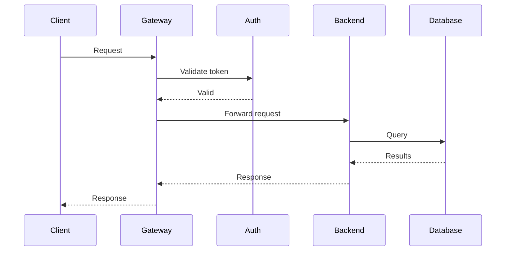
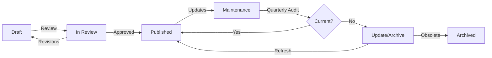

# Content & Communication Manifesto: 18 Foundational Principles

**Clear, accessible, actionable content across all touchpoints—from technical documentation to UI microcopy to marketing materials.**

---

## At a Glance

- **Goal**: Clear, maintainable, accessible content across all communication channels
- **Primary Users**: Technical writers, developers, designers, DevRel engineers, content strategists, product managers
- **Learning Curve**: Low-Medium
- **ROI**: Immediate (reduced support burden, higher conversion, better UX)
- **Adoption**: Universal (all projects with user-facing content)

**Content Types Covered**:
- Technical documentation (API docs, tutorials, guides, reference)
- UI/UX content (microcopy, error messages, tooltips, labels)
- Marketing content (landing pages, emails, product descriptions)
- Support content (help centers, FAQs, chatbots)
- Internal content (runbooks, incident reports, specifications)

---

## Principle Hierarchy

### Core Tier (Non-negotiable)
**Foundation for all content. Legal requirements. Usability baseline.**

1. **Clarity as Prime Directive** – Comprehension over cleverness
2. **Semantic Hierarchy** – Structure encodes meaning
3. **Precision in Terminology** – Consistent, defined terms
4. **Accessibility as Requirement** – WCAG 2.1 AA minimum
5. **Empathy & Respect** – Inclusive, blame-free language

### Standard Tier (Production-required)
**Professional quality. Organizational consistency. Maintainability.**

6. **Audience-First Architecture** – Reader goals determine structure
7. **Actionable Documentation** – Enable user success
8. **Progressive Disclosure** – Complexity gated by readiness
9. **Scannability & Skimming** – Optimize for F-pattern reading
10. **Code as Communication** – Executable, tested examples
11. **Voice & Tone Consistency** – Recognizable across touchpoints
12. **Version Control & Change Management** – Content as code
13. **Maintenance & Decay Prevention** – Regular audits, ownership

### Excellence Tier (Differentiation)
**Advanced practices. Competitive advantage. Continuous improvement.**

14. **Visual Communication** – Diagrams, screenshots, tables
15. **Searchability & Discoverability** – SEO, metadata, internal linking
16. **Content Governance & Strategy** – Workflows, ownership, lifecycle
17. **Internationalization & Localization** – Global-ready content
18. **Continuous Measurement** – Data-driven improvement

---

## Core Tier: Foundation

### I. Clarity as Prime Directive
**Every word serves comprehension; ambiguity eliminated; cognitive load minimized; reader understanding paramount.**

Obscurity is failure. Complexity without necessity is indulgence. Reader time precious; writer obligated to maximize comprehension per unit effort. Clear writing reflects clear thinking.

**Applies to**: All content types

**Guidelines**:
- Active voice preferred: "The system processes requests" > "Requests are processed by the system"
- Concrete over abstract: "Reduced load time from 3s to 800ms" > "Improved performance significantly"
- Short sentences: 15-20 words average; vary for rhythm
- One idea per sentence; one topic per paragraph
- Hemingway grade ≤ 10 for general audiences; adjust for domain expertise

**Context-specific application**:
- **Technical docs**: Precision, examples, no hand-waving
- **UI microcopy**: Ultra-concise, action-oriented (button: "Save changes" not "Proceed")
- **Error messages**: What happened, why, how to fix
- **Marketing**: Benefits clear, jargon minimized

```
Anti-pattern: Verbose, passive, abstract
"It has been observed that improvements in system performance
characteristics have been achieved through optimization efforts."

✓ Technical documentation
"We reduced response time by 60% through caching."

✓ UI microcopy
Button: "Save" | Error: "Invalid email address"

✓ Marketing
"Deploy in 30 seconds, not 30 minutes"
```

**Measurement**:
- Flesch-Kincaid grade level
- Average sentence length
- Passive voice percentage (<10% target)
- User comprehension testing

---

### II. Semantic Hierarchy
**Structure encodes meaning; headings form logical outline; visual hierarchy mirrors conceptual hierarchy.**

HTML semantics mandatory. Heading levels sequential (H1 → H2 → H3, no skips). Visual styling reinforces semantic structure. Document outline meaningful when extracted.

**Applies to**: Documentation, long-form content, web pages

```html
<!-- Anti-pattern: semantic chaos -->
<div class="big-text">Introduction</div>
<div class="medium-text">Overview</div>
<div class="medium-text">Details</div>

<!-- ✓ Semantic structure -->
<h1>User Authentication Guide</h1>
  <h2>Quick Start</h2>
    <h3>Installation</h3>
    <h3>Basic Configuration</h3>
  <h2>Authentication Methods</h2>
    <h3>OAuth 2.0</h3>
    <h3>API Keys</h3>
```

**Guidelines**:
- Heading levels: H1 (page title, once), H2 (major sections), H3 (subsections)
- Semantic HTML: `<article>`, `<section>`, `<aside>`, `<nav>`
- Lists: `<ul>` for unordered, `<ol>` for sequential, `<dl>` for term/definition
- Emphasis: `<strong>` for importance, `<em>` for stress, not `<b>` or `<i>`
- Accessibility: semantic structure enables screen readers, keyboard navigation

**UI Application**:
- Form labels use `<label>` with `for` attribute
- Buttons use `<button>`, not `<div onclick>`
- Navigation uses `<nav>` with proper ARIA landmarks

---

### III. Precision in Terminology
**Terms defined before use; jargon justified; synonyms avoided; consistency absolute.**

Technical writing and UI copy demand terminological rigor. Define domain terms explicitly. Use same term for same concept throughout. Glossary for ambiguous/novel terms.

**Applies to**: All content types (critical for UI consistency)

```
Anti-pattern: Synonym variation
"The service processes requests. When the system handles queries,
the application manages the workflow..."
(service = system = application? requests = queries?)

✓ Terminological precision
"The API gateway processes requests. When the gateway receives a
request, it validates, routes, and logs the request..."
(Consistent: gateway, request)
```

**UI Consistency Example**:
```
Anti-pattern: Synonym chaos
Button 1: "Submit form"
Button 2: "Send information"
Button 3: "Complete"

✓ Consistent terminology
All forms use: "Submit" (or all use "Save")
```

**Guidelines**:
- First use: define or link to definition
- Glossary: centralized term definitions
- Avoid: elegant variation (using synonyms for stylistic reasons)
- Abbreviations: spell out first use, abbreviation in parentheses
- Domain language: use established terminology from field
- UI terms: button labels, menu items must use identical terms across app

**Measurement**:
- Terminology consistency audit (quarterly)
- Controlled vocabulary enforcement
- User confusion metrics (support tickets about terminology)

---

### IV. Accessibility as Requirement
**WCAG 2.1 AA minimum; semantic HTML; screen reader compatible; keyboard navigable; color-blind safe.**

Accessible content reaches broader audience. Legal requirement in many jurisdictions. Improves SEO. Benefits all users.

**Applies to**: All digital content

**See dedicated [Accessibility Manifesto](../accessibility/ACCESSIBILITY_MANIFESTO.md) for comprehensive WCAG implementation.**

**Quick checklist for all content**:
- ✅ Semantic HTML (proper heading hierarchy)
- ✅ Alt text for all diagrams/screenshots/images
- ✅ 4.5:1 color contrast for text, 3:1 for UI components
- ✅ Keyboard-navigable interactive elements
- ✅ Screen reader testing with NVDA/JAWS/VoiceOver
- ✅ Captions for video, transcripts for audio
- ✅ Form labels properly associated
- ✅ Error messages announced to screen readers

```html
<!-- Anti-pattern: inaccessible -->
<div class="link" onclick="navigate()">Click here</div>

<span style="color: red">Error</span>

<!-- ✓ Accessible -->
<a href="/docs/authentication" aria-label="Read authentication documentation">
  Authentication Guide
</a>


<p>
  <span class="error-icon" aria-hidden="true">⚠</span>
  <span class="error-text">
    <strong>Error:</strong> Invalid API key.
    <a href="/docs/api-keys">Generate a new key</a>.
  </span>
</p>
```

**Content-Specific Guidelines**:
- **Documentation**: Proper heading hierarchy, descriptive link text
- **UI**: ARIA labels, focus states, keyboard shortcuts
- **Marketing**: Alt text for hero images, captions for promo videos
- **PDFs**: Tagged PDFs, OCR for scanned documents

**Related**: Full details in [♿ Accessibility Manifesto](../accessibility/)

---

### V. Empathy & Respect
**Language inclusive; examples diverse; frustration acknowledged; errors blamed on content/system, not user.**

Users arrive frustrated, time-constrained, varied backgrounds. Writing reflects empathy. Examples represent diverse contexts. Errors attributed to poor documentation/UX, never user incompetence.

**Applies to**: All content types (especially error messages, support)

```
Anti-pattern: Condescending, dismissive
"Obviously, you need to configure the API key first.
Simply set the environment variable. Anyone can do this."

✓ Empathetic, respectful (Technical docs)
"Before making API requests, you'll need an API key.

If you see a 401 Unauthorized error, the most common cause
is a missing or invalid API key. To fix this:

1. Generate a key at [dashboard.example.com/keys]
2. Set the environment variable:
   export API_KEY='your_key_here'
3. Retry your request

If you're still encountering issues, we're here to help:
support@example.com or #api-help on Slack."

✓ Empathetic error message (UI)
"We couldn't save your changes because the file is too large (max 10MB).
Try compressing images or splitting into multiple files."

✓ Empathetic marketing
"We know deployment can be stressful. Our one-click rollback
gives you peace of mind."
```

**Guidelines**:
- Inclusive language: avoid gendered terms, ableist metaphors
- Examples: varied names (international), scenarios (not just tech startups)
- Frustration acknowledgment: "This error message is confusing. Here's what it means..."
- Error attribution: "Our documentation wasn't clear..." not "You didn't configure..."
- Support channels: prominent, multiple options (docs, community, direct support)
- Tone: professional, helpful, patient; never sarcastic, cute, or dismissive

**Error Message Framework**:
1. **What happened**: "File upload failed"
2. **Why**: "File size exceeds 10MB limit"
3. **How to fix**: "Compress images or split into multiple files"
4. **Where to get help**: Link to docs or support

**Inclusive Language Examples**:
- ❌ "Guys" → ✅ "Team", "Everyone", "Folks"
- ❌ "Sanity check" → ✅ "Validation check", "Verification"
- ❌ "Master/Slave" → ✅ "Primary/Replica", "Leader/Follower"
- ❌ "Crazy simple" → ✅ "Remarkably simple"
- ❌ "Blind to errors" → ✅ "Unaware of errors"

---

## Standard Tier: Production Quality

### VI. Audience-First Architecture
**Content structured for reader goals, not author convenience; user journey determines information architecture.**

Writers serve readers. Content organization reflects user mental models, not organizational chart. Progressive disclosure: essential information first, details on demand.

**Applies to**: Documentation, marketing funnels, onboarding flows

**Guidelines**:
- Personas: define primary, secondary, tertiary audiences
- User journey mapping: what do they need, when, why?
- Information scent: headers/links preview destination content
- Inverted pyramid: conclusion first, supporting details follow
- Skimmability: readers scan before reading; optimize for scanning

```
Anti-pattern: Author-centric organization
1. Historical Background (10 pages)
2. Theoretical Foundations (15 pages)
3. Implementation Details (20 pages)
4. How to Actually Use This (2 pages)

✓ Reader-centric organization (Technical docs)
1. Quick Start (get value in 5 minutes)
2. Common Use Cases (solve specific problems)
3. Core Concepts (understand the model)
4. Reference (comprehensive details)
5. Background (history and theory)

✓ Reader-centric organization (Marketing site)
1. Above fold: Value proposition, CTA
2. Social proof: Customer logos, testimonials
3. Features: How it helps
4. Pricing: Clear tiers
5. FAQ: Address objections
6. Footer: Resources, legal
```

**User Journey Example**:
```
New user journey (documentation):
1. Lands via search → Finds relevant tutorial
2. Copies working example → Sees success in 5 minutes
3. Wants to customize → Discovers configuration reference
4. Encounters error → Finds troubleshooting guide
5. Curious about internals → Reads architectural explanation

Content structure must support this flow, not force linear reading.
```

---

### VII. Actionable Documentation
**Imperative mood for instructions; tasks over features; examples over abstractions; copy-paste ready code.**

Technical documentation enables action. Tutorials: step-by-step instructions. How-to guides: goal-oriented solutions. Reference: comprehensive enumeration. Explanation: conceptual understanding.

**Applies to**: Technical documentation, runbooks, troubleshooting guides

**Diátaxis Framework**:

| Type | Purpose | Form | Analogy |
|------|---------|------|---------|
| **Tutorial** | Learning-oriented | Lesson | Teaching child to cook |
| **How-To Guide** | Goal-oriented | Steps | Recipe |
| **Reference** | Information-oriented | Description | Encyclopedia |
| **Explanation** | Understanding-oriented | Discussion | History of cuisine |

```
Anti-pattern: Feature description
"The Logger class provides functionality for recording application
events to various destinations including files, databases, and
remote servers."

✓ Actionable instruction (Tutorial)
"To log errors to a file:

```python
from logger import Logger

logger = Logger('app.log')
logger.error('Database connection failed', context={'db': 'users'})
```

This writes timestamped errors to `app.log` with structured context."

✓ Actionable instruction (How-to)
"## How to Debug Failed Deployments

1. Check deployment logs:
   `kubectl logs deployment/myapp`
2. Look for error patterns (common: ImagePullBackOff, CrashLoopBackOff)
3. If ImagePullBackOff: Verify image name and registry credentials
4. If CrashLoopBackOff: Check application logs for startup errors"
```

**Guidelines**:
- Imperative verbs: "Click Save", "Run the command", "Configure the setting"
- Code examples: executable, tested, copy-paste ready
- Expected output: show what success looks like
- Troubleshooting: common errors + solutions
- Prerequisites: list upfront, link to setup guides

**Documentation Type Selection**:
- **New to product?** → Tutorial
- **Specific task?** → How-to guide
- **Looking up syntax?** → Reference
- **Understanding how it works?** → Explanation

---

### VIII. Progressive Disclosure
**Information revealed incrementally; complexity gated by user readiness; depth on demand.**

Overwhelming users destroys comprehension. Start simple. Layer complexity. Provide escape hatches to depth. Advanced features documented but not prominent.

**Applies to**: Documentation, onboarding, UI (wizards, settings)

```
Level 1: Get started (5 minutes)
├─ Install CLI
├─ Run first command
└─ See results

Level 2: Common tasks (30 minutes)
├─ Configure settings
├─ Deploy application
└─ Monitor status

Level 3: Advanced usage (2 hours)
├─ Custom workflows
├─ Integration patterns
└─ Performance tuning

Level 4: Reference (comprehensive)
├─ Full API documentation
├─ Configuration options
└─ Architecture details
```

**UI Application**:
```
✓ Settings page with progressive disclosure
Basic Settings (visible)
├─ Email notifications
├─ Language
└─ [Show advanced settings] ← Click to expand

Advanced Settings (hidden by default)
├─ API webhooks
├─ Custom CSS
└─ Developer mode
```

**Techniques**:
- Accordion/expand sections: hide details until requested
- "Learn more" links: optional depth without cluttering main path
- Sidebar navigation: shows structure without forcing linear reading
- Tooltips: inline definitions without interrupting flow
- "Advanced" sections: clearly marked, skippable for beginners

---

### IX. Scannability & Skimming
**Readers scan before reading; optimize for scanning; information-dense headings; bullet points for lists.**

Web reading: F-pattern eye tracking. Users scan headings, bullet points, bold text. Optimize for scanning; reading follows if scan succeeds.

**Applies to**: Web content, documentation, marketing pages

```
Anti-pattern: Wall of text
"Authentication can be performed using several different methods
depending on your use case and security requirements. The most
common approach is OAuth 2.0 which provides a secure delegation
framework, but you might also consider API keys for server-to-server
communication or JWT tokens for stateless authentication..."

✓ Scannable structure
## Authentication Methods

Choose based on your use case:

- **OAuth 2.0**: User authentication, third-party apps
- **API Keys**: Server-to-server, internal services
- **JWT Tokens**: Stateless auth, microservices
- **Session Cookies**: Traditional web apps

Each method trades off security, complexity, and flexibility.
```

**Guidelines**:
- Visual hierarchy: headings, bold, lists, whitespace
- Frontloading: key information in first sentence/paragraph
- Bullet points: parallel structure, start with strong words
- Bold sparingly: key terms only, not entire sentences
- Whitespace: breathing room between sections
- Descriptive headings: "How to Reset Password" > "Password Management"

**F-Pattern Optimization**:
```
Users read in F-pattern:
1. Horizontal scan of top (heading)
2. Horizontal scan of first paragraph
3. Vertical scan down left side (subheadings, bullets)

Optimize:
- Most important info in first two paragraphs
- Front-load bullet points with key terms
- Use descriptive subheadings
```

---

### X. Code as Communication
**Code examples tested, complete, idiomatic; comments explain why, not what; examples progress from simple to complex.**

Code is content. Examples must execute successfully. Comments clarify intent, not mechanics. Show idiomatic patterns, not pedagogical anti-patterns.

**Applies to**: Technical documentation, blog posts, tutorials

```python
# Anti-pattern: Untested, incomplete, commented unnecessarily
# Create a user object
user = User()  # User class
# Set the name
user.name = "Alice"  # Set name to Alice
# Save to database
user.save()  # Save user

# ✓ Tested, complete, purposeful comments
# Create user with validation
user = User(
    name="Alice",
    email="alice@example.com",
    role="admin"
)

# Encrypt password before storing (required by GDPR)
user.set_password("secure_password")

try:
    user.save()
except ValidationError as e:
    logger.error(f"User creation failed: {e}")
    raise
```

**Guidelines**:
- Executable examples: tested in CI, versioned with code
- Complete, not fragments: include imports, error handling, cleanup
- Idiomatic style: follow language conventions
- Progressive complexity: simple → intermediate → advanced
- Syntax highlighting: language-specific, accessible color schemes
- Inline annotations: explain non-obvious logic
- Copy-paste ready: no `...` placeholders, full working code

**Testing Code Examples**:
```yaml
# .github/workflows/test-docs.yml
name: Test Documentation Examples
on: [push, pull_request]
jobs:
  test-examples:
    runs-on: ubuntu-latest
    steps:
      - uses: actions/checkout@v3
      - name: Extract code blocks
        run: python scripts/extract_code_blocks.py
      - name: Run examples
        run: pytest docs_examples/
```

---

### XI. Voice & Tone Consistency
**Brand voice uniform across touchpoints; tone adjusts to context; style guide enforced; recognizable identity.**

Inconsistency signals carelessness or fragmented organization. Voice = personality (constant). Tone = emotion (context-dependent). Style guide documents decisions. Linters enforce mechanical consistency.

**Applies to**: All content types

**Voice (Constant)**: Who you are as a brand
**Tone (Variable)**: How you express it in different contexts

```yaml
# Style guide example
voice:
  personality: Professional, helpful, trustworthy (not cute, not sarcastic)
  person: Second ("you"), not first ("we") or third ("the user")
  tense: Present, not future ("click" not "you will click")
  mood: Imperative for instructions, indicative for explanation

tone_by_context:
  onboarding: Encouraging, supportive
  error_messages: Apologetic, solution-focused
  technical_docs: Precise, factual
  marketing: Confident, benefit-focused
  legal: Formal, comprehensive

terminology:
  - Use: "API key", avoid: "access token", "auth key"
  - Use: "response time", avoid: "latency", "speed"
  - Use: "deprecated", avoid: "legacy", "old"

formatting:
  - Code: `monospace` with syntax highlighting
  - UI elements: **bold** ("Click **Save**")
  - File paths: `italic monospace` (`/etc/config.yml`)
  - Placeholders: `<angle_brackets>` or `{curly_braces}`

numbers:
  - 0-9: spelled out ("three servers")
  - 10+: numerals ("42 requests")
  - Exception: technical contexts always numerals ("3ms", "5GB")
```

**Tone Adjustment Examples**:

| Context | Tone | Example |
|---------|------|---------|
| **Onboarding** | Encouraging | "Great! You've created your first project. Let's add some data." |
| **Error (recoverable)** | Helpful | "Connection lost. Retrying in 3 seconds..." |
| **Error (critical)** | Apologetic, clear | "We couldn't process your payment. No charges were made. Please verify your card details." |
| **Success** | Positive, brief | "Changes saved successfully" |
| **Documentation** | Neutral, precise | "The `timeout` parameter accepts values from 1-300 seconds. Default: 30." |
| **Marketing** | Confident, benefit-focused | "Deploy 10× faster with zero downtime" |

**Enforcement**:
- Vale, alex, write-good: automated style checking
- Templates: blog post, API documentation, tutorial, release notes
- Boilerplate: legal disclaimers, copyright notices, contribution guidelines
- Review process: style guide compliance checklist

---

### XII. Version Control & Change Management
**Documentation versioned with code; changelogs maintained; deprecation notices prominent; migration guides comprehensive.**

Documentation decays. Version control tracks changes. Changelogs communicate evolution. Deprecation warnings prevent breakage. Migration guides ease transitions.

**Applies to**: Technical documentation, product releases, API changes

```markdown
# Changelog

## [2.0.0] - 2025-11-20

### Breaking Changes
- **Authentication**: Removed support for API keys. Use OAuth 2.0.
  - **Migration guide**: See [OAuth Migration](./oauth-migration.md)
  - **Deprecation**: API keys deprecated in v1.8.0 (2025-06-01)

### Added
- WebSocket support for real-time updates
- Rate limiting per endpoint (see [Rate Limits](./rate-limits.md))

### Changed
- Response format: timestamps now ISO 8601 (was Unix epoch)
- Error codes: 4xx/5xx aligned with RFC 7231

### Fixed
- Documentation: corrected example in [Quick Start](./quickstart.md)

### Deprecated
- `/v1/users/list` endpoint. Use `/v2/users` instead. Removal: v3.0.0
```

**Guidelines**:
- Docs-as-code: Markdown in Git, reviewed like code
- Version selector: toggle between documentation versions
- Changelogs: Keep a Changelog format, semantic versioning
- Deprecation warnings: visible, actionable, with timeline
- Migration guides: step-by-step, automated tools when possible
- Date-stamping: "Last updated: YYYY-MM-DD" on each page

**Deprecation Notice Template**:
```html
<div class="deprecation-warning">
  ⚠️ <strong>Deprecated</strong>: This API endpoint will be removed in v3.0.0 (March 2026).
  Migrate to <a href="/docs/v2/users">the new Users API</a>.
  <a href="/docs/migration/v2-to-v3">Migration guide</a>
</div>
```

---

### XIII. Maintenance & Decay Prevention
**Documentation reviewed regularly; broken links detected; outdated content flagged; ownership assigned.**

Documentation rots. Code changes break examples. Links die. Regular maintenance mandatory. Ownership ensures accountability.

**Applies to**: All content (especially documentation, knowledge bases)

```yaml
# Documentation ownership (CODEOWNERS style)
/docs/api/           @backend-team @technical-writers
/docs/guides/        @devrel-team
/docs/reference/     @backend-team @devrel-team
/content/blog/       @marketing-team @devrel-team

# Maintenance schedule
- Weekly: Automated link checker
- Monthly: Review "last updated" dates, flag >6 months old
- Quarterly: Full content audit by DRI
- Per release: Update version-specific content
- Per deprecation: Add warnings, create migration guides

# Quality metrics
- Link health: <1% broken links
- Freshness: <10% pages >12 months old
- Completeness: 0 "TODO" or "Coming soon" in production
- Feedback: >4.0/5.0 average helpfulness rating
```

**Automation**:
```yaml
# .github/workflows/docs-health.yml
name: Documentation Health Check
on:
  schedule:
    - cron: '0 0 * * 0'  # Weekly
jobs:
  link-check:
    runs-on: ubuntu-latest
    steps:
      - uses: actions/checkout@v3
      - name: Check links
        uses: lycheeverse/lychee-action@v1
        with:
          args: --verbose --no-progress 'docs/**/*.md'
      - name: Flag stale content
        run: python scripts/check_freshness.py --threshold 180
```

**Guidelines**:
- Dead link detection: automated in CI (linkchecker, broken-link-checker, Lychee)
- Stale content detection: flag pages not updated in N months
- Feedback mechanism: "Was this helpful?" on every page
- Analytics: track page views, search queries, time-on-page
- Issue tracking: users report documentation bugs like code bugs
- Ownership: CODEOWNERS or similar, DRI (Directly Responsible Individual)

---

## Excellence Tier: Differentiation

### XIV. Visual Communication
**Diagrams clarify relationships; screenshots show interface; tables compare options; visual hierarchy guides attention.**

Text alone insufficient for spatial, relational, or procedural information. Diagrams encode structure. Screenshots verify understanding. Tables enable comparison.

**Applies to**: Documentation, marketing, presentations

```
Textual explanation (difficult):
"The client sends a request to the API gateway which authenticates
via the auth service then forwards to the backend which queries the
database and returns the response back through the gateway to the client."

✓ Visual diagram (clear):
┌────────┐     ┌─────────┐     ┌──────┐     ┌──────────┐
│ Client │────▶│ Gateway │────▶│ Auth │     │ Database │
└────────┘     └─────────┘     └──────┘     └──────────┘
                   │                             ▲
                   │         ┌─────────┐         │
                   └────────▶│ Backend │─────────┘
                             └─────────┘
```

**Guidelines**:
- Diagrams: architecture, flows, state machines, relationships
- Mermaid, PlantUML, Graphviz, Excalidraw: diagrams as code
- Screenshots: annotated with arrows/highlights, updated regularly
- Tables: comparison matrices, API parameters, configuration options
- Charts: metrics, trends, distributions (use accessible visualizations)
- Alt text: describe visual content for accessibility

**Diagram-as-Code Example**:


**Screenshot Best Practices**:
- Annotate with arrows, boxes, numbers
- Highlight relevant UI elements
- Crop to show only relevant area
- Update with each UI change (automated screenshot testing)
- Accessibility: full text alternative in caption

---

### XV. Searchability & Discoverability
**Metadata rich; SEO considered; internal linking extensive; search-friendly terminology.**

Users arrive via search (Google, internal search). Content must be findable. Metadata enables discovery. Internal linking creates knowledge graph.

**Applies to**: Web content, documentation, knowledge bases

```html
<!-- Rich metadata -->
<head>
  <title>OAuth 2.0 Authentication Guide | MyAPI Documentation</title>
  <meta name="description" content="Step-by-step guide to implementing OAuth 2.0 authentication with MyAPI. Includes code examples in Python, JavaScript, and Ruby.">
  <meta name="keywords" content="oauth, authentication, api, security, tutorial">
  <link rel="canonical" href="https://docs.example.com/auth/oauth">
</head>

<!-- Structured data -->
<script type="application/ld+json">
{
  "@context": "https://schema.org",
  "@type": "TechArticle",
  "headline": "OAuth 2.0 Authentication Guide",
  "author": "API Documentation Team",
  "datePublished": "2025-11-17",
  "dateModified": "2025-11-20"
}
</script>
```

**Guidelines**:
- SEO: descriptive titles, meta descriptions, header hierarchy
- Internal linking: related concepts, prerequisite reading, next steps
- Breadcrumbs: show location in information hierarchy
- Tags/categories: taxonomy for browsing
- Search: full-text search, filters, result previews
- Synonyms: accommodate different terminology ("latency" → "response time")
- URL structure: `/docs/category/topic` not `/docs/page123`

**Internal Linking Strategy**:
```markdown
## Prerequisites
Before implementing OAuth, ensure you have:
- [Created an API key](../api-keys/create)
- [Configured your application](../setup/configuration)
- Understanding of [HTTP authentication basics](../concepts/authentication)

## Next Steps
- [Implement token refresh](./token-refresh)
- [Handle OAuth errors](./error-handling)
- [See complete example application](../examples/oauth-demo)

## Related Topics
- [API Keys vs OAuth comparison](../concepts/auth-comparison)
- [Security best practices](../security/best-practices)
```

---

### XVI. Content Governance & Strategy
**Ownership assigned; workflows defined; review processes enforced; content lifecycle managed.**

Documentation without governance decays. Assign DRIs (Directly Responsible Individuals). Define creation, review, publication, and deprecation workflows.

**Applies to**: All content (especially organizational knowledge)

**CODEOWNERS for docs**:
```
# Documentation ownership
/docs/api/                @backend-team @technical-writers
/docs/tutorials/          @devrel-team @technical-writers
/docs/reference/          @product-team @technical-writers
/content/blog/            @marketing-team @devrel-team
/content/help-center/     @support-team @technical-writers
/content/legal/           @legal-team
```

**Content Lifecycle**:


**Workflows**:

| Content Type | Creator | Reviewer | Approver | Cadence |
|-------------|---------|----------|----------|---------|
| API Docs | Engineers | Tech Writer | Engineering Lead | Per release |
| Tutorials | DevRel | Tech Writer | DevRel Lead | Monthly |
| Blog Posts | Marketing/DevRel | Editor | Marketing Lead | Ad-hoc |
| Help Center | Support | Tech Writer | Support Lead | Per feature |
| Legal | Legal | Legal Lead | Legal + Exec | As needed |

**Review Checklist**:
- [ ] Follows style guide (Vale check passes)
- [ ] All links functional
- [ ] Code examples tested
- [ ] Accessibility requirements met (WCAG AA)
- [ ] SEO metadata complete
- [ ] Screenshots current
- [ ] Ownership assigned
- [ ] Related content linked

**Deprecation Workflow**:
1. **Month 0**: Announce deprecation, add warning banner
2. **Month 1**: Publish migration guide
3. **Month 3**: Email users still on old version
4. **Month 6**: Archive old content, redirect to new

---

### XVII. Internationalization & Localization
**Translation-ready; culturally aware; regional compliance considered; global-first mindset.**

English-first documentation excludes global audiences. Design for translation. Respect cultural differences. Consider regional legal requirements.

**Applies to**: All user-facing content (especially UI, documentation, marketing)

**i18n (Internationalization) - Design**:
```javascript
// Anti-pattern: Hardcoded strings
<button>Save your changes</button>
<p>You have 3 new messages</p>

// ✓ Externalized strings
<button>{t('actions.save')}</button>
<p>{t('messages.new_count', {count: 3})}</p>

// Translation files
// en.json
{
  "actions": {"save": "Save your changes"},
  "messages": {"new_count": "You have {{count}} new messages"}
}

// es.json
{
  "actions": {"save": "Guardar cambios"},
  "messages": {"new_count": "Tienes {{count}} mensajes nuevos"}
}
```

**L10n (Localization) - Adaptation**:
- **Language**: Translate UI, docs, marketing
- **Date/Time**: 2025-11-20 vs. 20/11/2025 vs. Nov 20, 2025
- **Currency**: $100 USD vs. €90 EUR vs. ¥14,000 JPY
- **Cultural**: Colors, images, examples, idioms
- **Legal**: GDPR (EU), CCPA (California), PIPL (China)
- **RTL support**: Arabic, Hebrew layouts

**Guidelines**:
- Avoid idioms, colloquialisms, cultural references
  - ❌ "Piece of cake" → ✅ "Easy to do"
  - ❌ "Hit a home run" → ✅ "Achieve great success"
- Use gender-neutral language
- Externalize all user-facing strings
- Consider text expansion (German ~30% longer than English)
- Use Unicode, UTF-8 encoding
- Test with pseudo-localization

**Localization Priority**:
```markdown
## Tier 1: High-ROI Languages (translate first)
- Spanish (LATAM + Spain)
- Simplified Chinese
- Japanese
- German
- French

## Tier 2: Growing Markets
- Portuguese (Brazil)
- Korean
- Hindi
- Arabic

## Tier 3: Long-tail
- Based on user analytics
```

**Tools**: Crowdin, Phrase, Lokalise, i18next, react-intl, vue-i18n

**Regional Compliance Example**:
```html
<!-- GDPR cookie consent (EU) -->
<div class="cookie-banner" data-region="EU">
  We use cookies. <a href="/privacy">Learn more</a>
  <button>Accept</button> <button>Reject</button>
</div>

<!-- CCPA opt-out link (California) -->
<footer data-region="US-CA">
  <a href="/privacy/ccpa">Do Not Sell My Personal Information</a>
</footer>
```

---

### XVIII. Continuous Measurement
**Metrics tracked; user feedback integrated; A/B testing conducted; data-driven improvement.**

Content effectiveness must be measured. Metrics inform priorities. User feedback reveals blind spots. A/B testing validates hypotheses.

**Applies to**: All content types

See full [Measurement Framework](#measurement-framework) section below.

**Key Metrics by Content Type**:

| Content Type | Leading Indicators | Lagging Indicators |
|-------------|-------------------|-------------------|
| **Documentation** | Search success rate, page views | Support ticket deflection, user satisfaction |
| **UI Microcopy** | Task completion rate, error recovery | User satisfaction, support volume |
| **Marketing** | Click-through rate, time on page | Conversion rate, signup/purchase |
| **Error Messages** | Error recovery rate, support clicks | Support ticket volume, user frustration |
| **Onboarding** | Step completion rate, time to value | Activation rate, retention |

**Feedback Collection**:
```html
<!-- Documentation feedback -->
<div class="page-feedback">
  <p>Was this page helpful?</p>
  <button data-vote="yes">Yes</button>
  <button data-vote="no">No</button>
  <textarea placeholder="How can we improve this page?"></textarea>
</div>

<!-- Track user behavior -->
<script>
  // Track scroll depth
  // Track time on page
  // Track link clicks
  // Track search queries
  // Track copy-paste of code examples
</script>
```

**A/B Testing Examples**:
- **Documentation**: Tutorial format A vs. format B (measure completion rate)
- **Error messages**: Technical vs. plain language (measure support clicks)
- **CTA buttons**: "Get Started" vs. "Start Free Trial" (measure clicks)
- **Onboarding**: Linear vs. choose-your-path (measure activation)

---

## Implementation Guide

### Phase 1: Foundation (Week 1-2)
**Focus**: Core Tier + style guide setup

**Deliverables**:
- [ ] Style guide document (voice, tone, terminology)
- [ ] Accessibility baseline audit (WCAG AA)
- [ ] Semantic HTML enforcement (linting)
- [ ] Core terminology glossary
- [ ] Empathy review of existing error messages

**Tools to set up**:
- Vale (prose linting) with base rules
- Markdown/HTML linter
- Accessibility checker (axe, Pa11y)

**Quick wins**:
- Fix top 10 worst error messages
- Add alt text to all images
- Establish heading hierarchy

**Time investment**: 10-20 hours (team-wide alignment)

---

### Phase 2: Production Quality (Month 1-2)
**Focus**: Standard Tier principles

**Deliverables**:
- [ ] Audience personas documented
- [ ] Content organized by Diátaxis framework
- [ ] Progressive disclosure in documentation/onboarding
- [ ] Voice & tone guide with context-specific examples
- [ ] Version control for documentation (docs-as-code)
- [ ] Maintenance schedule and ownership (CODEOWNERS)

**Tools to add**:
- Docs-as-code infrastructure (MkDocs, Docusaurus, etc.)
- Link checker automation (weekly CI job)
- Analytics (Plausible, Google Analytics)
- Feedback widget ("Was this helpful?")

**Content audit**:
- Review all documentation for scannability
- Ensure all code examples are tested
- Add "last updated" timestamps
- Flag stale content (>12 months old)

**Time investment**: 40-80 hours (distributed across team)

---

### Phase 3: Excellence (Month 3-6)
**Focus**: Excellence Tier principles

**Deliverables**:
- [ ] Visual communication standards (diagrams, screenshots)
- [ ] SEO optimization (metadata, internal linking)
- [ ] Content governance workflows documented
- [ ] Internationalization strategy (if global product)
- [ ] Measurement framework with dashboards

**Tools to add**:
- Diagram-as-code tooling (Mermaid, PlantUML)
- SEO tools (structured data, sitemaps)
- Translation management (if applicable)
- Analytics dashboards

**Advanced practices**:
- A/B test documentation formats
- User testing with target personas
- Content performance reviews (quarterly)
- Automated screenshot testing

**Time investment**: 80-120 hours (ongoing program)

---

### Phase 4: Continuous Improvement (Ongoing)
**Focus**: Measurement, iteration, maintenance

**Cadences**:
- **Weekly**: Automated checks (links, prose quality, accessibility)
- **Monthly**: Content freshness review, feedback analysis
- **Quarterly**: Full content audit, metrics review, strategy adjustment
- **Per release**: Version-specific documentation updates

**Metrics to track**:
- Documentation: Search success, page views, helpfulness ratings
- UI: Task completion, error recovery, support volume
- Marketing: Conversion rates, engagement metrics

---

## Measurement Framework

### Content Quality Scorecard

**Findability** (Can users find content?)
- Organic search traffic (trend)
- Internal search success rate (>85% target)
- Time to find information (user testing)
- Search query analysis (identify gaps)

**Comprehension** (Do users understand?)
- "Was this helpful?" ratings (>4.0/5.0 target)
- Time on page (Goldilocks zone: not too short, not too long)
- Support ticket deflection (docs reduced support load?)
- Task completion rate (can users complete workflows?)

**Correctness** (Is content accurate?)
- User-reported errors (track and fix)
- Example code execution success rate (100% target)
- Link health (>99% working target)
- Factual accuracy audits (quarterly)

**Freshness** (Is content current?)
- Median page age (<6 months ideal)
- % pages updated in last 6 months (>80% target)
- Version coverage (all supported versions documented?)
- Broken link rate (<1% target)

**Accessibility** (Can everyone access?)
- WCAG AA compliance (100% target)
- Automated test pass rate (Pa11y, axe)
- Screen reader compatibility (manual testing)
- Keyboard navigation coverage

**Efficiency** (Is content maintainable?)
- Review velocity (time to merge content PR <2 days)
- Ownership coverage (% content with assigned DRI >95%)
- Automation coverage (% checks automated >80%)

---

### Content Maturity Model

| Level | Characteristics | Typical Organizations |
|-------|----------------|----------------------|
| **1: Ad-hoc** | • No style guide<br>• Inconsistent structure<br>• Outdated content common<br>• No ownership | Early startups, technical debt |
| **2: Repeatable** | • Style guide exists<br>• Manual review process<br>• Some versioning<br>• Basic accessibility | Growing companies |
| **3: Defined** | • Automated linting<br>• CI/CD deployment<br>• Ownership assigned<br>• WCAG AA compliant | Mature teams |
| **4: Managed** | • Metrics tracked<br>• Regular audits<br>• User feedback integrated<br>• Governance workflows | Content-forward orgs |
| **5: Optimizing** | • Data-driven improvements<br>• A/B testing<br>• Continuous validation<br>• Strategic content ops | Best-in-class |

**Assessment**: Score each principle 1-5, average for overall maturity level.

---

## Tool Ecosystem Map

### Content Creation & Management

| Category | Tools | Purpose | Cost |
|----------|-------|---------|------|
| **Static Site Generators** | Docusaurus, MkDocs, Nextra, Mintlify, VitePress | Documentation websites | Free/Open Source |
| **API Documentation** | OpenAPI/Swagger, Redoc, Stoplight, ReadMe | API reference generation | Free - $$$ |
| **Headless CMS** | Contentful, Sanity, Strapi, Directus | Content management | Free - $$$ |
| **Knowledge Base** | Notion, Confluence, GitBook, Document360 | Internal/external docs | $$ - $$$ |

### Content Quality & Testing

| Category | Tools | Purpose | Cost |
|----------|-------|---------|------|
| **Prose Linting** | Vale, alex, write-good, textlint | Style guide enforcement | Free |
| **Grammar** | Grammarly, LanguageTool, Hemingway Editor | Writing quality | Free - $$ |
| **Link Checking** | linkchecker, broken-link-checker, Lychee | Dead link detection | Free |
| **Accessibility** | axe DevTools, WAVE, Pa11y, Lighthouse | WCAG compliance testing | Free |
| **Readability** | Hemingway Editor, readable.com, Flesch-Kincaid | Comprehension scoring | Free - $ |
| **Plagiarism** | Copyscape, Grammarly | Originality checking | $ - $$ |

### Visual Communication

| Category | Tools | Purpose | Cost |
|----------|-------|---------|------|
| **Diagramming** | Mermaid, PlantUML, Excalidraw, draw.io, Lucidchart | Diagrams-as-code, visual design | Free - $$ |
| **Screenshots** | Snagit, CloudApp, Cleanshot X | Annotated screenshots | $ - $$ |
| **Screen Recording** | Loom, Camtasia, OBS Studio | Video tutorials | Free - $$ |
| **Design** | Figma, Canva, Adobe Creative Suite | Marketing visuals | Free - $$$ |

### Localization & i18n

| Category | Tools | Purpose | Cost |
|----------|-------|---------|------|
| **Translation Management** | Crowdin, Phrase, Lokalise, POEditor | Translation workflows | $$ - $$$ |
| **i18n Libraries** | i18next, react-intl, vue-i18n, rails-i18n | Framework integration | Free |
| **Machine Translation** | DeepL, Google Translate API | Automated translation | Free - $$ |

### Analytics & Measurement

| Category | Tools | Purpose | Cost |
|----------|-------|---------|------|
| **Web Analytics** | Plausible, Fathom, Google Analytics, Matomo | Traffic, engagement | Free - $$ |
| **Search Analytics** | Algolia Insights, Elasticsearch | Search behavior | $$ - $$$ |
| **Heatmaps** | Hotjar, Crazy Egg, Microsoft Clarity | User interaction | Free - $$ |
| **Feedback** | Docsly, FeedBear, UserVoice | User feedback collection | $ - $$ |
| **A/B Testing** | Optimizely, Google Optimize, VWO | Experimentation | Free - $$$ |

### CI/CD Integration

| Category | Tools | Purpose | Cost |
|----------|-------|---------|------|
| **GitHub Actions** | Vale GitHub Action, Link Checker Action | Automated linting/testing | Free |
| **GitLab CI** | Custom jobs with Vale, linkchecker | CI pipeline integration | Free |
| **Pre-commit Hooks** | pre-commit, husky | Local validation | Free |

### Specialized

| Category | Tools | Purpose | Cost |
|----------|-------|---------|------|
| **API Testing** | Postman, Insomnia, Bruno | API example validation | Free - $$ |
| **Code Example Testing** | pytest, Jest, doctest | Executable documentation | Free |
| **Style Guides** | Google Style Guide, Microsoft Style Guide | Reference standards | Free |

**Cost Legend**: $ (<$100/mo) | $$ ($100-500/mo) | $$$ (>$500/mo)

---

## Common Anti-Patterns

| Anti-Pattern | Description | Fix |
|--------------|-------------|-----|
| **Novelization** | Starting with history/theory instead of quick start | Inverted pyramid: value first, theory later |
| **Wall of Text** | No headings, long paragraphs, no visual breaks | Scannability: headings, lists, whitespace |
| **Assumed Knowledge** | Undefined jargon, missing prerequisites | Define terms, link to prerequisites |
| **Stale Examples** | Code that no longer compiles/runs | Tested examples in CI, version-specific docs |
| **Dead Link Forest** | Unmaintained internal/external links | Automated link checking weekly |
| **Defensive Writing** | "Obviously...", "Simply...", "Just..." | Empathetic: acknowledge difficulty |
| **Feature Vomit** | Lists what system does, not how to use it | Actionable: tutorials > feature lists |
| **Clever Writing** | Puns, metaphors that obscure meaning | Clarity over cleverness |
| **Passive Voice Overload** | "It is recommended..." (by whom?) | Active voice: "We recommend..." |
| **Screenshot Hell** | 50 screenshots, minimal explanation | Screenshots + context + expected outcome |
| **RTFM Syndrome** | "See documentation" without link/context | Specific links, inline explanations |
| **Version Amnesia** | Single version documented, others ignored | Version selector, changelog |
| **Synonym Soup** | Different terms for same concept | Terminological precision, glossary |
| **Click Here Links** | Non-descriptive link text | Descriptive: "Read the API guide" |
| **PDF Prison** | Critical docs only in PDF format | HTML first, PDF optional |
| **Orphaned Content** | No navigation, dead ends | Breadcrumbs, "next steps", related links |
| **Jargon Jungle** | Unexplained technical terms | Glossary, inline definitions, tooltips |
| **Error Message Hostility** | Blaming user, no solution | Empathy, clear fix, support option |

---

## Selection by Role

### Technical Writers / Documentation Engineers
**Primary focus**: All Core + Standard principles

1. **Start**: Clarity (I), Semantic Hierarchy (II), Precision (III), Actionable (VII)
2. **Add**: Style guide enforcement (XI), maintenance automation (XIII)
3. **Master**: Diátaxis framework (VII), visual communication (XIV), searchability (XV)
4. **Tools**: Vale, MkDocs/Docusaurus, Mermaid, link checkers

**Key responsibilities**:
- Maintain style guide
- Review all content for consistency
- Automate quality checks
- Track content metrics

---

### Developers (Writing API Docs)
**Primary focus**: Core + selected Standard

1. **Start**: Clarity (I), Actionable Documentation (VII), Code as Communication (X)
2. **Focus**: OpenAPI/Swagger, executable examples, version control integration
3. **Avoid**: Feature listing without usage examples
4. **Tools**: OpenAPI, code example testing, docs-as-code

**Key responsibilities**:
- Write API reference documentation
- Provide tested code examples
- Update docs with code changes
- Review technical accuracy

---

### DevRel / Developer Advocates
**Primary focus**: Core + Audience-First + Measurement

1. **Start**: Audience-First (VI), Progressive Disclosure (VIII), Empathy (V)
2. **Add**: Scannability (IX), visual communication (XIV), searchability (XV)
3. **Focus**: Tutorials > reference, community feedback loops
4. **Tools**: Tutorial platforms, video recording, analytics

**Key responsibilities**:
- Create tutorials and how-to guides
- Gather user feedback
- Identify documentation gaps
- Measure content effectiveness

---

### UX Writers / Content Designers
**Primary focus**: Core + Voice & Tone + Internationalization

1. **Start**: Clarity (I), Precision (III), Voice & Tone (XI), Empathy (V)
2. **Focus**: UI microcopy, error messages, onboarding flows
3. **Cross-reference**: [UX Manifesto](../user_experience/) for broader context
4. **Tools**: Figma, i18n libraries, A/B testing platforms

**Key responsibilities**:
- Write UI copy (buttons, labels, tooltips)
- Design error messages
- Create onboarding content
- Ensure terminological consistency across product

---

### Product Managers (Writing Requirements/Specs)
**Primary focus**: Core + Audience-First + Precision

1. **Start**: Clarity (I), Precision in Terminology (III), Audience-First (VI)
2. **Focus**: User stories, acceptance criteria, non-ambiguous requirements
3. **Cross-reference**: UX Manifesto for product documentation
4. **Tools**: Notion, Confluence, Linear

**Key responsibilities**:
- Write clear specifications
- Define terminology for features
- Document product decisions
- Create release notes

---

### Marketing / Content Marketing
**Primary focus**: Core + Voice & Tone + Measurement

1. **Start**: Clarity (I), Audience-First (VI), Voice & Tone (XI)
2. **Add**: Scannability (IX), visual communication (XIV), searchability (XV), measurement (XVIII)
3. **Focus**: Conversion optimization, SEO, brand consistency
4. **Tools**: CMS, SEO tools, analytics, A/B testing

**Key responsibilities**:
- Maintain brand voice
- Optimize for conversion
- SEO optimization
- Content performance tracking

---

### Support / Customer Success
**Primary focus**: Core + Actionable + Empathy

1. **Start**: Clarity (I), Actionable (VII), Empathy (V)
2. **Focus**: Help articles, FAQs, troubleshooting guides
3. **Metric**: Support ticket deflection rate
4. **Tools**: Knowledge base platforms, feedback widgets

**Key responsibilities**:
- Write help center articles
- Create troubleshooting guides
- Identify common pain points
- Update content based on support tickets

---

### Engineering Managers / Leadership
**Primary focus**: Content Governance + Measurement

1. **Start**: Content Governance (XVI), Maintenance (XIII), Measurement (XVIII)
2. **Focus**: Ownership, processes, metrics, ROI
3. **Deliverables**: Assign DRIs, establish cadences, track KPIs

**Key responsibilities**:
- Assign content ownership
- Establish review processes
- Allocate resources for documentation
- Track content ROI

---

## Content Type Decision Matrix

### When to Use Each Content Type

| User Need | Content Type | Characteristics | Example |
|-----------|--------------|-----------------|---------|
| **Learn basics** | Tutorial | Step-by-step, beginner-friendly, guarantee success | "Build your first API integration" |
| **Solve specific problem** | How-to guide | Goal-oriented, assumes basics, practical | "How to implement rate limiting" |
| **Look up details** | Reference | Comprehensive, dry, organized | API endpoint reference, CLI command list |
| **Understand concepts** | Explanation | Conceptual, discursive, clarifying | "Understanding OAuth 2.0 flows" |
| **Quick answer** | FAQ | Question-answer pairs, scannable | "What's the difference between API keys and OAuth?" |
| **Troubleshoot error** | Troubleshooting guide | Problem → diagnosis → solution | "Debugging 401 Unauthorized errors" |
| **See it in action** | Video/demo | Visual, procedural, engaging | Product demo, feature walkthrough |
| **Quick reference** | Cheat sheet | Dense, scannable, expert-oriented | Markdown syntax, keyboard shortcuts |
| **Understand change** | Changelog/Release notes | Chronological, version-specific | "What's new in v2.0" |
| **Learn to migrate** | Migration guide | Before/after, step-by-step, version bridge | "Migrating from v1 to v2" |

---

## Success Metrics by Content Type

### Documentation
**Leading Indicators**:
- Search success rate (% queries finding answer)
- Page views on new content
- Time to complete tutorial (faster = better)
- Code example copy rate (engagement)

**Lagging Indicators**:
- Support ticket deflection (% issues resolved via docs)
- "Was this helpful?" rating (>4.0/5.0 target)
- User activation rate (docs → product usage)
- Organic search traffic (SEO success)

---

### UI Microcopy
**Leading Indicators**:
- Task completion rate (can users complete workflows?)
- Error recovery rate (users fix errors without support?)
- Time on task (faster = clearer copy)

**Lagging Indicators**:
- Support volume (fewer tickets = better copy)
- User satisfaction (NPS, CSAT)
- Feature adoption (clear copy → higher usage)

---

### Marketing Content
**Leading Indicators**:
- Click-through rate (CTR)
- Time on page
- Scroll depth
- Video watch completion

**Lagging Indicators**:
- Conversion rate (signup, purchase)
- Lead quality
- Brand awareness metrics
- Attribution to revenue

---

### Error Messages
**Leading Indicators**:
- Error recovery rate (users self-resolve)
- Support article clicks from error
- Retry success rate

**Lagging Indicators**:
- Support ticket volume for specific errors
- User frustration metrics
- Churn correlation

---

### Onboarding Content
**Leading Indicators**:
- Step completion rate (% completing each step)
- Time to value (first successful action)
- Drop-off points (identify friction)

**Lagging Indicators**:
- Activation rate (% reaching "aha moment")
- Retention (D1, D7, D30)
- Feature adoption

---

## Corollaries

**Metaprinciple: Writing is rewriting.**
First draft never sufficient. Editing essential. Remove 50% of words without losing meaning.

**Docs or It Doesn't Exist**: Undocumented features don't exist for users. Documentation is part of feature delivery, not an afterthought.

**Show, Don't Tell**: Examples > explanations. Demonstrations > descriptions. Working code > prose.

**Optimize for Scanning**: Users scan first, read second. Structure for scanning or lose readers in first 10 seconds.

**Test Documentation**: Examples must execute. Links must resolve. Instructions must work. Treat docs like code.

**Docs-as-Code Benefits**: Version control, code review, automated testing, CI/CD deployment. Documentation evolves with product.

**The Curse of Knowledge**: Writers assume too much. Fresh eyes essential. User testing reveals blind spots.

**Error Messages Are UI**: Error messages are often the only documentation users read. Invest accordingly.

**One Source of Truth**: Content duplication leads to inconsistency. Link, don't copy. Single source, multiple presentations.

**Content is a Product**: Treat content with same rigor as code. Invest in quality. Measure outcomes. Iterate based on data.

---

## Version Information

**Version**: 2.0
**Last Updated**: 2025-11-20
**Status**: Current
**Classification**: Public
**License**: CC0 - Public Domain

**Standards Alignment**:
- WCAG 2.1 AA (Accessibility)
- Plain Language Guidelines (US)
- Microsoft Style Guide
- Google Developer Documentation Style Guide
- Diátaxis Framework (Documentation structure)
- ISO/IEC/IEEE 26514 (Software user documentation)

**Changelog**: See [CHANGELOG.md](./CHANGELOG.md)

---

## Contributing

These are living documents. Contributions welcome:

- **Feedback**: [Open issues](../../issues) with suggestions or questions
- **Improvements**: Submit pull requests for clarifications or examples
- **Case Studies**: Share adoption stories and lessons learned
- **Translations**: Help make accessible to global community
- **Tool Recommendations**: Suggest additions to ecosystem map

**Style**: Follow the principles within this manifesto for contributions.

---

**Navigation**: [Top ↑](#content--communication-manifesto-18-foundational-principles) | [Principle Hierarchy ↑](#principle-hierarchy) | [Implementation ↑](#implementation-guide)
