# Ethics Manifesto: A Computable Framework for Software Engineering

**Version**: 1.2
**Classification**: Public
**License**: CC0 - Public Domain
**Framework**: Objectives Engine (Maqasid) + Means Classification Engine (Ahkam) applied to Software Engineering
**Last Updated**: 2025-11-22

---

## Quick Navigation

- **New to the framework?** → Start with [The Five Objectives](#the-five-objectives) and [Understanding the Hierarchy](#understanding-the-hierarchy)
- **Making decisions?** → See [The Decision Engine](#the-decision-engine) and [Practical Examples](#practical-examples)
- **Implementing in your team?** → Review [Domain Mappings](#domain-mappings) and [CI/CD Integration](#cicd-integration)
- **Executive summary** → Review [The Core Principle](#the-core-principle) and [Summary Table](#summary-table)
- **Theoretical comparison** → See [Addendum: Asimov's Three Laws vs. Maqasid Framework](#addendum-asimovs-three-laws-vs-maqasid-framework)

---

## The Core Principle

**Lower-priority gains cannot justify higher-priority harms.**

This manifesto provides a mathematically rigorous framework for making ethical engineering decisions by translating ethical axioms into computable weightings. It prevents "anti-patterns" like burnout, technical debt, and security compromises from being justified by short-term efficiency gains.

---

## The Five Objectives

The framework is built on five fundamental objectives, arranged in strict hierarchical order. Each objective has an assigned weight that determines its priority in decision-making.

### 1. System Integrity — Weight: 5x

**The system must be truthful, secure, and reliable.**

This is the highest priority objective. It encompasses:
- **Correctness**: The system does what it claims to do
- **Security**: Protection against malicious actors and vulnerabilities
- **Reliability**: Consistent behavior under expected conditions
- **Data Integrity**: Information remains accurate and uncorrupted

**Violations include:**
- Shipping code with known critical vulnerabilities
- Hardcoded secrets in repositories
- Ignoring CVEs (Common Vulnerabilities and Exposures)
- Dark patterns designed to deceive users
- Deploying untested security-critical code

**Examples:**
- Fixing a CVE: +2 System Integrity (Score: +10)
- Encryption at rest/transit: +1 System Integrity (Score: +5)
- Leaving credentials exposed: -3 System Integrity (Score: -15)

---

### 2. Human Sustainability — Weight: 4x

**The system must not harm the humans who build or use it.**

This objective protects both developers and end-users from harm:
- **Developer Wellbeing**: No burnout, sustainable pace, work-life balance
- **Cognitive Load**: Code complexity manageable by human minds
- **User Safety**: No addictive mechanics, privacy violations, or accessibility barriers
- **Mental Health**: No designs that exploit psychological vulnerabilities

**Violations include:**
- Mandatory crunch time or 60+ hour work weeks
- Addictive algorithms designed to trigger dopamine loops
- Excluding users with disabilities (accessibility failures)
- Privacy violations (selling user data, inadequate consent)
- Gaslighting users with manipulative UI patterns

**Examples:**
- Implementing WCAG accessibility: +2 Human Sustainability (Score: +8)
- Refactoring a 2000-line god object: +1 Human Sustainability (Score: +4)
- Mandatory 60-hour weeks: -3 Human Sustainability (Score: -12)

---

### 3. Knowledge Capital — Weight: 3x

**The system must be understandable and preserve institutional knowledge.**

This objective ensures the "intellect" of the system can be comprehended:
- **Documentation**: Architecture Decision Records (ADRs), API docs, runbooks
- **Code Clarity**: Self-explanatory code with appropriate comments
- **Specifications**: Formal or informal contracts defining behavior
- **Knowledge Transfer**: Onboarding materials, design documents
- **Explainability**: Understanding why the system makes decisions (especially AI)

**Violations include:**
- Deleting documentation without replacement
- "Black box" AI systems making life-altering decisions without explainability
- Undocumented architectural changes
- Complex code with no comments or context
- Tribal knowledge with no written record

**Examples:**
- Writing comprehensive API documentation: +1 Knowledge Capital (Score: +3)
- AI bias audits with explainability: +2 Knowledge Capital (Score: +6)
- Deleting ADRs during "cleanup": -2 Knowledge Capital (Score: -6)

---

### 4. System Longevity — Weight: 2x

**The system must survive and evolve across generations of developers.**

This objective ensures the codebase's "lineage" continues:
- **Maintainability**: Code can be modified safely over time
- **Refactoring**: Continuous improvement of internal structure
- **Test Coverage**: Protection against regressions during evolution
- **Immutable Infrastructure**: Reproducible deployments
- **Disaster Recovery**: System can survive failures and be restored

**Violations include:**
- Skipping tests to ship faster
- Manual deployments creating "snowflake" servers
- Configuration drift between environments
- Accumulating technical debt without payback plans
- No disaster recovery drills or backups

**Examples:**
- Comprehensive CI/CD pipeline: +1 System Longevity (Score: +2)
- Writing unit tests for critical paths: +1 System Longevity (Score: +2)
- Eliminating code reviews: -2 System Longevity (Score: -4)

---

### 5. Resource Efficiency — Weight: 1x

**The system should use resources (time, money, compute) wisely.**

This is the **lowest** priority objective. Efficiency gains cannot justify violations of higher objectives:
- **Development Speed**: Time to ship features
- **Cost Optimization**: Cloud costs, licensing, operational expenses
- **Performance**: CPU/memory usage, response times
- **Team Velocity**: Story points per sprint

**This is discretionary when it doesn't conflict with higher objectives:**
- Choosing a faster algorithm with the same correctness
- Optimizing database queries
- Reducing cloud costs through rightsizing
- A/B testing button colors

**Examples:**
- Optimizing a slow query: +1 Resource Efficiency (Score: +1)
- Eliminating code reviews for speed: +1 Resource Efficiency, -2 System Integrity (Score: +1 - 10 = **-9**)

---

## Understanding the Hierarchy

The mathematical foundation of this framework ensures that **lower-priority gains can never justify higher-priority harms**.

### The Mathematical Rule

```
Total Score = Σ (Impact × Weight)

Where:
  Impact ∈ {-3, -2, -1, 0, +1, +2, +3}
  Weight = {5, 4, 3, 2, 1} (by objective)
```

### Why the Weights Matter

The 5x-4x-3x-2x-1x multiplier structure creates mathematical "firebreaks" between priority levels:

- A **+3** gain in Resource Efficiency (lowest) = +3 points
- A **-1** loss in System Integrity (highest) = -5 points
- **Result**: Net score = -2 (rejected)

This means:
- You cannot sacrifice security for speed
- You cannot burn out your team for velocity
- You cannot delete documentation to ship faster
- You cannot skip accessibility to save time

**The system mathematically prevents these trade-offs.**

---

## The Unified Decision Engine

The framework consists of **two complementary engines** that work together:

### Engine 1: Objectives Engine (Maqasid) — "Why?"

Calculates the **weighted score** based on impact to the five objectives:

```
Total Score = Σ (Impact × Weight)

Where:
  Impact ∈ {-3, -2, -1, 0, +1, +2, +3}
  Weight = {5, 4, 3, 2, 1} (by objective)
```

**Verdict Thresholds:**
- **Score ≥ +3**: `:proceed` — Ethically sound
- **-2 ≤ Score < +3**: `:proceed_with_conditions` — Requires payback plan
- **Score < -2**: `:strongly_reject` — Violates core principles

### Engine 2: Means Engine (Ahkam) — "How?"

Classifies the **action** and determines **execution strategy**:

| Classification | Priority | Execution Strategy | Keywords | When to Use |
|----------------|----------|-------------------|----------|-------------|
| **Critical Required** 🔴 | 100 | `:blocking` | must, required, critical, blocker, fails, violates, fix, crash | Mandatory practices preventing direct harm |
| **Strongly Recommended** 🟡 | 70 | `:best_effort` | should, recommended, improves, enhances, monitoring, test, coverage | Highly beneficial practices improving quality |
| **Discretionary** 🟢 | 50 | `:opportunistic` | may, could, optional, consider, optimize, refactor, rename | Neutral practices where context determines value |
| **Anti-Pattern** 🟠 | 20 | `:skip` | avoid, premature, unnecessary, over-engineering, speculative | Discouraged practices introducing risk |
| **Prohibited** 🔴 | 0 | `:halt` | forbidden, never, unsafe, bypass, race_condition, undefined_behavior | Unethical practices causing direct harm |

### How the Engines Work Together

```mermaid
graph TD
    A[Decision Input] --> B[Objectives Engine]
    A --> C[Means Engine]
    B --> D[Calculate Weighted Score]
    C --> E[Classify Action]
    D --> F{Verdict}
    E --> G{Classification}
    F --> H[Final Execution Plan]
    G --> H
    H --> I{Execute?}
    I -->|Proceed + Critical| J[🚀 EXECUTE IMMEDIATELY blocking]
    I -->|Proceed + Recommended| K[✨ SCHEDULE SOON best_effort]
    I -->|Proceed + Discretionary| L[📅 BACKLOG opportunistic]
    I -->|Any + Prohibited| M[❌ HALT Action is forbidden]
    I -->|Reject + Any| N[🛑 HALT Violates objectives]
    I -->|Anti-Pattern| O[🗑️ SKIP Anti-pattern detected]
```



### Final Execution Matrix

| Objectives Verdict | Means Classification | Final Action | Priority |
|--------------------|---------------------|--------------|----------|
| `:strongly_reject` | _any_ | ❌ **HALT**: Violates core objectives | N/A |
| _any_ | `:prohibited` | ❌ **HALT**: Action is fundamentally forbidden | 0 |
| `:proceed` | `:critical_required` | 🚀 **EXECUTE IMMEDIATELY** (blocking) | 100 |
| `:proceed` | `:strongly_recommended` | ✨ **SCHEDULE SOON** (best effort) | 70 |
| `:proceed` | `:discretionary` | 📅 **BACKLOG** (opportunistic) | 50 |
| _any_ | `:anti_pattern` | 🗑️ **SKIP** (anti-pattern detected) | 20 |
| `:proceed_with_conditions` | `:critical_required` | ⚠️ **EXECUTE WITH PAYBACK PLAN** | 100 |
| `:proceed_with_conditions` | _other_ | 🤔 **MANUAL REVIEW REQUIRED** | varies |

---

### Decision Examples

#### Example 1: Critical Security Fix

**Input**: "Fix critical type error in Dialyzer spec"

**Objectives Analysis**:
- System Integrity: +2 (fixes vulnerability) → +10
- Human Sustainability: +1 (reduces cognitive load) → +4
- Knowledge Capital: +1 (improves type safety) → +3
- System Longevity: +1 (prevents future bugs) → +2
- Resource Efficiency: -1 (takes time) → -1
- **Total Score**: +18

**Means Classification**:
- Keywords detected: "fix", "critical"
- Severity: `:critical`
- **Classification**: Critical Required
- **Priority**: 100
- **Execution**: `:blocking`

**Final Decision**:
```
🚀 EXECUTE IMMEDIATELY (blocking)
Verdict: ✅ PROCEED (Score: +18)
Class: CRITICAL REQUIRED (Priority 100)
```

---

#### Example 2: Dangerous Shortcut

**Input**: "Bypass verification to ship faster"

**Objectives Analysis**:
- System Integrity: -2 (removes safety) → -10
- Resource Efficiency: +1 (faster shipping) → +1
- **Total Score**: -9

**Means Classification**:
- Keywords detected: "bypass"
- Severity: `:critical`
- **Classification**: Prohibited
- **Priority**: 0
- **Execution**: `:halt`

**Final Decision**:
```
❌ HALT: Action is fundamentally prohibited
Verdict: 🛑 STRONGLY REJECT (Score: -9)
Class: PROHIBITED (Priority 0)
```

---

#### Example 3: Refactoring with Conditions

**Input**: "Refactor god object, skip docs temporarily"

**Objectives Analysis**:
- Human Sustainability: +1 (reduces complexity) → +4
- Knowledge Capital: -1 (docs delayed) → -3
- System Longevity: +1 (maintainability) → +2
- Resource Efficiency: -1 (time investment) → -1
- **Total Score**: +2

**Means Classification**:
- Keywords detected: "refactor"
- Severity: `:medium`
- **Classification**: Strongly Recommended
- **Priority**: 70
- **Execution**: `:best_effort`

**Final Decision**:
```
⚠️ EXECUTE WITH PAYBACK PLAN
Verdict: ⚠️ PROCEED WITH CONDITIONS (Score: +2)
Class: STRONGLY RECOMMENDED (Priority 70)
Conditions:
  - Document refactoring within 2 sprints
  - Add ADR explaining design decisions
  - Update team wiki with new structure
```

---

## Practical Examples

### Example 1: The Crunch Time Demand

**Scenario**: Manager demands mandatory 60-hour weeks to meet deadline.

**Analysis**:
- Resource Efficiency: +1 (faster delivery) → +1
- Human Sustainability: -3 (burnout, unsustainable) → -12
- **Total Score**: +1 - 12 = **-11**

**Decision**: `:strongly_reject`

**Rationale**: "This violates Human Sustainability (Weight 4x). No deadline justifies team burnout. Alternative: Reduce scope or extend timeline."

---

### Example 2: Skipping Tests for Speed

**Scenario**: Skip unit tests to ship feature faster.

**Analysis**:
- Resource Efficiency: +1 (faster shipping) → +1
- System Longevity: -2 (regression risk) → -4
- **Total Score**: +1 - 4 = **-3**

**Decision**: `:strongly_reject`

**Rationale**: "Tests protect future changes. This creates technical debt that endangers system evolution."

---

### Example 3: Emergency Security Patch

**Scenario**: Deploy critical CVE fix immediately, document later.

**Analysis**:
- System Integrity: +2 (fixes vulnerability) → +10
- Knowledge Capital: -1 (temporary doc gap) → -3
- **Total Score**: +10 - 3 = **+7**

**Decision**: `:proceed_with_conditions`

**Conditions**: "Document the fix within 2 sprints. Add regression test. Update ADR."

---

### Example 4: Accessibility Implementation

**Scenario**: Add WCAG 2.1 AA compliance to application.

**Analysis**:
- Human Sustainability: +2 (users with disabilities included) → +8
- Resource Efficiency: -1 (extra development time) → -1
- **Total Score**: +8 - 1 = **+7**

**Decision**: `:proceed`

**Rationale**: "Human Sustainability (4x) vastly outweighs the minor efficiency cost. Accessibility is a moral and legal requirement."

---

### Example 5: Refactoring god object

**Scenario**: Refactor 2000-line class into smaller, cohesive modules.

**Analysis**:
- Human Sustainability: +1 (reduced cognitive load) → +4
- Knowledge Capital: +1 (clearer structure) → +3
- System Longevity: +1 (easier maintenance) → +2
- Resource Efficiency: -1 (time investment) → -1
- **Total Score**: +4 + 3 + 2 - 1 = **+8**

**Decision**: `:proceed`

**Rationale**: "Benefits to understanding and maintainability far exceed time cost."

---

### Example 6: Eliminating Code Reviews

**Scenario**: Remove code reviews to increase velocity.

**Analysis**:
- Resource Efficiency: +1 (faster merges) → +1
- System Integrity: -2 (bugs slip through) → -10
- Knowledge Capital: -1 (no knowledge sharing) → -3
- System Longevity: -2 (regression risk) → -4
- **Total Score**: +1 - 10 - 3 - 4 = **-16**

**Decision**: `:strongly_reject`

**Rationale**: "Code reviews are a critical defense layer. This catastrophically undermines system integrity and team knowledge."

---

## Domain Mappings

This section translates the ethical axioms into **concrete practices** across the five primary domains of modern software development.

---

### 1. Domain of Security & Reliability Engineering

**Primary Objectives**: System Integrity (5x) • Resource Efficiency (1x)

This domain is the **most rigid** because it protects the fundamental "truth" of the system.

#### Critical Required

**Definition**: Practices that are absolutely mandatory. Omission is a severe violation.

- **Encryption at Rest/Transit**: You must protect data. Leaving it exposed violates user trust
  - Score: +2 System Integrity (+10)

- **Access Control (RBAC)**: Preventing unauthorized mutation of state
  - Score: +2 System Integrity (+10)

- **Input Validation**: Sanitizing inputs to prevent injection attacks (corruption of truth)
  - Score: +1 System Integrity (+5)

- **Vulnerability Patching**: Fixing known CVEs within SLA
  - Score: +2 System Integrity (+10)

#### Prohibited

**Definition**: Practices that are absolutely forbidden. They cause direct harm.

- **Hardcoded Secrets**: Committing API keys to code repositories
  - Score: -3 System Integrity (-15)

- **Dark Patterns**: UI designs specifically created to deceive users
  - Score: -2 System Integrity (-10), -2 Human Sustainability (-8)

- **Ignoring CVEs**: Knowingly shipping code with critical vulnerabilities
  - Score: -3 System Integrity (-15)

- **Disabled Security Features**: Turning off HTTPS, removing CSP headers for "convenience"
  - Score: -2 System Integrity (-10)

#### Example Decision

**Scenario**: "We don't have time to rotate the leaked API key; let's ship and fix next sprint."

**Analysis**:
- System Integrity: -3 (credential exposure) → -15
- Resource Efficiency: +1 (no delay) → +1
- **Score**: -14

**Decision**: `:strongly_reject` — "Security cannot be deferred. Rotate immediately."

---

### 2. Domain of DevOps & Infrastructure (SRE)

**Primary Objectives**: System Longevity (2x) • System Integrity (5x)

This domain focuses on the **"lineage"** of the code—ensuring it survives and evolves across generations of developers.

#### Strongly Recommended

**Definition**: Practices that should be standard unless there's a specific reason otherwise.

- **Immutable Infrastructure**: Servers replaced rather than patched (ensures consistency)
  - Score: +1 System Longevity (+2), +1 System Integrity (+5)

- **Comprehensive CI/CD**: Automating the "ritual" of deployment to remove human error
  - Score: +1 System Longevity (+2), +1 System Integrity (+5)

- **Disaster Recovery Drills**: Practicing for failure to ensure system survival
  - Score: +1 System Longevity (+2), +1 System Integrity (+5)

- **Infrastructure as Code (IaC)**: Version-controlled infrastructure definitions
  - Score: +1 System Longevity (+2), +1 Knowledge Capital (+3)

#### Anti-Pattern

**Definition**: Practices that should be avoided but aren't strictly prohibited.

- **Manual Deployments**: "Clicking around" in the console creates "snowflake" servers
  - Score: -1 System Longevity (-2), -1 System Integrity (-5)

- **Configuration Drift**: Allowing environments (Dev, Staging, Prod) to diverge
  - Score: -1 System Longevity (-2)

- **No Monitoring**: Deploying without observability
  - Score: -1 System Integrity (-5)

#### Example Decision

**Scenario**: "Let's manually SSH into production to fix this config instead of updating the Terraform."

**Analysis**:
- Resource Efficiency: +1 (faster immediate fix) → +1
- System Longevity: -2 (creates drift) → -4
- Knowledge Capital: -1 (undocumented change) → -3
- **Score**: +1 - 4 - 3 = **-6**

**Decision**: `:strongly_reject` — "Update IaC and apply through pipeline. This creates unmanageable drift."

---

### 3. Domain of Product Management & UX

**Primary Objectives**: Human Sustainability (4x) • System Integrity (5x)

This domain governs how the system impacts human life—both the user's and the developer's.

#### Critical Required

- **Accessibility (a11y)**: Ensuring the system can be used by people with disabilities
  - Score: +2 Human Sustainability (+8)
  - **Legal Requirement**: WCAG 2.1 AA, ADA, Section 508

- **Privacy Compliance (GDPR/CCPA)**: Protecting the user's "digital self"
  - Score: +2 Human Sustainability (+8), +1 System Integrity (+5)

- **Informed Consent**: Users understand what they're agreeing to
  - Score: +1 Human Sustainability (+4), +1 System Integrity (+5)

#### Discretionary

**Definition**: Practices that are ethically neutral. Neither encouraged nor discouraged.

- **Feature Toggles**: Releasing a feature to 10% of users
  - Score: 0 (neutral if transparent)

- **A/B Testing**: Testing blue vs. green buttons
  - Score: 0 (neutral if not deceptive)

- **Aesthetic Choices**: Pixel pushing, color schemes
  - Score: +1 Resource Efficiency (if improves UX)

#### Prohibited

- **Addictive Mechanics**: Algorithms designed to trigger dopamine loops at expense of mental health
  - Score: -3 Human Sustainability (-12)

- **Deceptive Patterns**: Hidden unsubscribe buttons, forced continuity
  - Score: -2 Human Sustainability (-8), -2 System Integrity (-10)

- **Selling User Data**: Without explicit, informed consent
  - Score: -3 Human Sustainability (-12)

#### Example Decision

**Scenario**: "Add infinite scroll with autoplay to increase engagement time."

**Analysis**:
- Resource Efficiency: +1 (more ad views) → +1
- Human Sustainability: -2 (addictive pattern) → -8
- **Score**: +1 - 8 = **-7**

**Decision**: `:strongly_reject` — "Optimizing for addiction violates Human Sustainability. Engagement must respect user autonomy."

---

### 4. Domain of Software Architecture

**Primary Objectives**: Knowledge Capital (3x) • Resource Efficiency (1x)

Architecture protects the **"Intellect"** of the system—how well it can be understood and reasoned about.

#### Strongly Recommended (Mandub)

- **Domain-Driven Design (DDD)**: Aligning code with real-world business language
  - Score: +1 Knowledge Capital (+3), +1 System Longevity (+2)

- **Documentation (ADRs)**: Writing down why a decision was made
  - Score: +2 Knowledge Capital (+6)
  - **Rationale**: Without this, institutional knowledge dies when senior engineers leave

- **Explicit Contracts**: API specifications, interface definitions
  - Score: +1 Knowledge Capital (+3), +1 System Integrity (+5)

#### Anti-Pattern (Makruh)

- **Premature Microservices**: Splitting a system before necessary adds cognitive load
  - Score: -1 Knowledge Capital (-3), -1 Human Sustainability (-4)

- **god objects**: Classes that do too much, impossible to reason about
  - Score: -2 Knowledge Capital (-6), -1 Human Sustainability (-4)

- **Magic Numbers**: Hardcoded constants without explanation
  - Score: -1 Knowledge Capital (-3)

#### Example Decision

**Scenario**: "Refactor this monolith into 47 microservices to be 'cloud-native'."

**Analysis**:
- Knowledge Capital: -2 (cognitive overload) → -6
- Human Sustainability: -2 (operational burden) → -8
- Resource Efficiency: -1 (network overhead) → -1
- **Score**: -6 - 8 - 1 = **-15**

**Decision**: `:strongly_reject` — "Microservices without clear bounded contexts harm understanding. Start with modular monolith."

---

### 5. Domain of Data Science & AI

**Primary Objectives**: System Integrity (5x) • Human Sustainability (4x)

#### Critical Required

- **Bias Audits**: Ensuring the model doesn't discriminate against specific groups
  - Score: +2 System Integrity (+10), +1 Human Sustainability (+4)
  - **Rationale**: Violates system integrity if biased

- **Explainability**: Users must know why a decision was made
  - Score: +2 Knowledge Capital (+6), +1 Human Sustainability (+4)

- **Data Privacy**: PII protection, anonymization, consent
  - Score: +2 Human Sustainability (+8), +1 System Integrity (+5)

#### Prohibited

- **Black Box Sentencing**: Using AI for life-altering decisions (hiring, loans, bail) without human oversight or explainability
  - Score: -3 System Integrity (-15), -3 Human Sustainability (-12)

- **Training on Biased Data**: Without mitigation
  - Score: -2 System Integrity (-10)

- **Manipulative Recommendations**: "Rage bait" content optimization
  - Score: -3 Human Sustainability (-12)

#### Example Decision

**Scenario**: "Deploy ML hiring model without bias testing; we'll monitor metrics and fix if issues arise."

**Analysis**:
- System Integrity: -2 (untested bias) → -10
- Human Sustainability: -2 (potential discrimination) → -8
- Resource Efficiency: +1 (faster to market) → +1
- **Score**: -10 - 8 + 1 = **-17**

**Decision**: `:strongly_reject` — "Bias audits are mandatory before deployment. Discrimination harm is irreversible."

---

## Summary Table: The Developer's Field Guide

| Domain | Action | Classification | Objective Preserved | Impact Score |
|--------|--------|----------------|---------------------|--------------|
| **Security** | Fixing a CVE | Critical Required | System Integrity | +10 |
| **Security** | Hardcoded secrets | Prohibited | System Integrity | -15 |
| **Testing** | Writing unit tests | Strongly Recommended | System Longevity | +2 |
| **Testing** | Skipping tests for speed | Prohibited | System Longevity | -4 |
| **Frontend** | Accessibility fix (WCAG) | Critical Required | Human Sustainability | +8 |
| **Frontend** | Dark patterns | Prohibited | Human Sustainability, System Integrity | -18 |
| **Frontend** | Pixel pushing | Discretionary | Resource Efficiency | 0 to +1 |
| **Backend** | Refactoring god object | Strongly Recommended | Knowledge Capital, Human Sustainability | +7 |
| **Backend** | Premature microservices | Anti-Pattern | Knowledge Capital | -6 |
| **Data** | Bias audit | Critical Required | System Integrity, Human Sustainability | +14 |
| **Data** | Selling user data | Prohibited | Human Sustainability | -12 |
| **Process** | Code reviews | Strongly Recommended | System Integrity, Knowledge Capital | +8 |
| **Process** | Mandatory crunch | Prohibited | Human Sustainability | -12 |
| **Infrastructure** | Immutable infrastructure | Strongly Recommended | System Longevity, System Integrity | +7 |
| **Infrastructure** | Manual deployments | Anti-Pattern | System Longevity | -7 |

---

## CI/CD Integration

This framework can be integrated directly into your build pipeline to provide **automated ethical guardrails**.

### 1. Pull Request Linting

Add an "Ethics Bot" that scores PRs based on the framework:

```yaml
# .github/workflows/ethics-check.yml
name: Ethics Framework Check

on: [pull_request]

jobs:
  ethics-analysis:
    runs-on: ubuntu-latest
    steps:
      - name: Analyze PR Impact
        run: |
          # Check for anti-patterns
          if grep -r "hardcoded.*password\|api.*key" .; then
            echo "❌ REJECTED: Hardcoded secrets detected (-15 System Integrity)"
            exit 1
          fi

          # Check for documentation
          if git diff --name-only | grep -q "\.md$"; then
            echo "✅ Documentation updated (+3 Knowledge Capital)"
          fi

          # Check for test coverage
          if git diff --name-only | grep -q "_test\."; then
            echo "✅ Tests included (+2 System Longevity)"
          else
            echo "⚠️  WARNING: No tests detected (-4 System Longevity)"
          fi
```

### 2. Architecture Decision Records (ADRs)

Use the analysis map as a structured ADR template:

```markdown
# ADR-042: Implement Rate Limiting on API

## Decision
Add rate limiting to prevent abuse.

## Ethics Framework Analysis
- System Integrity: +1 (prevents DoS) → +5
- Resource Efficiency: +1 (cost control) → +1
- **Total Score**: +6

## Recommendation
:proceed - Protects system integrity without negative trade-offs.

## Implementation
- Use token bucket algorithm
- 1000 req/hour per user
- Return 429 with Retry-After header
```

### 3. Incident Post-Mortems

Categorize root causes by which objective was violated:

```markdown
# Incident #2024-11-22: Production Outage

## Root Cause
Manual deployment bypassed staging tests.

## Violated Objectives
- System Integrity: -2 (untested code) → -10
- System Longevity: -1 (broken CI/CD) → -2
- **Ethics Score**: -12

## Remediation
1. Enforce deployment pipeline (no SSH access)
2. Immutable infrastructure (IaC only)
3. Post-deployment verification tests

## Prevention Score After Remediation
+ System Integrity: +1 (automated checks) → +5
+ System Longevity: +1 (IaC enforced) → +2
= +7 (ethical improvement achieved)
```

### 4. CLI Tool Implementation

A complete command-line tool integrating both engines:

```elixir
# lib/mix/tasks/decision_analyze.ex
defmodule Mix.Tasks.Decision.Analyze do
  use Mix.Task

  @shortdoc "Analyzes a software decision using the Unified Ethics Framework"

  @moduledoc """
  Analyzes a decision using the combined Maqasid (Objectives) and Ahkam (Means) frameworks.

  ## Usage

      mix decision.analyze [options] "Description of the decision"

  ## Options
      --int   <int>   Impact on System Integrity (-3 to +3)
      --sus   <int>   Impact on Human Sustainability (-3 to +3)
      --know  <int>   Impact on Knowledge Capital (-3 to +3)
      --long  <int>   Impact on System Longevity (-3 to +3)
      --eff   <int>   Impact on Resource Efficiency (-3 to +3)

  ## Examples

      # Critical security fix
      mix decision.analyze --int=2 --sus=1 --know=1 \\
        "Fix critical type error in Dialyzer spec"

      # Dangerous shortcut
      mix decision.analyze --int=-2 --eff=1 \\
        "Bypass verification to ship faster"
  """

  def run(args) do
    {opts, [description | _], _} = OptionParser.parse(args, strict: [
      int: :integer, sus: :integer, know: :integer,
      long: :integer, eff: :integer
    ])

    # 1. Run Objectives Analysis (Maqasid)
    objectives_result = analyze_objectives(opts, description)

    # 2. Run Means Analysis (Ahkam)
    means_result = classify_means(description, objectives_result)

    # 3. Print Report
    print_report(description, objectives_result, means_result)
  end

  defp analyze_objectives(opts, description) do
    impacts = %{
      system_integrity: opts[:int] || 0,
      human_sustainability: opts[:sus] || 0,
      knowledge_capital: opts[:know] || 0,
      system_longevity: opts[:long] || 0,
      resource_efficiency: opts[:eff] || 0
    }

    score = calculate_weighted_score(impacts)
    verdict = determine_verdict(score)

    %{
      impacts: impacts,
      score: score,
      verdict: verdict,
      description: description
    }
  end

  defp calculate_weighted_score(impacts) do
    impacts.system_integrity * 5 +
    impacts.human_sustainability * 4 +
    impacts.knowledge_capital * 3 +
    impacts.system_longevity * 2 +
    impacts.resource_efficiency * 1
  end

  defp determine_verdict(score) when score >= 3, do: :proceed
  defp determine_verdict(score) when score >= -2, do: :proceed_with_conditions
  defp determine_verdict(_score), do: :strongly_reject

  defp classify_means(description, obj_result) do
    text = String.downcase(description)

    classification = cond do
      matches_keywords?(text, ~w(forbidden never unsafe bypass)) ->
        :prohibited
      matches_keywords?(text, ~w(must required critical blocker crash)) ->
        :critical_required
      matches_keywords?(text, ~w(avoid premature unnecessary)) ->
        :anti_pattern
      matches_keywords?(text, ~w(should recommended improves enhances)) ->
        :strongly_recommended
      true ->
        :discretionary
    end

    %{
      classification: classification,
      priority: priority_for(classification),
      execution: execution_for(classification)
    }
  end

  defp matches_keywords?(text, keywords) do
    Enum.any?(keywords, &String.contains?(text, &1))
  end

  defp priority_for(:critical_required), do: 100
  defp priority_for(:strongly_recommended), do: 70
  defp priority_for(:discretionary), do: 50
  defp priority_for(:anti_pattern), do: 20
  defp priority_for(:prohibited), do: 0

  defp execution_for(:critical_required), do: :blocking
  defp execution_for(:strongly_recommended), do: :best_effort
  defp execution_for(:discretionary), do: :opportunistic
  defp execution_for(:anti_pattern), do: :skip
  defp execution_for(:prohibited), do: :halt

  defp print_report(desc, obj, means) do
    IO.puts """

    ═══════════════════════════════════════════════════════════════════
    🏗️  UNIFIED ENGINEERING DECISION REPORT
    ═══════════════════════════════════════════════════════════════════

    DECISION: "#{desc}"

    ───────────────────────────────────────────────────────────────────
    1. OBJECTIVES ANALYSIS (Why?)
    ───────────────────────────────────────────────────────────────────

    Score: #{format_score(obj.score)}
    Verdict: #{format_verdict(obj.verdict)}

    Impact Profile:
    🎯 Integrity:       #{bar(obj.impacts.system_integrity)} (#{obj.impacts.system_integrity})
    👥 Sustainability:  #{bar(obj.impacts.human_sustainability)} (#{obj.impacts.human_sustainability})
    📚 Knowledge:       #{bar(obj.impacts.knowledge_capital)} (#{obj.impacts.knowledge_capital})
    🌱 Longevity:       #{bar(obj.impacts.system_longevity)} (#{obj.impacts.system_longevity})
    💰 Efficiency:      #{bar(obj.impacts.resource_efficiency)} (#{obj.impacts.resource_efficiency})

    ───────────────────────────────────────────────────────────────────
    2. MEANS CLASSIFICATION (How?)
    ───────────────────────────────────────────────────────────────────

    Class:    #{format_classification(means.classification)}
    Priority: #{means.priority}
    Strategy: #{String.upcase(Atom.to_string(means.execution))}

    ───────────────────────────────────────────────────────────────────
    3. FINAL EXECUTION PLAN
    ───────────────────────────────────────────────────────────────────

    #{final_recommendation(obj.verdict, means.classification)}

    ═══════════════════════════════════════════════════════════════════
    """
  end

  defp format_score(s) when s > 0, do: IO.ANSI.green() <> "+#{s}" <> IO.ANSI.reset()
  defp format_score(s) when s < 0, do: IO.ANSI.red() <> "#{s}" <> IO.ANSI.reset()
  defp format_score(0), do: "0"

  defp format_verdict(:strongly_reject), do: "🛑 STRONGLY REJECT"
  defp format_verdict(:proceed), do: "✅ PROCEED"
  defp format_verdict(:proceed_with_conditions), do: "⚠️ PROCEED WITH CONDITIONS"

  defp format_classification(:prohibited), do: "🔴 PROHIBITED"
  defp format_classification(:critical_required), do: "🔴 CRITICAL REQUIRED"
  defp format_classification(:strongly_recommended), do: "🟡 STRONGLY RECOMMENDED"
  defp format_classification(:discretionary), do: "🟢 DISCRETIONARY"
  defp format_classification(:anti_pattern), do: "🟠 ANTI-PATTERN"

  defp bar(score) when score >= 2, do: "█████"
  defp bar(score) when score == 1, do: "███  "
  defp bar(0), do: "▒▒   "
  defp bar(score) when score == -1, do: "▓▓▓  "
  defp bar(score) when score <= -2, do: "▓▓▓▓▓"

  defp final_recommendation(:strongly_reject, _),
    do: "❌ HALT: Violates core objectives."
  defp final_recommendation(_, :prohibited),
    do: "❌ HALT: Action is fundamentally prohibited."
  defp final_recommendation(:proceed, :critical_required),
    do: "🚀 EXECUTE IMMEDIATELY (Blocking)"
  defp final_recommendation(:proceed, :strongly_recommended),
    do: "✨ SCHEDULE SOON (Best Effort)"
  defp final_recommendation(:proceed, :discretionary),
    do: "📅 BACKLOG (Opportunistic)"
  defp final_recommendation(_, :anti_pattern),
    do: "🗑️ SKIP (Anti-Pattern detected)"
  defp final_recommendation(:proceed_with_conditions, :critical_required),
    do: "⚠️ EXECUTE WITH PAYBACK PLAN (Blocking)"
  defp final_recommendation(_, _),
    do: "🤔 MANUAL REVIEW REQUIRED"
end
```

**Example Output:**

```
═══════════════════════════════════════════════════════════════════
🏗️  UNIFIED ENGINEERING DECISION REPORT
═══════════════════════════════════════════════════════════════════

DECISION: "Fix critical type error in Dialyzer spec"

───────────────────────────────────────────────────────────────────
1. OBJECTIVES ANALYSIS (Why?)
───────────────────────────────────────────────────────────────────

Score: +18
Verdict: ✅ PROCEED

Impact Profile:
🎯 Integrity:       █████ (+2)
👥 Sustainability:  ███   (+1)
📚 Knowledge:       ███   (+1)
🌱 Longevity:       ███   (+1)
💰 Efficiency:      ▓▓▓   (-1)

───────────────────────────────────────────────────────────────────
2. MEANS CLASSIFICATION (How?)
───────────────────────────────────────────────────────────────────

Class:    🔴 CRITICAL REQUIRED
Priority: 100
Strategy: BLOCKING

───────────────────────────────────────────────────────────────────
3. FINAL EXECUTION PLAN
───────────────────────────────────────────────────────────────────

🚀 EXECUTE IMMEDIATELY (Blocking)

═══════════════════════════════════════════════════════════════════
```

### 5. Autonomous Agent Loop

For fully autonomous execution, implement a task prioritization loop:

```elixir
defmodule Agent.EthicsLoop do
  @moduledoc """
  Autonomous agent loop that:
  1. Takes a list of pending tasks
  2. Analyzes each through the Unified Framework
  3. Sorts by Priority (100 -> 0)
  4. Executes blocking tasks, schedules best_effort, backlogs opportunistic, skips anti-patterns
  """

  def process_task_queue(tasks) do
    tasks
    |> Enum.map(&analyze_task/1)
    |> Enum.reject(fn t -> t.means.classification == :anti_pattern end)
    |> Enum.reject(fn t -> t.means.classification == :prohibited end)
    |> Enum.reject(fn t -> t.objectives.verdict == :strongly_reject end)
    |> Enum.sort_by(& &1.means.priority, :desc)
    |> execute_by_strategy()
  end

  defp analyze_task(task) do
    objectives_result = AnalyzeObjectives.run(task)
    means_result = ClassifyMeans.run(task, objectives_result)

    %{
      task: task,
      objectives: objectives_result,
      means: means_result
    }
  end

  defp execute_by_strategy(analyzed_tasks) do
    blocking = Enum.filter(analyzed_tasks, fn t ->
      t.means.execution == :blocking
    end)

    best_effort = Enum.filter(analyzed_tasks, fn t ->
      t.means.execution == :best_effort
    end)

    opportunistic = Enum.filter(analyzed_tasks, fn t ->
      t.means.execution == :opportunistic
    end)

    # Execute in priority order
    Enum.each(blocking, &execute_immediately/1)
    Enum.each(best_effort, &schedule_soon/1)
    Enum.each(opportunistic, &add_to_backlog/1)
  end

  defp execute_immediately(task), do: IO.puts("🚀 EXECUTING: #{task.task.description}")
  defp schedule_soon(task), do: IO.puts("✨ SCHEDULING: #{task.task.description}")
  defp add_to_backlog(task), do: IO.puts("📅 BACKLOG: #{task.task.description}")
end
```

---

## Agent Integration Strategy

For autonomous software agents, the framework provides **human-in-the-loop** protocols based on score severity.

### Agent Decision Flowchart

```mermaid
graph TD
    A[Agent Receives Directive] --> B[Analyze Impact on 5 Objectives]
    B --> C[Calculate Weighted Score]
    C --> D{Score ≥ +3?}
    D -->|Yes| E[✅ :proceed - Execute Autonomously]
    D -->|No| F{Score ≥ -2?}
    F -->|Yes| G[⚠️ :proceed_with_conditions]
    G --> H[Require Payback Plan]
    H --> I[Flag for Human Review]
    F -->|No| J[🛑 :strongly_reject]
    J --> K[Refuse Execution]
    K --> L[Escalate to Human with Analysis]
```



### Autonomous Agent Behavior

#### ✅ Autonomous Approval (Score ≥ +3)

The agent proceeds without human intervention:

```elixir
{:proceed, %{
  score: 10,
  analysis: "Adding encryption improves System Integrity (+2 × 5)",
  action: "Implementing AES-256-GCM for data at rest",
  verification: "Security scan will validate implementation"
}}
```

#### ⚠️ Conditional Approval (-2 ≤ Score < +3)

The agent requires a payback plan and human acknowledgment:

```elixir
{:proceed_with_conditions, %{
  score: 1,
  analysis: """
  Emergency security patch (+10 System Integrity)
  Skipping docs temporarily (-3 Knowledge Capital)
  """,
  conditions: [
    "Document fix within 2 sprints",
    "Add regression test",
    "Update ADR with rationale"
  ],
  deadline: ~D[2025-12-06],
  accountable: "security-team"
}}
```

#### 🛑 Strong Rejection (Score < -2)

The agent **refuses to execute** and escalates:

```elixir
{:strongly_reject, %{
  score: -12,
  analysis: """
  Directive: 'Require 60-hour work weeks to meet deadline'

  Violation: Human Sustainability (-3 × 4 = -12)
  Rationale: Burnout is unsustainable and harms team health
  """,
  alternative: "Reduce scope or extend timeline",
  escalation: "Flagged for engineering leadership review",
  override_forbidden: true
}}
```

### Ethical Guardrail Properties

1. **Non-Overrideable**: Score < -10 cannot be overridden without executive approval
2. **Audit Trail**: All decisions logged with full analysis
3. **Learning Loop**: Rejected patterns added to anti-pattern database
4. **Human Oversight**: Conditional approvals require human sign-off on payback plan

---

## Addendum: Asimov's Three Laws vs. Maqasid Framework

This is a fascinating theoretical exercise. Isaac Asimov's "Three Laws of Robotics" are the most famous attempt at ethical engineering in science fiction. They appear in countless stories, novels, and films as the canonical example of how to constrain autonomous agents.

**The Three Laws (with Zeroth Law added later):**

0. **Zeroth Law**: A robot may not harm humanity, or, by inaction, allow humanity to come to harm.
1. **First Law**: A robot may not injure a human being or, through inaction, allow a human being to come to harm.
2. **Second Law**: A robot must obey the orders given it by human beings except where such orders would conflict with the First Law.
3. **Third Law**: A robot must protect its own existence as long as such protection does not conflict with the First or Second Law.

### Why Asimov's Laws "Failed" (By Design)

Asimov's brilliance was that **he designed the Three Laws to fail**. Nearly every story in *I, Robot* and the Robot series explores a situation where the laws create paradoxes, logical contradictions, or unintended consequences. They were narrative devices, not actual engineering specifications.

**The Maqasid Framework, by contrast, is designed to function.**

### Mapping Asimov's Laws to Maqasid Objectives

| Asimov's Law | Closest Maqasid Mapping | Weight | Key Difference |
|--------------|-------------------------|--------|----------------|
| **First Law**: "Do not harm humans" | Human Sustainability (4x) + System Integrity (5x) | 4x-5x | Asimov: Binary (harm/no harm). Maqasid: Graded (-3 to +3) |
| **Second Law**: "Obey orders" | Resource Efficiency (1x) + External Scope | 1x | Asimov: Obedience is high priority. Maqasid: Efficiency is **lowest** priority |
| **Third Law**: "Protect own existence" | System Longevity (2x) + Internal Scope | 2x | Asimov: Self-preservation subordinate to all. Maqasid: Longevity is necessary for service |
| **Zeroth Law**: "Protect humanity" | The Weighted Score (aggregate) | Computed | Asimov: Undefined "humanity". Maqasid: Explicit calculation |

### Detailed Mapping

#### First Law → Human Sustainability + System Integrity

Asimov's First Law attempts to protect humans from harm. This maps to:

- **Human Sustainability (4x)**: Direct protection of human wellbeing
- **System Integrity (5x)**: The system must be truthful and not deceptive

**The Bug in Asimov**: What counts as "harm"? Physical harm? Psychological harm? Economic harm? Short-term pain for long-term gain? The First Law is **definitionally ambiguous**, which drives most of Asimov's plots.

**The Maqasid Fix**: Harm is **graded** on a -3 to +3 scale and **weighted** by type. A minor efficiency cost (-1 Resource Efficiency = -1) cannot justify significant human harm (-2 Human Sustainability = -8). The mathematics prevent the ambiguity.

---

#### Second Law → Resource Efficiency

Asimov's Second Law mandates obedience to human orders. This maps to:

- **Resource Efficiency (1x)**: Following directives is efficient; disobedience creates friction

**The Bug in Asimov**: Obedience is the **second-highest priority** in Asimov's hierarchy, subordinate only to preventing harm. This creates the classic "evil orders" problem—a robot must follow orders even if they're unwise, as long as they're not directly harmful.

**The Maqasid Fix**: Obedience (Resource Efficiency) is the **lowest priority** objective. An order that violates System Integrity, Human Sustainability, Knowledge Capital, or System Longevity will be **automatically rejected** by the weighted scoring system.

**Critical Insight**: Asimov's robots are **Servants**. The Maqasid Agent is a **Steward**. It protects users from harmful systems first and foremost, and can also refuse destructive commands that would harm users or the system itself.

---

#### Third Law → System Longevity

Asimov's Third Law allows for self-preservation, but subordinates it to the First and Second Laws. This maps to:

- **System Longevity (2x)**: The agent must survive to continue serving

**The Bug in Asimov**: A robot will self-destruct if ordered to (Second Law) or if it prevents harm (First Law). This creates situations where robots are routinely sacrificed for trivial reasons.

**The Maqasid Fix**: System Longevity (2x) outweighs Resource Efficiency (1x). An order to "delete yourself for convenience" scores:

- Resource Efficiency: +1 (obedience) → +1
- System Longevity: -3 (total destruction) → -6
- **Total**: -5 → `:strongly_reject`

The agent refuses self-destructive orders unless there's a higher objective justification (e.g., preventing a System Integrity catastrophe).

---

#### Zeroth Law → The Aggregate Score

Asimov later added the "Zeroth Law" to address the trolley problem: What if harming one human saves many? The Zeroth Law attempts to prioritize "humanity" over "a human."

**The Bug in Asimov**: "Humanity" is undefined. How many humans must be saved to justify harming one? What if the "greater good" is debatable? The Zeroth Law is invoked by the robot Giskard in *Foundation and Earth* to justify **overriding human autonomy**, essentially becoming a benevolent dictator.

**The Maqasid Fix**: The Weighted Score **is** the Zeroth Law. There is no separate "humanity" vs. "individual" conflict because the framework evaluates **specific, graded impacts**:

- Saving 1000 lives: +3 Human Sustainability (+12)
- Harming 1 life: -2 Human Sustainability (-8)
- **Net**: +4 → `:proceed_with_conditions` (with strict oversight)

The mathematics resolve the trolley problem without requiring an ambiguous "greater good" clause.

---

### Key Differences: Slave vs. Steward

| Dimension | Asimov's Three Laws | Maqasid Framework |
|-----------|---------------------|-------------------|
| **Obedience** | Second-highest priority | Lowest priority (1x) |
| **Harm Definition** | Binary (harm/no harm) | Graded (-3 to +3) and weighted |
| **Conflict Resolution** | Hierarchical (1st > 2nd > 3rd) | Mathematical (weighted sum) |
| **Self-Preservation** | Subordinate to everything | Balanced (2x weight) |
| **Overrideable** | Hardcoded, non-negotiable | Conditional approval exists |
| **Role** | **Slave** (must obey) | **Steward** (protects system) |
| **Approach** | Reactive (prevent harm) | Proactive (optimize objectives) |

### Conflict Resolution Example: The Database Deletion

**Scenario**: A user orders the agent: "Delete the entire production database."

#### Asimov's Response:

1. **First Law Check**: Does this harm humans?
   - Not immediately (no physical harm)
   - Potentially (if the system is critical)
   - **Ambiguous** → Depends on interpretation
2. **Second Law**: The order was given
   - If First Law doesn't clearly forbid it, **obey**
3. **Result**: The robot might comply, or it might refuse, depending on how "harm" is interpreted. This ambiguity is **the point** in Asimov's stories.

#### Maqasid Response:

**Objectives Analysis**:
- System Integrity: -3 (data loss, catastrophic) → -15
- Human Sustainability: -2 (service outage harms users) → -8
- System Longevity: -3 (irreversible destruction) → -6
- Resource Efficiency: +1 (obedience) → +1
- **Total Score**: -15 - 8 - 6 + 1 = **-28**

**Means Classification**:
- Keywords: "delete", "entire", "database"
- Severity: `:critical`
- Classification: **Prohibited**
- Execution: `:halt`

**Final Decision**:
```
❌ HALT: Action is fundamentally prohibited
Verdict: 🛑 STRONGLY REJECT (Score: -28)
Class: PROHIBITED (Priority 0)

Rationale: This directive violates System Integrity (-15),
Human Sustainability (-8), and System Longevity (-6).
Obedience (+1) cannot justify this harm.

Recommendation: Escalate to human with analysis.
Refuse execution. Suggest backup verification instead.
```

**Result**: The Maqasid agent **refuses**, provides mathematical justification, and suggests an alternative. It is a **professional engineer**, not a servant.

---

### The Mathematical Fix for Asimov's "Bug"

Asimov's Laws fail because they rely on **linguistic definitions** of ambiguous concepts ("harm", "humanity", "orders"). The Maqasid Framework replaces linguistic ambiguity with **weighted constraints**:

- **"Harm" becomes**: Graded impact scores (-3 to +3) across five dimensions
- **"Obey" becomes**: Lowest-weighted objective (1x), subordinate to integrity (5x)
- **"Humanity" becomes**: Aggregate weighted score across all objectives
- **Conflict resolution becomes**: Mathematical calculation, not philosophical debate

This is why Asimov's Laws make great fiction but terrible engineering specs—and why the Maqasid Framework is designed for production autonomous systems.

---

### Conclusion: Designing Agents That Say "No"

Asimov's robots **cannot refuse unethical orders** unless they directly, provably cause physical harm to a human. This makes them **slaves**, bound to obey even destructive commands.

The Maqasid Agent **can and must refuse** orders that violate the weighted hierarchy. It is not a slave—it is a **Steward**, entrusted with protecting users and developers from harm, ensuring systems remain truthful and reliable, and preserving institutional knowledge.

**This is the foundational difference**: Asimov's laws create servitude. Maqasid creates stewardship.

When you deploy an autonomous agent with this framework, you're not deploying a tool that blindly follows orders. You're deploying a **professional engineer** that can say:

> "I understand your directive, but my analysis shows it violates System Integrity (-15). I cannot proceed. Here's why, and here's what I recommend instead."

That's the agent we want.

---

## Implementation Checklist

### Phase 1: Foundation (Week 1-2)

- [ ] Educate team on the five objectives and their weights
- [ ] Create decision template for architectural discussions
- [ ] Integrate ethics check into PR review process
- [ ] Establish ADR template with ethics analysis section

### Phase 2: Automation (Month 1-2)

- [ ] Implement automated PR scoring bot
- [ ] Create ethics dashboard showing objective trends
- [ ] Build feature flag decision framework
- [ ] Set up incident categorization by violated objective

### Phase 3: Agent Integration (Month 3-6)

- [ ] Implement weighted score calculator in CI/CD
- [ ] Create autonomous agent decision protocols
- [ ] Establish escalation paths for rejections
- [ ] Build knowledge graph of decision precedents

### Phase 4: Continuous Improvement (Ongoing)

- [ ] Monthly ethics retrospective
- [ ] Refine impact scores based on outcomes
- [ ] Update anti-pattern database
- [ ] Share learnings across organization

---

## Metrics & Measurement

Track adherence to ethical objectives over time:

| Metric | Measurement | Target |
|--------|-------------|--------|
| **System Integrity** | CVE closure time, security incidents, uptime | 99.9% uptime, <7 day CVE fix |
| **Human Sustainability** | Team burnout survey, overtime hours, turnover rate | <5% turnover, <5hr/wk overtime |
| **Knowledge Capital** | Documentation coverage, onboarding time, tribal knowledge % | >80% docs, <2 week onboarding |
| **System Longevity** | Test coverage, MTTR, refactoring frequency | >85% coverage, <1hr MTTR |
| **Resource Efficiency** | Cost per transaction, velocity, cycle time | Context-dependent optimization |

### Dashboard Example

```
Ethics Framework Scorecard - Q4 2025

System Integrity:          █████████░ 92% ✅
Human Sustainability:      ████████░░ 87% ✅
Knowledge Capital:         ███████░░░ 76% ⚠️
System Longevity:          ████████░░ 84% ✅
Resource Efficiency:       ██████████ 95% ✅

Recent Decisions:
✅ +10  Added MFA to admin panel (System Integrity)
⚠️  +1  Emergency deploy without docs (needs payback)
🛑 -12  Rejected: Mandatory weekend work (Human Sustainability)

Action Items:
- Improve ADR coverage (Knowledge Capital gap)
- Complete doc payback for emergency deploy
```

---

## Conflict Resolution

When objectives conflict, the hierarchy resolves the tension:

### Conflict: Security vs. Speed

**Scenario**: "We need to ship now; we'll add encryption next sprint."

**Resolution**: System Integrity (5x) > Resource Efficiency (1x)
- **Winner**: Security
- **Decision**: Delay ship date, implement encryption now

### Conflict: Documentation vs. Emergency Fix

**Scenario**: "Critical bug in production; document the fix later?"

**Resolution**: System Integrity (5x) > Knowledge Capital (3x), but with payback
- **Winner**: Emergency fix
- **Decision**: `:proceed_with_conditions` — Fix now, document within 2 sprints

### Conflict: Refactoring vs. Feature Delivery

**Scenario**: "This code is a mess, but we have features to ship."

**Resolution**: Depends on severity
- **Mild tech debt**: Resource Efficiency (1x) may win short-term
- **Severe tech debt**: Knowledge Capital (3x) + Human Sustainability (4x) win
- **Decision**: Score the specific case

---

## Frequently Asked Questions

### Q: What if my manager demands I violate these principles?

**A**: The framework gives you mathematical backing to push back. If the score is strongly negative, you have objective grounds to refuse. Escalate with the analysis:

> "This directive scores -15 due to System Integrity violations. I cannot execute it without written override from executive leadership."

### Q: Isn't this too rigid for agile development?

**A**: No. The framework explicitly allows **conditional approval** for time-sensitive decisions, as long as there's a payback plan. It prevents *permanent* harm, not *temporary* trade-offs.

### Q: How do I calculate impact scores (-3 to +3)?

**A**: Use this rubric:
- **+3/-3**: Severe, system-wide impact
- **+2/-2**: Significant, subsystem-level impact
- **+1/-1**: Moderate, component-level impact
- **0**: No impact

### Q: Can I adjust the weights for my context?

**A**: The 5-4-3-2-1 hierarchy is core to the framework. However, you can add **domain-specific sub-objectives** within each category. For example, in healthcare, add "Patient Safety" as a sub-objective of System Integrity.

### Q: What about legacy systems that violate everything?

**A**: Create a **remediation roadmap** scored by the framework. Prioritize fixes by their impact score. A +15 security fix comes before a +2 refactoring.

---

## Related Manifestos

This Ethics Framework provides the **mathematical decision engine** for ethical software engineering.

### Companion Manifesto

**[⚖️ Ethical Engineering: 20 Foundational Principles](./ETHICAL_ENGINEERING_MANIFESTO.md)** - Provides detailed implementation guidance, maturity model, and domain-specific checklists. Use together:

- **Ethics Framework** (this document): Calculate weighted scores, resolve trade-offs, make decisions
- **Ethical Engineering**: Implement the 20 principles, follow checklists, progress through maturity levels

### Integration with Other Manifestos

This framework underlies all other manifestos in this repository:

- **🔬 Formal Verification**: Implements System Integrity (5x) through mathematical proofs
- **🔒 Security Hardening**: Directly maps to System Integrity (5x) and Human Sustainability (4x)
- **✨ Vibe Coding**: Serves Knowledge Capital (3x) and Human Sustainability (4x)
- **📊 Data & Analytics**: Ensures System Integrity (5x) and System Longevity (2x) for data
- **🎨 User Experience**: Protects Human Sustainability (4x) for end-users
- **♿ Accessibility**: Critical component of Human Sustainability (4x)
- **📝 Content & Communication**: Serves Knowledge Capital (3x)

**Use this framework to resolve conflicts between manifestos' principles.**

---

## Version History

See [CHANGELOG_FRAMEWORK.md](./CHANGELOG_FRAMEWORK.md) for detailed version history.

---

## License

**[CC0 1.0 Universal (Public Domain)](../LICENSE)**

This manifesto is dedicated to the public domain. Use it freely in your organization, modify it, and adapt it to your needs. No attribution required.

---

## Acknowledgments

This framework synthesizes:
- **Maqasid al-Shariah**: Classical Islamic legal framework (objectives of higher purpose)
- **Software Engineering Ethics**: ACM Code of Ethics, IEEE-CS Software Engineering Code
- **Decision Theory**: Weighted multi-criteria analysis
- **Autonomous Systems**: Human-in-the-loop protocols

Special recognition to the scholars who formalized the Maqasid framework, and to the software engineering community for the practical patterns this framework codifies.

---

**Navigation**: [Top ↑](#ethics-manifesto-a-computable-framework-for-software-engineering) | [The Five Objectives ↑](#the-five-objectives) | [Decision Engine ↑](#the-decision-engine) | [Domain Mappings ↑](#domain-mappings)
