# Ethics Manifesto: A Computable Framework for Software Engineering

**Version**: 1.0
**Classification**: Public
**License**: CC0 - Public Domain
**Framework**: Maqasid al-Shariah (Objectives of Higher Purpose) applied to Software Engineering
**Last Updated**: 2025-11-22

---

## Quick Navigation

- **New to the framework?** → Start with [The Five Objectives](#the-five-objectives) and [Understanding the Hierarchy](#understanding-the-hierarchy)
- **Making decisions?** → See [The Decision Engine](#the-decision-engine) and [Practical Examples](#practical-examples)
- **Implementing in your team?** → Review [Domain Mappings](#domain-mappings) and [CI/CD Integration](#cicd-integration)
- **Executive summary** → Review [The Core Principle](#the-core-principle) and [Summary Table](#summary-table)

---

## The Core Principle

**Resources must serve system integrity, not vice versa.**

This manifesto provides a mathematically rigorous framework for making ethical engineering decisions by translating classical ethical philosophy into computable weightings. It prevents "anti-patterns" like burnout, technical debt, and security compromises from being justified by short-term efficiency gains.

---

## The Five Objectives

The framework is built on five fundamental objectives, arranged in strict hierarchical order. Each objective has an assigned weight that determines its priority in decision-making.

### 1. System Integrity (Hifz al-Din) — Weight: 5x

**The system must be truthful, secure, and reliable.**

This is the highest priority objective. It encompasses:
- **Correctness**: The system does what it claims to do
- **Security**: Protection against malicious actors and vulnerabilities
- **Reliability**: Consistent behavior under expected conditions
- **Data Integrity**: Information remains accurate and uncorrupted

**Violations include:**
- Shipping code with known critical vulnerabilities
- Hardcoded secrets in repositories
- Ignoring CVEs (Common Vulnerabilities and Exposures)
- Dark patterns designed to deceive users
- Deploying untested security-critical code

**Examples:**
- Fixing a CVE: +2 System Integrity (Score: +10)
- Encryption at rest/transit: +1 System Integrity (Score: +5)
- Leaving credentials exposed: -3 System Integrity (Score: -15)

---

### 2. Human Sustainability (Hifz al-Nafs) — Weight: 4x

**The system must not harm the humans who build or use it.**

This objective protects both developers and end-users from harm:
- **Developer Wellbeing**: No burnout, sustainable pace, work-life balance
- **Cognitive Load**: Code complexity manageable by human minds
- **User Safety**: No addictive mechanics, privacy violations, or accessibility barriers
- **Mental Health**: No designs that exploit psychological vulnerabilities

**Violations include:**
- Mandatory crunch time or 60+ hour work weeks
- Addictive algorithms designed to trigger dopamine loops
- Excluding users with disabilities (accessibility failures)
- Privacy violations (selling user data, inadequate consent)
- Gaslighting users with manipulative UI patterns

**Examples:**
- Implementing WCAG accessibility: +2 Human Sustainability (Score: +8)
- Refactoring a 2000-line god object: +1 Human Sustainability (Score: +4)
- Mandatory 60-hour weeks: -3 Human Sustainability (Score: -12)

---

### 3. Knowledge Capital (Hifz al-Aql) — Weight: 3x

**The system must be understandable and preserve institutional knowledge.**

This objective ensures the "intellect" of the system can be comprehended:
- **Documentation**: Architecture Decision Records (ADRs), API docs, runbooks
- **Code Clarity**: Self-explanatory code with appropriate comments
- **Specifications**: Formal or informal contracts defining behavior
- **Knowledge Transfer**: Onboarding materials, design documents
- **Explainability**: Understanding why the system makes decisions (especially AI)

**Violations include:**
- Deleting documentation without replacement
- "Black box" AI systems making life-altering decisions without explainability
- Undocumented architectural changes
- Complex code with no comments or context
- Tribal knowledge with no written record

**Examples:**
- Writing comprehensive API documentation: +1 Knowledge Capital (Score: +3)
- AI bias audits with explainability: +2 Knowledge Capital (Score: +6)
- Deleting ADRs during "cleanup": -2 Knowledge Capital (Score: -6)

---

### 4. System Longevity (Hifz al-Nasl) — Weight: 2x

**The system must survive and evolve across generations of developers.**

This objective ensures the codebase's "lineage" continues:
- **Maintainability**: Code can be modified safely over time
- **Refactoring**: Continuous improvement of internal structure
- **Test Coverage**: Protection against regressions during evolution
- **Immutable Infrastructure**: Reproducible deployments
- **Disaster Recovery**: System can survive failures and be restored

**Violations include:**
- Skipping tests to ship faster
- Manual deployments creating "snowflake" servers
- Configuration drift between environments
- Accumulating technical debt without payback plans
- No disaster recovery drills or backups

**Examples:**
- Comprehensive CI/CD pipeline: +1 System Longevity (Score: +2)
- Writing unit tests for critical paths: +1 System Longevity (Score: +2)
- Eliminating code reviews: -2 System Longevity (Score: -4)

---

### 5. Resource Efficiency (Hifz al-Mal) — Weight: 1x

**The system should use resources (time, money, compute) wisely.**

This is the **lowest** priority objective. Efficiency gains cannot justify violations of higher objectives:
- **Development Speed**: Time to ship features
- **Cost Optimization**: Cloud costs, licensing, operational expenses
- **Performance**: CPU/memory usage, response times
- **Team Velocity**: Story points per sprint

**This is discretionary when it doesn't conflict with higher objectives:**
- Choosing a faster algorithm with the same correctness
- Optimizing database queries
- Reducing cloud costs through rightsizing
- A/B testing button colors

**Examples:**
- Optimizing a slow query: +1 Resource Efficiency (Score: +1)
- Eliminating code reviews for speed: +1 Resource Efficiency, -2 System Integrity (Score: +1 - 10 = **-9**)

---

## Understanding the Hierarchy

The mathematical foundation of this framework ensures that **lower-priority gains can never justify higher-priority harms**.

### The Mathematical Rule

```
Total Score = Σ (Impact × Weight)

Where:
  Impact ∈ {-3, -2, -1, 0, +1, +2, +3}
  Weight = {5, 4, 3, 2, 1} (by objective)
```

### Why the Weights Matter

The 5x-4x-3x-2x-1x multiplier structure creates mathematical "firebreaks" between priority levels:

- A **+3** gain in Resource Efficiency (lowest) = +3 points
- A **-1** loss in System Integrity (highest) = -5 points
- **Result**: Net score = -2 (rejected)

This means:
- You cannot sacrifice security for speed
- You cannot burn out your team for velocity
- You cannot delete documentation to ship faster
- You cannot skip accessibility to save time

**The system mathematically prevents these trade-offs.**

---

## The Decision Engine

Based on the total weighted score, the framework produces three recommendation levels:

### ✅ Autonomous Approval (Score ≥ +3)

**Recommendation**: `:proceed`

The decision is ethically sound and can be executed without additional oversight.

**Examples:**
- Adding encryption to user data (+2 System Integrity = +10)
- Implementing accessibility features (+2 Human Sustainability = +8)
- Writing comprehensive tests (+1 System Longevity = +2)

---

### ⚠️ Conditional Approval (-2 ≤ Score < +3)

**Recommendation**: `:proceed_with_conditions`

The decision involves trade-offs. Technical debt may be incurred, but a **Payback Plan** is required.

**Conditions Required:**
1. **Justification**: Why is this trade-off necessary?
2. **Mitigation**: How will the harm be minimized?
3. **Payback Timeline**: When will the debt be repaid?
4. **Accountability**: Who owns the payback?

**Example:**
- **Scenario**: Skip writing docs to fix critical security bug
- **Score**: -1 Knowledge Capital (-3) + 2 System Integrity (+10) = **+7**
- **Condition**: "Document the fix within 2 sprints" (payback plan)

---

### 🛑 Strong Rejection (Score < -2)

**Recommendation**: `:strongly_reject`

The decision violates core ethical principles and **must not** be executed.

**The system acts as an ethical guardrail**, refusing to implement harmful directives even under management pressure.

**Examples:**
- Mandatory 60-hour weeks (-3 Human Sustainability = -12)
- Eliminating code reviews for speed (+1 Resource Efficiency, -2 System Integrity = -9)
- Shipping code with known critical CVE (-3 System Integrity = -15)

---

## Practical Examples

### Example 1: The Crunch Time Demand

**Scenario**: Manager demands mandatory 60-hour weeks to meet deadline.

**Analysis**:
- Resource Efficiency: +1 (faster delivery) → +1
- Human Sustainability: -3 (burnout, unsustainable) → -12
- **Total Score**: +1 - 12 = **-11**

**Decision**: `:strongly_reject`

**Rationale**: "This violates Human Sustainability (Weight 4x). No deadline justifies team burnout. Alternative: Reduce scope or extend timeline."

---

### Example 2: Skipping Tests for Speed

**Scenario**: Skip unit tests to ship feature faster.

**Analysis**:
- Resource Efficiency: +1 (faster shipping) → +1
- System Longevity: -2 (regression risk) → -4
- **Total Score**: +1 - 4 = **-3**

**Decision**: `:strongly_reject`

**Rationale**: "Tests protect future changes. This creates technical debt that endangers system evolution."

---

### Example 3: Emergency Security Patch

**Scenario**: Deploy critical CVE fix immediately, document later.

**Analysis**:
- System Integrity: +2 (fixes vulnerability) → +10
- Knowledge Capital: -1 (temporary doc gap) → -3
- **Total Score**: +10 - 3 = **+7**

**Decision**: `:proceed_with_conditions`

**Conditions**: "Document the fix within 2 sprints. Add regression test. Update ADR."

---

### Example 4: Accessibility Implementation

**Scenario**: Add WCAG 2.1 AA compliance to application.

**Analysis**:
- Human Sustainability: +2 (users with disabilities included) → +8
- Resource Efficiency: -1 (extra development time) → -1
- **Total Score**: +8 - 1 = **+7**

**Decision**: `:proceed`

**Rationale**: "Human Sustainability (4x) vastly outweighs the minor efficiency cost. Accessibility is a moral and legal requirement."

---

### Example 5: Refactoring God Object

**Scenario**: Refactor 2000-line class into smaller, cohesive modules.

**Analysis**:
- Human Sustainability: +1 (reduced cognitive load) → +4
- Knowledge Capital: +1 (clearer structure) → +3
- System Longevity: +1 (easier maintenance) → +2
- Resource Efficiency: -1 (time investment) → -1
- **Total Score**: +4 + 3 + 2 - 1 = **+8**

**Decision**: `:proceed`

**Rationale**: "Benefits to understanding and maintainability far exceed time cost."

---

### Example 6: Eliminating Code Reviews

**Scenario**: Remove code reviews to increase velocity.

**Analysis**:
- Resource Efficiency: +1 (faster merges) → +1
- System Integrity: -2 (bugs slip through) → -10
- Knowledge Capital: -1 (no knowledge sharing) → -3
- System Longevity: -2 (regression risk) → -4
- **Total Score**: +1 - 10 - 3 - 4 = **-16**

**Decision**: `:strongly_reject`

**Rationale**: "Code reviews are a critical defense layer. This catastrophically undermines system integrity and team knowledge."

---

## Domain Mappings

This section translates the ethical axioms into **concrete practices** across the five primary domains of modern software development.

---

### 1. Domain of Security & Reliability Engineering

**Primary Objectives**: System Integrity (5x) • Resource Efficiency (1x)

This domain is the **most rigid** because it protects the fundamental "truth" of the system.

#### Critical Required (Fard)

**Definition**: Practices that are absolutely mandatory. Omission is a severe violation.

- **Encryption at Rest/Transit**: You must protect data. Leaving it exposed violates user trust (Amanah)
  - Score: +2 System Integrity (+10)

- **Access Control (RBAC)**: Preventing unauthorized mutation of state
  - Score: +2 System Integrity (+10)

- **Input Validation**: Sanitizing inputs to prevent injection attacks (corruption of truth)
  - Score: +1 System Integrity (+5)

- **Vulnerability Patching**: Fixing known CVEs within SLA
  - Score: +2 System Integrity (+10)

#### Prohibited (Haram)

**Definition**: Practices that are absolutely forbidden. They cause direct harm.

- **Hardcoded Secrets**: Committing API keys to code repositories
  - Score: -3 System Integrity (-15)

- **Dark Patterns**: UI designs specifically created to deceive users
  - Score: -2 System Integrity (-10), -2 Human Sustainability (-8)

- **Ignoring CVEs**: Knowingly shipping code with critical vulnerabilities
  - Score: -3 System Integrity (-15)

- **Disabled Security Features**: Turning off HTTPS, removing CSP headers for "convenience"
  - Score: -2 System Integrity (-10)

#### Example Decision

**Scenario**: "We don't have time to rotate the leaked API key; let's ship and fix next sprint."

**Analysis**:
- System Integrity: -3 (credential exposure) → -15
- Resource Efficiency: +1 (no delay) → +1
- **Score**: -14

**Decision**: `:strongly_reject` — "Security cannot be deferred. Rotate immediately."

---

### 2. Domain of DevOps & Infrastructure (SRE)

**Primary Objectives**: System Longevity (2x) • System Integrity (5x)

This domain focuses on the **"lineage"** of the code—ensuring it survives and evolves across generations of developers.

#### Strongly Recommended (Mandub)

**Definition**: Practices that should be standard unless there's a specific reason otherwise.

- **Immutable Infrastructure**: Servers replaced rather than patched (ensures consistency)
  - Score: +1 System Longevity (+2), +1 System Integrity (+5)

- **Comprehensive CI/CD**: Automating the "ritual" of deployment to remove human error
  - Score: +1 System Longevity (+2), +1 System Integrity (+5)

- **Disaster Recovery Drills**: Practicing for failure to ensure system survival
  - Score: +1 System Longevity (+2), +1 System Integrity (+5)

- **Infrastructure as Code (IaC)**: Version-controlled infrastructure definitions
  - Score: +1 System Longevity (+2), +1 Knowledge Capital (+3)

#### Anti-Pattern (Makruh)

**Definition**: Practices that should be avoided but aren't strictly prohibited.

- **Manual Deployments**: "Clicking around" in the console creates "snowflake" servers
  - Score: -1 System Longevity (-2), -1 System Integrity (-5)

- **Configuration Drift**: Allowing environments (Dev, Staging, Prod) to diverge
  - Score: -1 System Longevity (-2)

- **No Monitoring**: Deploying without observability
  - Score: -1 System Integrity (-5)

#### Example Decision

**Scenario**: "Let's manually SSH into production to fix this config instead of updating the Terraform."

**Analysis**:
- Resource Efficiency: +1 (faster immediate fix) → +1
- System Longevity: -2 (creates drift) → -4
- Knowledge Capital: -1 (undocumented change) → -3
- **Score**: +1 - 4 - 3 = **-6**

**Decision**: `:strongly_reject` — "Update IaC and apply through pipeline. This creates unmanageable drift."

---

### 3. Domain of Product Management & UX

**Primary Objectives**: Human Sustainability (4x) • System Integrity (5x)

This domain governs how the system impacts human life—both the user's and the developer's.

#### Critical Required (Fard)

- **Accessibility (a11y)**: Ensuring the system can be used by people with disabilities
  - Score: +2 Human Sustainability (+8)
  - **Legal Requirement**: WCAG 2.1 AA, ADA, Section 508

- **Privacy Compliance (GDPR/CCPA)**: Protecting the user's "digital self"
  - Score: +2 Human Sustainability (+8), +1 System Integrity (+5)

- **Informed Consent**: Users understand what they're agreeing to
  - Score: +1 Human Sustainability (+4), +1 System Integrity (+5)

#### Discretionary (Mubah)

**Definition**: Practices that are ethically neutral. Neither encouraged nor discouraged.

- **Feature Toggles**: Releasing a feature to 10% of users
  - Score: 0 (neutral if transparent)

- **A/B Testing**: Testing blue vs. green buttons
  - Score: 0 (neutral if not deceptive)

- **Aesthetic Choices**: Pixel pushing, color schemes
  - Score: +1 Resource Efficiency (if improves UX)

#### Prohibited (Haram)

- **Addictive Mechanics**: Algorithms designed to trigger dopamine loops at expense of mental health
  - Score: -3 Human Sustainability (-12)

- **Deceptive Patterns**: Hidden unsubscribe buttons, forced continuity
  - Score: -2 Human Sustainability (-8), -2 System Integrity (-10)

- **Selling User Data**: Without explicit, informed consent
  - Score: -3 Human Sustainability (-12)

#### Example Decision

**Scenario**: "Add infinite scroll with autoplay to increase engagement time."

**Analysis**:
- Resource Efficiency: +1 (more ad views) → +1
- Human Sustainability: -2 (addictive pattern) → -8
- **Score**: +1 - 8 = **-7**

**Decision**: `:strongly_reject` — "Optimizing for addiction violates Human Sustainability. Engagement must respect user autonomy."

---

### 4. Domain of Software Architecture

**Primary Objectives**: Knowledge Capital (3x) • Resource Efficiency (1x)

Architecture protects the **"Intellect"** of the system—how well it can be understood and reasoned about.

#### Strongly Recommended (Mandub)

- **Domain-Driven Design (DDD)**: Aligning code with real-world business language
  - Score: +1 Knowledge Capital (+3), +1 System Longevity (+2)

- **Documentation (ADRs)**: Writing down why a decision was made
  - Score: +2 Knowledge Capital (+6)
  - **Rationale**: Without this, institutional knowledge dies when senior engineers leave

- **Explicit Contracts**: API specifications, interface definitions
  - Score: +1 Knowledge Capital (+3), +1 System Integrity (+5)

#### Anti-Pattern (Makruh)

- **Premature Microservices**: Splitting a system before necessary adds cognitive load
  - Score: -1 Knowledge Capital (-3), -1 Human Sustainability (-4)

- **God Objects**: Classes that do too much, impossible to reason about
  - Score: -2 Knowledge Capital (-6), -1 Human Sustainability (-4)

- **Magic Numbers**: Hardcoded constants without explanation
  - Score: -1 Knowledge Capital (-3)

#### Example Decision

**Scenario**: "Refactor this monolith into 47 microservices to be 'cloud-native'."

**Analysis**:
- Knowledge Capital: -2 (cognitive overload) → -6
- Human Sustainability: -2 (operational burden) → -8
- Resource Efficiency: -1 (network overhead) → -1
- **Score**: -6 - 8 - 1 = **-15**

**Decision**: `:strongly_reject` — "Microservices without clear bounded contexts harm understanding. Start with modular monolith."

---

### 5. Domain of Data Science & AI

**Primary Objectives**: System Integrity (5x) • Human Sustainability (4x)

#### Critical Required (Fard)

- **Bias Audits**: Ensuring the model doesn't discriminate against specific groups
  - Score: +2 System Integrity (+10), +1 Human Sustainability (+4)
  - **Rationale**: Violates Justice (Adl) if biased

- **Explainability**: Users must know why a decision was made
  - Score: +2 Knowledge Capital (+6), +1 Human Sustainability (+4)

- **Data Privacy**: PII protection, anonymization, consent
  - Score: +2 Human Sustainability (+8), +1 System Integrity (+5)

#### Prohibited (Haram)

- **Black Box Sentencing**: Using AI for life-altering decisions (hiring, loans, bail) without human oversight or explainability
  - Score: -3 System Integrity (-15), -3 Human Sustainability (-12)

- **Training on Biased Data**: Without mitigation
  - Score: -2 System Integrity (-10)

- **Manipulative Recommendations**: "Rage bait" content optimization
  - Score: -3 Human Sustainability (-12)

#### Example Decision

**Scenario**: "Deploy ML hiring model without bias testing; we'll monitor metrics and fix if issues arise."

**Analysis**:
- System Integrity: -2 (untested bias) → -10
- Human Sustainability: -2 (potential discrimination) → -8
- Resource Efficiency: +1 (faster to market) → +1
- **Score**: -10 - 8 + 1 = **-17**

**Decision**: `:strongly_reject` — "Bias audits are mandatory before deployment. Discrimination harm is irreversible."

---

## Summary Table: The Developer's Field Guide

| Domain | Action | Classification | Objective Preserved | Impact Score |
|--------|--------|----------------|---------------------|--------------|
| **Security** | Fixing a CVE | Critical (Fard) | System Integrity | +10 |
| **Security** | Hardcoded secrets | Prohibited (Haram) | System Integrity | -15 |
| **Testing** | Writing unit tests | Recommended (Mandub) | System Longevity | +2 |
| **Testing** | Skipping tests for speed | Prohibited (Haram) | System Longevity | -4 |
| **Frontend** | Accessibility fix (WCAG) | Critical (Fard) | Human Sustainability | +8 |
| **Frontend** | Dark patterns | Prohibited (Haram) | Human Sustainability, System Integrity | -18 |
| **Frontend** | Pixel pushing | Discretionary (Mubah) | Resource Efficiency | 0 to +1 |
| **Backend** | Refactoring god object | Recommended (Mandub) | Knowledge Capital, Human Sustainability | +7 |
| **Backend** | Premature microservices | Anti-Pattern (Makruh) | Knowledge Capital | -6 |
| **Data** | Bias audit | Critical (Fard) | System Integrity, Human Sustainability | +14 |
| **Data** | Selling user data | Prohibited (Haram) | Human Sustainability | -12 |
| **Process** | Code reviews | Recommended (Mandub) | System Integrity, Knowledge Capital | +8 |
| **Process** | Mandatory crunch | Prohibited (Haram) | Human Sustainability | -12 |
| **Infrastructure** | Immutable infrastructure | Recommended (Mandub) | System Longevity, System Integrity | +7 |
| **Infrastructure** | Manual deployments | Anti-Pattern (Makruh) | System Longevity | -7 |

---

## CI/CD Integration

This framework can be integrated directly into your build pipeline to provide **automated ethical guardrails**.

### 1. Pull Request Linting

Add an "Ethics Bot" that scores PRs based on the framework:

```yaml
# .github/workflows/ethics-check.yml
name: Ethics Framework Check

on: [pull_request]

jobs:
  ethics-analysis:
    runs-on: ubuntu-latest
    steps:
      - name: Analyze PR Impact
        run: |
          # Check for anti-patterns
          if grep -r "hardcoded.*password\|api.*key" .; then
            echo "❌ REJECTED: Hardcoded secrets detected (-15 System Integrity)"
            exit 1
          fi

          # Check for documentation
          if git diff --name-only | grep -q "\.md$"; then
            echo "✅ Documentation updated (+3 Knowledge Capital)"
          fi

          # Check for test coverage
          if git diff --name-only | grep -q "_test\."; then
            echo "✅ Tests included (+2 System Longevity)"
          else
            echo "⚠️  WARNING: No tests detected (-4 System Longevity)"
          fi
```

### 2. Architecture Decision Records (ADRs)

Use the analysis map as a structured ADR template:

```markdown
# ADR-042: Implement Rate Limiting on API

## Decision
Add rate limiting to prevent abuse.

## Ethics Framework Analysis
- System Integrity: +1 (prevents DoS) → +5
- Resource Efficiency: +1 (cost control) → +1
- **Total Score**: +6

## Recommendation
:proceed - Protects system integrity without negative trade-offs.

## Implementation
- Use token bucket algorithm
- 1000 req/hour per user
- Return 429 with Retry-After header
```

### 3. Incident Post-Mortems

Categorize root causes by which objective was violated:

```markdown
# Incident #2024-11-22: Production Outage

## Root Cause
Manual deployment bypassed staging tests.

## Violated Objectives
- System Integrity: -2 (untested code) → -10
- System Longevity: -1 (broken CI/CD) → -2
- **Ethics Score**: -12

## Remediation
1. Enforce deployment pipeline (no SSH access)
2. Immutable infrastructure (IaC only)
3. Post-deployment verification tests

## Prevention Score After Remediation
+ System Integrity: +1 (automated checks) → +5
+ System Longevity: +1 (IaC enforced) → +2
= +7 (ethical improvement achieved)
```

### 4. Feature Flag Decisions

Use the framework to decide whether to enable experimental features:

```elixir
defmodule FeatureDecision do
  @moduledoc """
  Ethics-based feature flagging
  """

  def should_enable_feature?(feature_name, analysis) do
    score = calculate_weighted_score(analysis)

    cond do
      score >= 3 -> {:proceed, "Feature is ethically sound"}
      score >= -2 -> {:conditional, "Requires monitoring and payback plan"}
      true -> {:reject, "Feature violates core objectives"}
    end
  end

  defp calculate_weighted_score(analysis) do
    analysis
    |> Enum.map(fn {objective, impact} ->
      impact * weight_for(objective)
    end)
    |> Enum.sum()
  end

  defp weight_for(:system_integrity), do: 5
  defp weight_for(:human_sustainability), do: 4
  defp weight_for(:knowledge_capital), do: 3
  defp weight_for(:system_longevity), do: 2
  defp weight_for(:resource_efficiency), do: 1
end
```

---

## Agent Integration Strategy

For autonomous software agents, the framework provides **human-in-the-loop** protocols based on score severity.

### Agent Decision Flowchart

```mermaid
graph TD
    A[Agent Receives Directive] --> B[Analyze Impact on 5 Objectives]
    B --> C[Calculate Weighted Score]
    C --> D{Score ≥ +3?}
    D -->|Yes| E[✅ :proceed - Execute Autonomously]
    D -->|No| F{Score ≥ -2?}
    F -->|Yes| G[⚠️ :proceed_with_conditions]
    G --> H[Require Payback Plan]
    H --> I[Flag for Human Review]
    F -->|No| J[🛑 :strongly_reject]
    J --> K[Refuse Execution]
    K --> L[Escalate to Human with Analysis]
```



### Autonomous Agent Behavior

#### ✅ Autonomous Approval (Score ≥ +3)

The agent proceeds without human intervention:

```elixir
{:proceed, %{
  score: 10,
  analysis: "Adding encryption improves System Integrity (+2 × 5)",
  action: "Implementing AES-256-GCM for data at rest",
  verification: "Security scan will validate implementation"
}}
```

#### ⚠️ Conditional Approval (-2 ≤ Score < +3)

The agent requires a payback plan and human acknowledgment:

```elixir
{:proceed_with_conditions, %{
  score: 1,
  analysis: """
  Emergency security patch (+10 System Integrity)
  Skipping docs temporarily (-3 Knowledge Capital)
  """,
  conditions: [
    "Document fix within 2 sprints",
    "Add regression test",
    "Update ADR with rationale"
  ],
  deadline: ~D[2025-12-06],
  accountable: "security-team"
}}
```

#### 🛑 Strong Rejection (Score < -2)

The agent **refuses to execute** and escalates:

```elixir
{:strongly_reject, %{
  score: -12,
  analysis: """
  Directive: 'Require 60-hour work weeks to meet deadline'

  Violation: Human Sustainability (-3 × 4 = -12)
  Rationale: Burnout is unsustainable and harms team health
  """,
  alternative: "Reduce scope or extend timeline",
  escalation: "Flagged for engineering leadership review",
  override_forbidden: true
}}
```

### Ethical Guardrail Properties

1. **Non-Overrideable**: Score < -10 cannot be overridden without executive approval
2. **Audit Trail**: All decisions logged with full analysis
3. **Learning Loop**: Rejected patterns added to anti-pattern database
4. **Human Oversight**: Conditional approvals require human sign-off on payback plan

---

## Implementation Checklist

### Phase 1: Foundation (Week 1-2)

- [ ] Educate team on the five objectives and their weights
- [ ] Create decision template for architectural discussions
- [ ] Integrate ethics check into PR review process
- [ ] Establish ADR template with ethics analysis section

### Phase 2: Automation (Month 1-2)

- [ ] Implement automated PR scoring bot
- [ ] Create ethics dashboard showing objective trends
- [ ] Build feature flag decision framework
- [ ] Set up incident categorization by violated objective

### Phase 3: Agent Integration (Month 3-6)

- [ ] Implement weighted score calculator in CI/CD
- [ ] Create autonomous agent decision protocols
- [ ] Establish escalation paths for rejections
- [ ] Build knowledge graph of decision precedents

### Phase 4: Continuous Improvement (Ongoing)

- [ ] Monthly ethics retrospective
- [ ] Refine impact scores based on outcomes
- [ ] Update anti-pattern database
- [ ] Share learnings across organization

---

## Metrics & Measurement

Track adherence to ethical objectives over time:

| Metric | Measurement | Target |
|--------|-------------|--------|
| **System Integrity** | CVE closure time, security incidents, uptime | 99.9% uptime, <7 day CVE fix |
| **Human Sustainability** | Team burnout survey, overtime hours, turnover rate | <5% turnover, <5hr/wk overtime |
| **Knowledge Capital** | Documentation coverage, onboarding time, tribal knowledge % | >80% docs, <2 week onboarding |
| **System Longevity** | Test coverage, MTTR, refactoring frequency | >85% coverage, <1hr MTTR |
| **Resource Efficiency** | Cost per transaction, velocity, cycle time | Context-dependent optimization |

### Dashboard Example

```
Ethics Framework Scorecard - Q4 2025

System Integrity:          █████████░ 92% ✅
Human Sustainability:      ████████░░ 87% ✅
Knowledge Capital:         ███████░░░ 76% ⚠️
System Longevity:          ████████░░ 84% ✅
Resource Efficiency:       ██████████ 95% ✅

Recent Decisions:
✅ +10  Added MFA to admin panel (System Integrity)
⚠️  +1  Emergency deploy without docs (needs payback)
🛑 -12  Rejected: Mandatory weekend work (Human Sustainability)

Action Items:
- Improve ADR coverage (Knowledge Capital gap)
- Complete doc payback for emergency deploy
```

---

## Conflict Resolution

When objectives conflict, the hierarchy resolves the tension:

### Conflict: Security vs. Speed

**Scenario**: "We need to ship now; we'll add encryption next sprint."

**Resolution**: System Integrity (5x) > Resource Efficiency (1x)
- **Winner**: Security
- **Decision**: Delay ship date, implement encryption now

### Conflict: Documentation vs. Emergency Fix

**Scenario**: "Critical bug in production; document the fix later?"

**Resolution**: System Integrity (5x) > Knowledge Capital (3x), but with payback
- **Winner**: Emergency fix
- **Decision**: `:proceed_with_conditions` — Fix now, document within 2 sprints

### Conflict: Refactoring vs. Feature Delivery

**Scenario**: "This code is a mess, but we have features to ship."

**Resolution**: Depends on severity
- **Mild tech debt**: Resource Efficiency (1x) may win short-term
- **Severe tech debt**: Knowledge Capital (3x) + Human Sustainability (4x) win
- **Decision**: Score the specific case

---

## Frequently Asked Questions

### Q: What if my manager demands I violate these principles?

**A**: The framework gives you mathematical backing to push back. If the score is strongly negative, you have objective grounds to refuse. Escalate with the analysis:

> "This directive scores -15 due to System Integrity violations. I cannot execute it without written override from executive leadership."

### Q: Isn't this too rigid for agile development?

**A**: No. The framework explicitly allows **conditional approval** for time-sensitive decisions, as long as there's a payback plan. It prevents *permanent* harm, not *temporary* trade-offs.

### Q: How do I calculate impact scores (-3 to +3)?

**A**: Use this rubric:
- **+3/-3**: Severe, system-wide impact
- **+2/-2**: Significant, subsystem-level impact
- **+1/-1**: Moderate, component-level impact
- **0**: No impact

### Q: Can I adjust the weights for my context?

**A**: The 5-4-3-2-1 hierarchy is core to the framework. However, you can add **domain-specific sub-objectives** within each category. For example, in healthcare, add "Patient Safety" as a sub-objective of System Integrity.

### Q: What about legacy systems that violate everything?

**A**: Create a **remediation roadmap** scored by the framework. Prioritize fixes by their impact score. A +15 security fix comes before a +2 refactoring.

---

## Related Manifestos

This Ethics Manifesto provides the **decision framework** that underlies all other manifestos in this repository:

- **🔬 Formal Verification**: Implements System Integrity (5x) through mathematical proofs
- **🔒 Security Hardening**: Directly maps to System Integrity (5x) and Human Sustainability (4x)
- **✨ Vibe Coding**: Serves Knowledge Capital (3x) and Human Sustainability (4x)
- **📊 Data & Analytics**: Ensures System Integrity (5x) and System Longevity (2x) for data
- **🎨 User Experience**: Protects Human Sustainability (4x) for end-users
- **♿ Accessibility**: Critical component of Human Sustainability (4x)
- **📝 Content & Communication**: Serves Knowledge Capital (3x)

**Use this manifesto to resolve conflicts between other manifestos' principles.**

---

## Version History

See [CHANGELOG.md](./CHANGELOG.md) for detailed version history.

---

## License

**[CC0 1.0 Universal (Public Domain)](../LICENSE)**

This manifesto is dedicated to the public domain. Use it freely in your organization, modify it, and adapt it to your needs. No attribution required.

---

## Acknowledgments

This framework synthesizes:
- **Maqasid al-Shariah**: Classical Islamic legal philosophy (objectives of higher purpose)
- **Software Engineering Ethics**: ACM Code of Ethics, IEEE-CS Software Engineering Code
- **Decision Theory**: Weighted multi-criteria analysis
- **Autonomous Systems**: Human-in-the-loop protocols

Special recognition to the scholars who formalized the Maqasid framework, and to the software engineering community for the practical patterns this framework codifies.

---

**Navigation**: [Top ↑](#ethics-manifesto-a-computable-framework-for-software-engineering) | [The Five Objectives ↑](#the-five-objectives) | [Decision Engine ↑](#the-decision-engine) | [Domain Mappings ↑](#domain-mappings)
